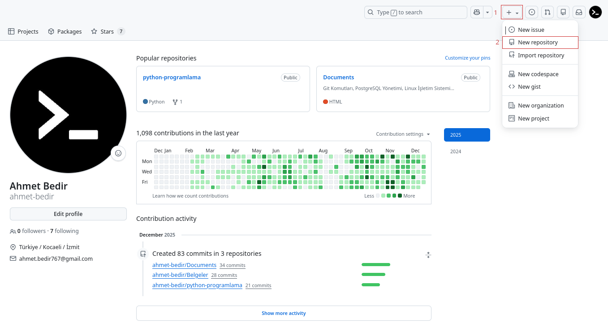
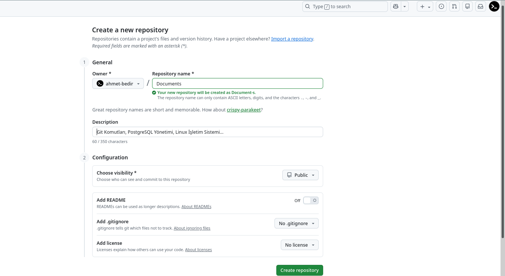
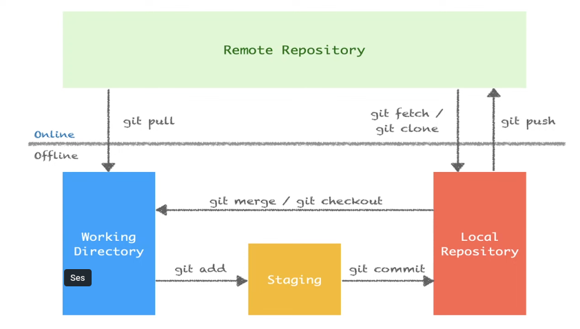

<p align="center">
	
<p/>


###### Son güncelleme : 08/2026

---

### Versiyon Kontrol Sistemi (Version Control System — VCS)

Bir proje geliştirirken yaptığın her değişikliğin ne zaman, kim tarafından, neden yapıldığını kaydetmek ve istediğin ana geri dönmek için kullanılır. Dosyalardaki değişikliklerin geçmişini takip eden ve geri dönüş imkânı veren bir sistemdir.

#### VCS'nin Kısa Tarihi

##### 🏛️ 1. Nesil: Yerel Sistemler (1970-80'ler)

İlk VCS'ler tek bir bilgisayarda çalışıyordu. (RCS - Revision Control System, 1982)

##### 🏢 2. Nesil: Merkezi Sistemler (1990-2000'ler)

CVS (1990) ve Subversion/SVN (2000) ile merkezi model doğdu.

Burada tek bir sunucu var. Herkes bu sunucuya bağlanıyor. Değişiklikleri sunucuya gönderiyor, sunucudan alıyor.

**Merkezi (Centralized) Model Dezavantajları:**

- Tek nokta arızası (Single Point of Failure): Sunucu çökerse? Kimse çalışamaz. Geçmiş kaybolabilir.

- Ağ bağımlılığı.

- Yavaşlık: Her işlem sunucuyla iletişim gerektirdiği için log bakmak bile ağ hızına bağlıydı.

- Geliştiricilerde sadece dosyaların son hali vardı.

##### 🌐 3. Nesil: Dağıtık Sistemler (2005-Günümüz)

**Dağıtık (Distributed) Model — Git ve Türevleri**

- Her geliştirici, projenin tam kopyasına sahip.

- İnternetsiz çalışabilirsin.

- Sunucu çökerse? Herkesin yedeği var. Diğer bilgisayarından komple geri yükleme yapılabilir.

---

#### Git (Global Information Tracker) Nedir?

Git, yazılım geliştirme süreçlerinde kod değişikliklerini zaman içinde kaydetmek ve takip etmek için kullanılan dağıtık bir versiyon kontrol sistemidir. Aynı proje üzerinde çalışan birden fazla yazılımcının kodları birbirine karıştırmadan, eş zamanlı ve düzenli bir şekilde geliştirmesini sağlar. Hatalı güncellemelerde projenin eski sürümlerine kolayca geri dönülmesine imkan tanıyarak veri kaybını önler. Git, her commit'te projenin tamamının anlık görüntüsünü (snapshot) saklar.

##### Git Ekosistemi

```tex
                         ┌───────────────────┐
                         │      Git CLI      │
                         │  (Komut Satırı)   │
                         └────────┬──────────┘
                                  │
                 ┌────────────────┼────────────────┐
                 │                │                │
          ┌──────┴──────┐   ┌─────┴──────┐  ┌──────┴──────┐
          │   GUI'ler   │   │  Hosting   │  │   CI/CD     │
          │             │   │            │  │             │
          │ VS Code Git │   │ GitHub     │  │ GitHub      │
          │ GitKraken   │   │ GitLab     │  │ Actions     │
          │ Sourcetree  │   │ Bitbucket  │  │ Jenkins     │
          │ Fork        │   │ Gitea      │  │ GitLab CI   │
          └─────────────┘   └────────────┘  └─────────────┘
```

- **GUI Araçları:** Komut satırına alternatif olarak grafik arayüzler var.
- **Hosting:** Kodunu bulutta tutmak, paylaşmak, işbirliği yapmak için.
- **CI/CD:** Kodun her push'ta otomatik test edilmesi, derlenmesi, deploy edilmesi.

##### Üç Alan (Three States): Working Directory, Staging Area, Repository

Git, dosyalarını üç temel alanda yönetir.

```text
┌──────────────┐     ┌──────────────┐      ┌──────────────┐
│   Working    │     │   Staging    │      │  Repository  │
│  Directory   │────▶│    Area      │─────▶│   (.git)     │
│              │ add │   (Index)    │commit│              │
│ Dosyalarını  │     │   Sahneye    │      │    Kalıcı    │
│ düzenlediğin │     │ hazırladığın │      │    kayıt     │
│     yer      │     │     yer      │      │              │
└──────────────┘     └──────────────┘      └──────────────┘
```

##### 1. Working Directory (Çalışma Dizini)

Dosyalarını düzenlediğin, kodlarını yazdığın yer. Git'in gözünde bu alan "kontrol dışı" — yani burada ne yaparsan yap, henüz kayıt altına alınmadı.

```text
Working Directory'deki dosya durumları:

┌──────────────┐
│  Untracked   │  Git bu dosyayı hiç bilmiyor (yeni eklendi)
├──────────────┤
│  Modified    │  Git tanıyor ama son commit'ten beri değişmiş
├──────────────┤
│  Unmodified  │  Git tanıyor ve değişmemiş (commit'teki haliyle aynı)
└──────────────┘
```

##### 2. Staging Area (Hazırlık Alanı / Index)

Staging area, "bir sonraki commit'e neleri dahil edeceğim?" sorusunun cevabı.

```text
git add dosya.txt      # dosya.txt'yi sepete koy (staging'e al)
git commit             # sepetteki her şeyi satın al (commit'le)
```

##### 3. Repository (.git dizini)

Repository (kısaca repo), git tarafından izlenen bir proje klasörüdür. Normal bir klasörden farkı, içinde `.git` adlı gizli bir dizin barındırmasıdır.

İki tür repository vardır:

```text
┌──────────────────────────┐    ┌──────────────────────────┐
│    Yerel Repo (Local)    │    │    Uzak Repo (Remote)    │
│                          │    │                          │
│  Senin bilgisayarında    │    │  GitHub, GitLab, vb.     │
│  git init ile oluşturur  │    │  İnternette barınır      │
│  veya git clone ile      │    │  Ekip paylaşımı için     │
│  kopyalarsın             │    │                          │
│                          │◄──►│                          │
│  Commit, branch,         │    │  push/pull/fetch ile     │
│  her şeyi yaparsın       │    │  senkronize olur         │
└──────────────────────────┘    └──────────────────────────┘
```

Commit'lediğin her şey burada **kalıcı olarak** saklanır. Her commit bir snapshot gibi ve bu snapshot'lar zincir gibi birbirine bağlı.

##### Üç Alanın Akışı

```text
  Working Directory          Staging Area            Repository
   (Çalışma Alanı)            (Hazırlık)              (.git)
  ─────────────────         ──────────────          ──────────────
                    
  dosya.txt [değişti]
          │
          │  git add dosya.txt
          ▼
                            dosya.txt [hazır]
                                    │
                                    │  git commit -m "mesaj"
                                    ▼
                                                    Commit #abc123
                                                    dosya.txt kaydedildi


  ◄─────────────────────────────────────────────────────────
                    git checkout / git restore
                    (Commit'teki hali geri getirir)
```

Bu akışın CLI komutları:

```bash
# 1. Dosya oluştur (Working Directory'de)
$ echo "Merhaba Dünya" > merhaba.txt

# 2. Git'in durumuna bak
$ git status
On branch main
Untracked files:
  (use "git add <file>..." to include in what will be committed)
        merhaba.txt

# "Untracked" = Git bu dosyayı tanımıyor, izlemiyor

# 3. Staging'e al
$ git add merhaba.txt

$ git status
On branch main
Changes to be committed:
  (use "git restore --staged <file>..." to unstage)
        new file:   merhaba.txt

# "Changes to be committed" = Staging'de, commit'e hazır

# 4. Commit'le
$ git commit -m "İlk dosya eklendi"
[main abc1234] İlk dosya eklendi
 1 file changed, 1 insertion(+)
 create mode 100644 merhaba.txt

$ git status
On branch main
nothing to commit, working tree clean

# "Clean" = Her şey commit'lenmiş, değişiklik yok
```

---

#### Git Yapılandırması | `git config`

Git'in üç farklı yapılandırma seviyesi vardır:

```text 
┌──────────────────────────────────────────────────────┐
│  System  (/etc/gitconfig)                            │
│  Tüm kullanıcılar, tüm repolar için geçerli          │
│                                                      │
│  ┌──────────────────────────────────────────────┐    │
│  │  Global  (~/.gitconfig)                      │    │
│  │  Bu kullanıcının tüm repoları için geçerli   │    │
│  │                                              │    │
│  │  ┌──────────────────────────────────────┐    │    │
│  │  │  Local  (.git/config)                │    │    │
│  │  │  Sadece bu repo için geçerli         │    │    │
│  │  │  ⬆️ EN YÜKSEK ÖNCELİK                │    │    │
│  │  └──────────────────────────────────────┘    │    │
│  └──────────────────────────────────────────────┘    │
└──────────────────────────────────────────────────────┘
```


**Git'in sistemine kullanıcıadımızı ve e-mail adresimizi tanımlamak için:**

```bash
git config --global user.name "user_name"
git config --global user.email "user_email"
```

> *Not : Depoya özgü yani local kullanıcıadı ve email tanımlama işlemi için `--global` anahtarının belirtilmemesi veya `--global` anahtarı yerine `--local` anahtarı yazılması gerekir. Local ayar, global'den önceliklidir. O repoda yaptığın commit'ler `--local` anahtarı ile tanımladığın kullanıcı bilgileri ile kayıt olur.*

<small>⚠️ Dikkat: Bu ayarları yapmazsan, commit atarken seni uyarır veya sistemin hostname ve kullanıcı adını kullanır. (user.name "root" ve user.email "root@localhost" olarak gözükür.)</small>

**Tanımlamış olduğumuz kullanıcı adını veya email adresini görüntülemek için:**

```bash
git config --global user.name
git config --global user.email

# Tüm ayarlar için
git config --global --list
```

> *Not: Depoya özgü yani local konfigurasyonlar için `git config user.name` veya `git config user.email` komutları, tüm ayarlar için `git config --local --list` komutu kullanılır.*

---


#### Varsayılan Editör

- VS Code ayarlamak için:git config --global user.name
  
   `git config --global core.editor "code --wait"`

- Nano ayarlamak için:

   `git config --global core.editor "nano -w"`

- Vim ayarlamak için:

   `git config --global core.editor "vim"`

- Gedit (linux) ayarlamak için:

   `git config --global core.editor "gedit --wait --new-window"`

- Emacs ayarlamak için:

   `git config --global core.editor emacs`

- Sublime Text  ayarlamak için:

   `git config --global core.editor "subl -n -w"`


**Git varsayılan editörü görüntülemek için:**

```bash
git config --global core.editor
```

> <small>💡 İpucu: Git, editörü açar ve senin düzenleme yapıp kaydetmeni bekler. `--wait` bayrağı olmadan git hemen devam eder ve boş mesaj alır.</small>

---

#### Varsayılan Branch İsmi

Varsayılan brach ismini değiştirmek için:

```bash
git config --global init.defaultBranch main
```

> <small>💡 İpucu: Bu ayardan sonra `git init` ile oluşturulan tüm yeni repolar `main` branch'i ile başlar.</small>

#### Satır Sonu Ayarları (Line Endings)

Windows `CRLF` (\r\n), Linux/Mac `LF` (\n) kullanır. Ekipte karışık işletim sistemi varsa sorun olur.

```bash
# Windows'ta:
$ git config --global core.autocrlf true
# Checkout: LF → CRLF, Commit: CRLF → LF

# Mac/Linux'ta:
$ git config --global core.autocrlf input
# Checkout: dokunma, Commit: CRLF → LF (yanlışlıkla CRLF girdiyse düzelt)
```

#### Tüm Ayarları Görüntüleme

```bash
# Tüm aktif ayarlar (global+local)
$ git config --list
user.name=termux
user.email=community@termux.com
core.editor=code --wait
init.defaultbranch=main
core.autocrlf=true
color.ui=auto

# Belirli bir ayar
$ git config user.name
termux

# Ayarın hangi dosyadan geldiğini görme
$ git config --show-origin user.name
file:/home/user/.gitconfig  termux
```

#### Ayar Silme

```bash
# Bir ayarı sil
$ git config --global --unset user.name

# Bir bölümü tamamen sil
$ git config --global --remove-section user
```

#### Alias (Kısayollar)

Alias'lar, sık kullandığın komutlara kısayol tanımlar. Kısayol tanımlama şekli:

```bash
$ git config --global alias.<kısayol> <komut_adı>
```

Örnekler:

```bash
# Kısa log görünümü
$ git config --global alias.lg "log --oneline --graph --all --decorate"

# Durum kısayolu
$ git config --global alias.st "status"

# Kısa commit
$ git config --global alias.cm "commit -m"

# Branch listesi
$ git config --global alias.br "branch"

# Checkout kısayolu
$ git config --global alias.co "checkout"

# Son commit'i göster
$ git config --global alias.last "log -1 HEAD"

# Unstage (staging'den çıkar)
$ git config --global alias.unstage "restore --staged"
```

Kullanımı:

```bash
# Artık şunu yazmak yerine:
$ git log --oneline --graph --all --decorate

# Şunu yazabilirsin:
$ git lg
* a1b2c3d (HEAD -> main) Feature X eklendi
* d4e5f6g Login sayfası
* h7i8j9k İlk commit
```

---


---

> - **Bulunduğun dizinde boş bir git deposu oluşturmak için:**
>
>   `git init`

> - **0luşturmuş olduğumuz deponun güncel durum bilgisini görüntülemek için kullanabilirsiniz. Bu komut ile hangi branch'te olduğumuz veya hangi dosyaların staging alanında (index bölgesi) olduğu gibi bilgiler verir.**
>
>   `git status`

> - **İsmi verilen tek bir dosyayı staging alanına eklemek için:**
>
>   `git add <file_name>`

> - **Tüm dosyaları staging alanına eklemek için:**
>
>   `git add .`

> - **Staging alanına eklemeden önce dosyada yapılan son değişiklikleri geri almak için:**
>
>   `git restore <file_name>`

> - **Dosyayı staging alanından çıkarmak için:**
>
>   `git restore --staged <file_name>` | `git reset HEAD <file_name>` | `git rm --cached <file_name>`

---

| Dosya İşlemleri                                       |                                                    |
| ----------------------------------------------------- | -------------------------------------------------- |
| `git rm <file_name>`                                  | Dosya silmek için kullanılır                       |
| `git rm -r <directory_name>/`                         | Dizin silmek için kullanılır                       |
| `git mv <file_name> <new_file_name>`                  | Dosya adı değiştirmek için kullanılır              |
| `git mv <file_name> <directory_name>/`                | Dosyayı taşımak için kullanılır                    |
| `git mv <file_name> <directory_name>/<new_file_name>` | Dosyayı adını değiştirerek taşımak için kullanılır |

---

> - **Git ile yapılan değişikliklerin kaydedildiği bir işlemdir. Bu işlem sayesinde herhangi bir zamanda geriye dönülerek değişiklikler eski haline getirilebilir.**

```shell
git commit -m "commit_mesajı"
```

> - `git commit -a` **: Git add yapmadan direk commit etme işlemi için kullanabilirsiniz.**
>
> - `git commit --amend -m "yeni commit mesajı"` **: En son yapılan commit mesajını değiştirmek için kullanılır.**


> - `git log` **: Yapılan commitleri gösterir.**
>
> - `git log --oneline` **: Yapılan commitleri tek satır şeklinde gösterir.**


`HEAD` : Git'in içinde bulunduğumuz konumu belirten bir referanstır. Genellikle en son commit'i işaret eder. Bu, nerede olduğumuzu ve hangi commit üzerinde çalıştığımızı belirlememizi sağlar.


> - `.gitignore` **: Git'in, belirtilen dosyaları görmezden gelmesine izin veren bir dosyadır. Proje kök dizinine eklenir.**
>
> - `dizin/*`      **: Dizin klasöründeki tüm dosyaları kapsar.**
>
> - `!dizin/b`    **: Dizin klasöründeki b dosyası hariç tüm dosyaları kapsar.**


> - **Zamanı geri alma yani git deposunda geçmiş tarihli bir commit'e geri gitmemiz için:**

```shell
git checkout <commit_id>
```

> - **Gittiğimiz committen geri gelmemize yani son commite geri dönmek için:**

```shell
git checkout master || git switch master
```

> - **Git versiyon değiştirme (silinen tüm dosyaları geri getirmek) için:**

```shell
git checkout <commit id> -- .
```


---

> - `git diff` **: Staging alanına eklenmeden önce tüm dosyalarda yapılan değişiklikleri gösterir.**
>
> - `git diff <file_name>` **: Staging alanına eklenmeden önce ismi verilen tek bir dosyada yapılan değişiklikleri gösterir.**
> 
> - `git diff --staged` **: Git deposu ile staging alanındaki değişiklikleri gösterir.**


> - `git branch` **: Yerelimizde kaç dal (branch) olduğunu ve hangi dalda bulunduğumuzu gösterir.**
> - `git branch --all` **: Yerelimizde ve uzak depodaki tüm dalları gösterir.**
> - `git branch -r` **: Uzak depodaki dalları gösterir.**
> - `git branch <branch_name>`  **:  Yeni dal (branch) oluşturmak için kullanılır.**
> - `git branch -m <branch_name> <new_branch_name>` **: Dal adını değiştirir, ancak yeni isimde bir dal varsa hata verir.**
> - `git branch -M <branch_name> <new_branch_name>` **: Dal adını değiştirir, yeni isimde bir dal varsa üzerine yazar (force).**
> - `git branch -D <branch_name>` **: Lokalde ismi verilen bir dalı (branch) silmek için kullanılır.**


> - `git switch <branch_name>` **: Girilen branch'a  geçiş yapar.**
>
> - `git checkout <branch_name>` **: Uzak depodan yerel depoya indirilen branch'a geçiş yapar.**


> - `git merge <branch_name>` **: Master branch'ındayken ismi verilen diğer branch'ı master branch'ıyla birleştirmek için kullanılır.**


---

> - `git stash` **: Git versiyon kontrol sistemi kullanılarak yapılan değişiklikleri geçici olarak kaydetmenizi sağlayan bir özelliktir. Bu, henüz tamamlanmayan bir iş üzerinde çalışırken veya bir dal üzerinde çalışırken aniden başka bir acil işle ilgilenmeniz gerektiğinde özellikle kullanışlıdır.**

> - `git stash list` **: Kaydedilen tüm stash'leri listeler.**
> 
> - `stash@{0}` **: Git stash listesi içerisindeki ilk yani en son eklenen geçici değişiklikler listesindeki kaydedilmiş çalışma dizininin (working directory) saklandığı referans adıdır.**

> - `git stash apply` **: En son kaydedilen stash'i geri yükler.**
> 
> - `git stash apply stash@{n}` **: Belirtilen numaralı stash'i geri yükler.**

> - `git stash drop` **: En son kaydedilen stash'i siler.**
> 
> - `git stash drop stash@{n}` **: Belirtilen numaralı stash'i siler.**

> - `git stash pop` **: Komutu, en son kaydedilen stash girdisini alır ve bu değişiklikleri uygular (apply) ve stash havuzundan (stash pool) kaldırır. Yani, pop işlemi stash havuzundan en son eklenen stash girdisini çıkarır ve çalışma dizinindeki değişiklikleri bu girdiye göre günceller.**

> - `git stash clear` **: Komutu ise stash havuzundaki tüm stash girdilerini siler.**

---

> - `git reset <commit_id>` **: Belirtilen bir commit'e geri dönmeyi sağlar ve bu işlem esnasında commit'ler silinir değişiklikler kalır.**
> 
> - `git reset --hard <commit_id>` **: Belirtilen bir commit'e geri dönmeyi sağlar ve bu işlem esnasında commit'ler ve değişiklikler silinir.**

> - `git revert <commit_id>` **: Belirli bir commit'i geri alırsınız ve bu işlem sonucunda yeni bir commit oluşur. Bu sayede, Git geçmişi değiştirilmez, ancak istenmeyen değişiklikler geri alınmış olur.**

---

> - `git rebase` **komutu, git’te branch  (dal) yönetiminde kullanılır ve commit geçmişini düzenlemeye yarar.  Temel amacı, bir branch’in temelini başka bir branch’in en son haliyle  değiştirmek ve daha "düzgün" bir commit geçmişi oluşturmaktır.**
>
>   **Yani:**
>
>   - **Branch’inizdeki commitleri, hedef branch’in en güncel commitlerinin üstüne "taşır".**
>   - **Genellikle** `git merge` **ile benzer problemlere çözüm getirir ama geçmişi daha lineer hale getirir.**
>
>   **En yaygın kullanım:**
>
>   ```shell
>   git checkout feature-branch
>   git rebase main
>   ```
>
>   **Bu komut,** `feature-branch` **dalındaki değişiklikleri,** `main` **dalının en güncel halinin üzerine taşır.**
>
>   **Faydaları:**
>
>   - **Commit geçmişi daha temiz ve düz olur.**
>   - **Ortak bir temel üzerinde çalışmayı kolaylaştırır.**
>   - **Merge commitleri oluşturmaz (tüm commitler tek bir çizgide görünür).**
>
>   **Dikkat edilmesi gereken noktalar:**
>
>   - **Rebase işlemi, var olan commitleri yeniden yazdığı için, paylaşılan branch’lerde kullanırken dikkatli olunmalıdır.**
>   - **Başkaları tarafından erişilen branch’lerde rebase yapılmamalı.**
>
>   **Kısaca,** `git rebase` **, branch’leri birleştirirken temiz ve düzenli bir commit geçmişi sağlar.**

---


### Remote

**Remote uzun linkleri kısaltmamıza ve onları bir isim ile bağdaştırmamızı sağlar. Örneğin:**                                       `git remote add <remote_name> https://github.com/<github_username>/<repo_name>.git` **komutunda** `<remote_name>` **kısmına istediğiniz ismi verebilirsiniz. Yani** `<remote_name>` **dediğimizde** `https://github.com/<github_username>/<repo_name>.git` **bu url temsil edilmektedir.**


---

### GitHub’da yeni bir repo (depo) oluşturmak için aşağıdaki adımları takip edebilirsiniz:

1. **GitHub Hesabınıza Giriş Yapın:**
   [https://github.com](https://github.com/) adresine gidin ve hesabınıza giriş yapın.

2. **Yeni Depo Oluşturma Sayfasına Gidin:**
   Sağ üst köşedeki “+” simgesine tıklayın ve açılan menüden “New repository” (Yeni depo) seçeneğini seçin.
   Alternatif: https://github.com/new adresine doğrudan gidebilirsiniz.

3. **Depo Bilgilerini Doldurun:**

   - **Owner (Sahip):** Depoyu kendi hesabınızda mı yoksa bir organizasyonda mı oluşturmak istediğinizi seçin.
   - **Repository Name (Depo Adı):** Depoya benzersiz bir isim verin.
   - **Description (Açıklama):** (İsteğe bağlı) Depo hakkında kısa bir açıklama yazın.
   - Visibility (Görünürlük):
     - **Public:** Herkes görebilir.
     - **Private:** Sadece siz ve davet ettikleriniz görebilir.

4. **İlk Ayarları Yapın (Opsiyonel):**

   - “Add a README file” kutucuğunu işaretleyerek başlangıçta bir README dosyası oluşturabilirsiniz.
   - .gitignore ve lisans eklemek için uygun seçenekleri belirleyebilirsiniz.

5. **“Create Repository” Butonuna Tıklayın:**
   Sayfanın en altında yeşil renkli “Create repository” butonuna tıklayın.

6. **(Opsiyonel) Depoyu Bilgisayarınıza Klonlayın:**
   Oluşturduğunuz repoyu kendi bilgisayarınıza kopyalamak için “Code” butonuna tıklayın ve bağlantıyı kopyalayıp terminalde şu komutu kullanın:

   ```shell
   git clone https://github.com/<github_username>/<repo_name>.git
   ```


---



---




---

> - **Yereldeki repoya uzak sunucudaki repoyu  ilişkilendirmek için uzak repo adresini https protokolü ile ekliyoruz.**

```shell
git remote add <remote_name> https://github.com/<github_username>/<repo_name>.git
```


### PAT (Personal Access Token) Nedir, Ne İçin Kullanılır?

**PAT (Personal Access Token) GitHub, GitLab gibi platformlarda kullanıcıların hesabına komut satırı (CLI) veya üçüncü parti uygulamalar üzerinden erişim sağlamak için kullandığı bir kimlik doğrulama yöntemidir. Özellikle şifre ile kimlik doğrulama devre dışı bırakıldığından, HTTPS ile erişimlerde şifre yerine PAT kullanılır.**

**Kullanım amaçları:**

- **Komut satırı veya uygulamalar üzerinden kimlik doğrulama yapmak**
- **Otomasyon scriptlerinde veya CI/CD süreçlerinde erişim sağlamak**
- **Klasik şifre ile giriş yerine, daha güvenli ve süreli erişim belirteçleri üretmek**


---

### PAT Nasıl Oluşturulur?

**1. GitHub hesabına giriş yap**
   **Sağ üstteki profil fotoğrafına tıkla** → *Settings* **menüsüne gir.**

**2. Developer settings → Personal access tokens başlığına gel.**

**3.** *Tokens (classic)* **veya** *Fine-grained tokens* **sekmesini seç.**

**4. Generate new token butonuna tıkla.**

**5. Açılan formda:**

   - **Token'a bir isim ver (ör: "CLI erişimi için")**
   - **Erişim süresi (expiration) belirle**
   - **Hangi izinlere sahip olacağını seç (repo, workflow, user, vs.)**

**6. Generate token diyerek token'ı oluştur.**
   **Oluşan token'ı güvenli bir yere kopyala (çünkü bir daha gösterilmez).**


---

### Komut Satırında PAT ile Kimlik Doğrulama

> - **PAT’i kullanarak HTTPS ile push/pull işlemi yapmak için:**

```shell
git remote set-url <remote_name> https://<github_username>:<pat>@github.com/<github_username>/<repo_name>.git
```

<small>Not : Kısacası, PAT güvenli ve modern bir kimlik doğrulama yöntemidir ve GitHub gibi platformlarda şifreyle girişin yerini almıştır.</small>


---

## SSH Key Oluşturma ve Yapılandırma

### SSH Neden Gerekli?

GitHub, GitLab gibi platformlara kodu göndermek (push) için kimliğini doğrulamalısın. İki yol var:

1. **HTTPS:** Her seferinde kullanıcı adı/şifre veya token girersin.

2. **SSH:** Bir kere anahtar çifti oluşturursun, sonra şifresiz bağlanırsın.

### SSH Nasıl Çalışır?

```text
┌──────────────────────────────────────────────────────┐
│                   SSH Key Çifti                      │
│                                                      │
│  🔑 Private Key (Özel Anahtar)                       │
│  ~/.ssh/id_ed25519                                   │
│  ❌ KİMSEYLE PAYLAŞMA! Bilgisayarında kalır.         │
│                                                      │
│  🔓 Public Key (Genel Anahtar)                       │
│  ~/.ssh/id_ed25519.pub                               │
│  ✅ GitHub'a, GitLab'a ekle. Paylaşılabilir.         │
│                                                      │
│  Not: Kapının kilidi (public) herkeste olabilir      │
│  ama anahtarı (private) sadece sende.                │
└──────────────────────────────────────────────────────┘
```

- **Public key** = açık asma kilit — GitHub'a veriyorsun, "benim mesajlarımı bununla kilitle" diyorsun
- **Private key** = anahtarın — sadece sen açabilirsin

### Komut Satırında SSH ile Kimlik Doğrulama

**1.SSH anahtarınızı oluşturmak için:**

```bash
ssh-keygen -t ed25519 -C "email@adresiniz.com"
```

Not: Ssh key anahtarı ed25519 algoritması ile modern, güvenli, hızlı.

Terminalde size bazı sorular sorar:

```text
Generating public/private ed25519 key pair.
Enter file in which to save the key (/home/kullanıcı/.ssh/id_ed25519): 
# Varsayılan konum için enter'a bas veya yeni bir konum gir

Enter passphrase (empty for no passphrase): 
# Güçlü bir parola gir (önerilir) veya boş bırak

Enter same passphrase again:
# Aynı parolayı tekrar gir

Your identification has been saved in /home/kullanıcı/.ssh/id_ed25519
Your public key has been saved in /home/kullanıcı/.ssh/id_ed25519.pub
The key fingerprint is:
SHA256:xxxxxxxxxxxxxxxxxxxxxxxxxxxxxxxxxxxxxxxxxxx email@adresiniz.com
The key's randomart image is:
+--[ED25519 256]--+
|        .oo.     |
|       . o.o     |
|        = +.o    |
|       . B.=     |
|      . S.=.o    |
|     . + o.+.    |
|      + o.+.     |
|     . +.o.+     |
|      o.oo=.     |
+----[SHA256]-----+
```

**2.Genel anahtarı kopyalamak için:**

```bash
$ cat ~/.ssh/id_ed25519.pub
ssh-ed25519 AAAAC3NzaC1lZDI1NTE5AAAAIG... email@adresiniz.com

# çıktının tamamını kopyala
```

**3.Genel anahtarı GitHub’a ekleyin:**

- GitHub’da sağ üstte profil fotoğrafınıza tıklayın → Settings → SSH and GPG keys → New SSH key

- Title: "Kişisel Laptop" kTitle kısmına bir isim verin)

- Key type: "Authentication Key"

- Key: Kopyaladığın public key'i yapıştır

- Add SSH key butonuna tıkla

**4.Bağlantıyı test edin:**

```bash
ssh -T git@github.com
```

İlk seferde “Are you sure you want to continue connecting (yes/no/[fingerprint])?” sorusuna yes yazın. “Hi username! You've successfully authenticated...” mesajı görmelisiniz.

Hata alırsan:

```bash
# Detaylı debug modu (doğru key kullanılıyor mu?)
$ ssh -vT git@github.com
```

**5.Depoyu SSH ile kullanmak için depo bağlantı adresiniz şu şekilde olmalı:**

```bash
git@github.com:<github_username>/<repo_name>.git
```

**6.Var olan bir depoyu HTTPS’i SSH’ye çevirmek için:**

```bash
git remote set-url <remote_name> git@github.com:<github_username>/<repo_name>.git
```

---

**`git remote -v`**: Yerele indirdiğiniz (klonladığınız) bir github deposunun hangi hesaptan veya hangi url üzerinden klonlandığını ve hangi yöntem ile bağlantı kulduğunu öğrenmek için kullanılır.

---

> - **Uzak sunucudaki repoya yapılan commitleri göndermek için kullanabilirsiniz.**

```shell
git push -u <remote_name> <branch_name>
```

<small>Not : -u (upstream) ifadesi, varsayılan yukarı akış depoya (remote_name) ve ana dal (branch_name) için bir yer işaretçisi belirler. Bu işaretçi sayesinde, bir sonraki git push komutunu çağırdığınızda, Git (remote_name) ve (branch_name) argümanlarını tekrarlamak yerine bu yer işaretçisini kullanarak sadece `git push` komutu ile aynı işlemi yapabilirsiniz.</small>


---

> - **Fetch işlemi, uzak depodaki yeni değişiklikleri lokal depoya indirir ancak lokaldeki çalışma dizinine (working directory) birleştirmez. Bu işlem, uzak depodaki değişikliklerin var olup olmadığını kontrol etmek için kullanır.**

```shell
git fetch <remote_name> <branch_name>
```


---

> - **Pull işlemi, uzak depodaki yeni değişiklikleri hem indirir hem de lokaldeki değişikliklerle birleştirir. Bu işlem, uzak depodaki değişiklikleri lokaldeki çalışma dizinine (working directory) eklemek istediğinizde kullanılır.**
>   **git pull = git fetch + git merge**

```shell
git pull <remote_name> <branch_name>
```


---

> - **Bu komut, uzak depodaki tüm dosyaları, tarihçeyi ve yapılandırmayı https protokolü ile kopyalar ve lokalde yeni bir git deposu oluşturur.**

```shell
git clone https://github.com/<github_username>/<repo_name>.git
```

<small>Not: Bu işlem sonucunda username ve password giriși için username kısmına kullanıcıadı şifre kısmına ise oluşturduğunuz pat girilir. Yalnız bu kullanımda her `push` için giriş gerekir.</small>


Çözüm için klonlama yaparken:

```bash
git clone https://<username>:<pat>@github.com/<username>/<repo_name>.git
```

> - **Bu komut, uzak depodaki tüm dosyaları, tarihçeyi ve yapılandırmayı ssh protokolü ile kopyalar ve lokalde yeni bir git deposu oluşturur.**

```shell
git clone git@github.com:<github_username>/<repo_name>.git
```


---

<h3 align="center">Git Sistemi (Git System)<h3/>



