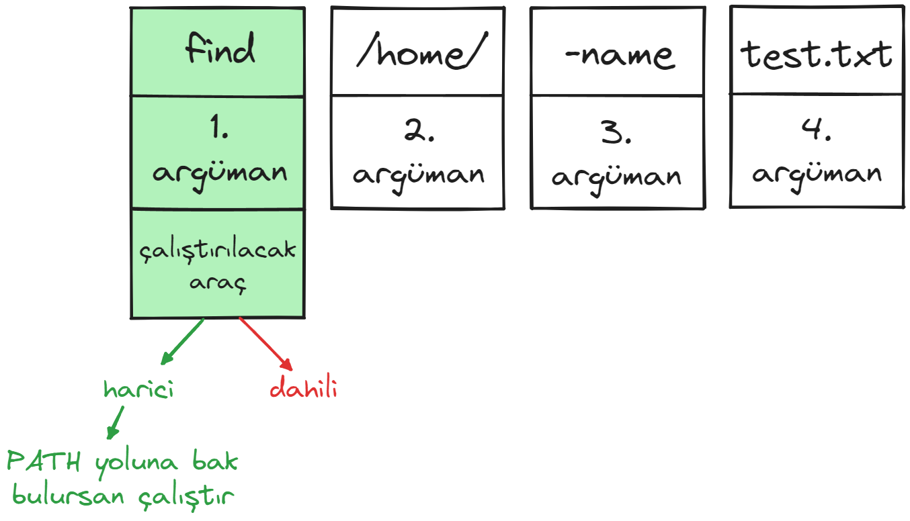
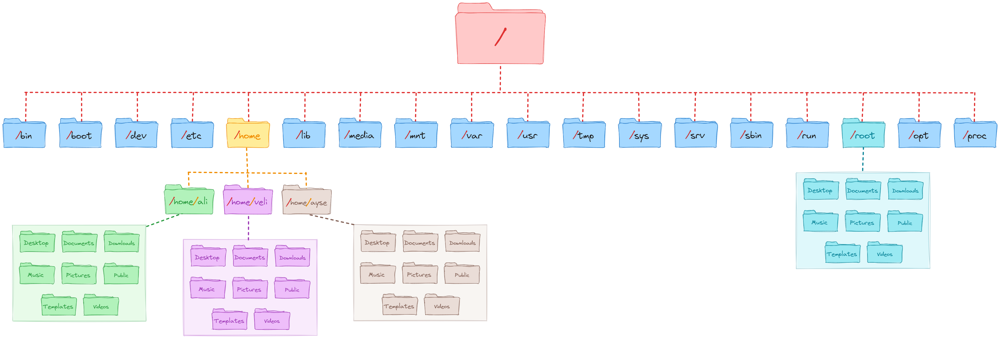
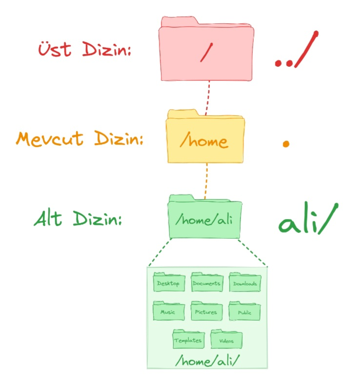
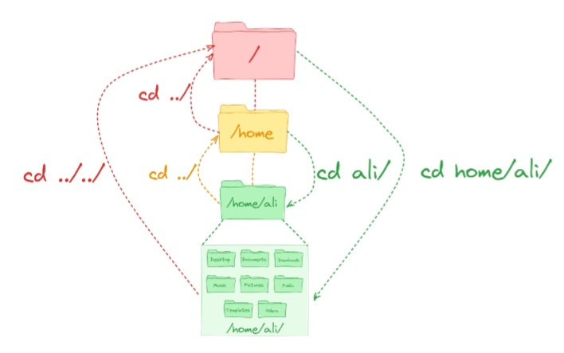
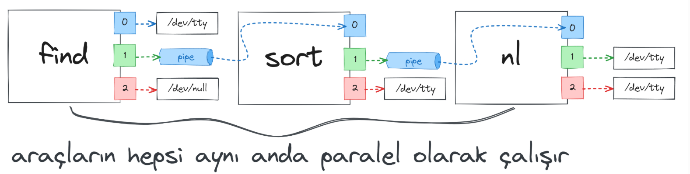
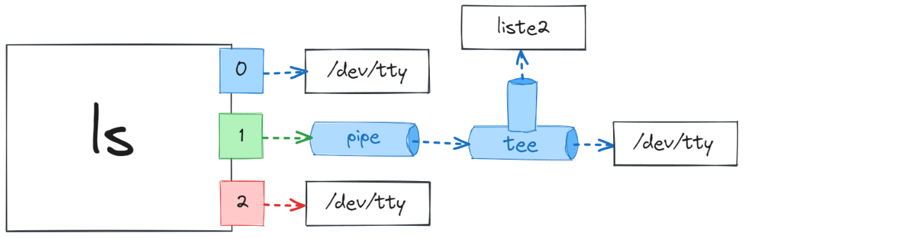
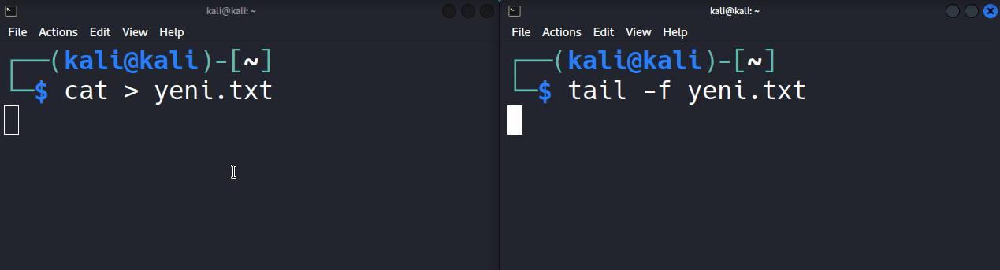
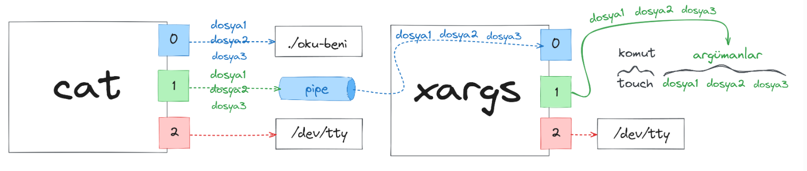
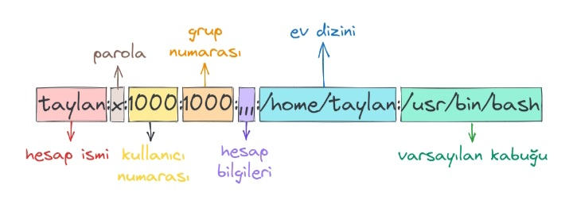
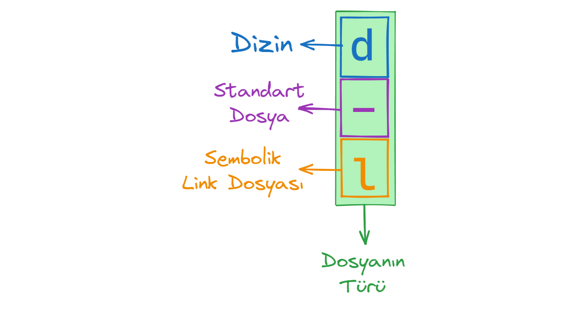

<p align="center">
    
</p>


# Linux İşletim Sistemi

###### Son güncelleme : 01/2026

---

<a id="basa_don"><a/>

**İçindekiler**

▸ [**Komut Satırı**](#komut_satiri)<br />▸ [**Metin İşlemleri**](#metin)<br />▸ [**Gelişmiş Metin İşlemleri**](#metin2)<br />▸ [**Kullanıcı Yönetimi**](#kullanici)<br />▸ [**İzinler**](#izinler)<br />▸ 


---

## 📅 Tarihçe

Linux'un nasıl ortaya çıktığını öğrenmek için, 1969'a, Ken Thompson ve Dennis Ritchie'nin Bell Laboratuvarlarında UNIX işletim sistemini geliştirdikleri zamana dönelim. Daha sonra taşınabilirliği artırmak için C dilinde yeniden yazıldı ve sonunda yaygın olarak kullanılan bir işletim sistemi haline geldi. Fakat UNIX işletim sistemi lisans ücreti talep ediyordu.

Yaklaşık on yıl sonra, Richard Stallman, GNU (GNU, UNIX Değildir) projesi üzerinde çalışmaya başladı. Bu proje kapsamında Hurd adında bir GNU çekirdeği geliştirildi, ancak maalesef asla tamamlanmadı. Bunun sonucu olarak, özgür yazılım lisansı olan GNU Genel Kamu Lisansı (GPL) de oluşturuldu.

Çekirdek, işletim sisteminin en önemli parçasıdır. Donanımın yazılımla iletişim kurmasını sağlar. Biz kullanıcılar sistemde bulunan yazılımlar ile çekirdeğe emirler veririz, çekirdekde donanıma o işi yaptırır. Çekirdek sisteminizde olup biten her şeyi kontrol eder.

Bu dönemde BSD, MINIX vb. gibi diğer UNIX benzeri sistemler geliştirildi. Ancak, tüm bu UNIX benzeri sistemlerin ortak noktası, tek bir çekirdek eksikliğiydi.

Ardından 1991'de Linus Torvalds adında genç bir adam, bugün bildiğimiz Linux çekirdeğini geliştirmeye başladı. Topluluğa sunulması ile Linux çekirdeği dahada geliştirildi.

Sonuç olarak Linux çekirdeğinin GPL lisansına geçişiyle birlikte, GNU projesinin halihazırda sahip olduğu açık kaynaklı özgür yazılım araçları ve topluluk desteği, ortaya açık kaynaklı ve özgür bir işletim sistemi olan “GNU Linux” işletim sistemini çıkarmıştı. GNU’nun eksik olan çekirdeği, Linux çekirdeğinin de eksik olan işletim sistemi araçları birbirini tamamlayarak açık kaynaklı özgür bir işletim sistemi oluşturdu.


## 🔥 Linux Dağıtımları


Bir Linux sistemi üç ana bölümden oluşur:

* **Donanım:** Bu, sisteminizin çalıştığı tüm donanımları, bellek, CPU, diskler vb. içerir.
* **Linux Çekirdeği:** Yukarıda belirttiğimiz gibi, çekirdek işletim sisteminin merkezidir. Donanımı yönetir ve sistemle nasıl etkileşim kuracağını söyler. Çekirdek dediğimiz yapının, yazılım olduğu unutulmamalıdır.
* **Kullanıcı Alanı:** Bu, bizler gibi kullanıcıların çeşitli yazımlar ile doğrudan sistemle etkileşim kuracağı yerdir.

Seçilebilecek birçok Linux dağıtımı vardır, sadece en popüler seçeneklere göz atacağız.

### » Debian Dağıtımı

**Genel Bakış**

Debian, tamamen özgür ve açık kaynaklı yazılımlardan oluşan bir işletim sistemidir. Geniş çapta bilinen ve 20 yılı aşkın süredir geliştirilmektedir. Kullanabileceğiniz üç ana sürümü vardır: Stable ( kararlı), Testing (test ) ve Unstable (kararsız).

**Sürümler**

**Stable:** Genel olarak kullanılması iyi olan bir sürüm. Sisteminizde kararlılık ve güvenlik öncelikliyse bu sürümü tercih edebilirsiniz.
**Testing ve Unstable:** Sürekli güncelleme (rolling release) alan dallardır. Bu, bu dallardaki aşamalı değişikliklerin sonunda Stable sürümüne dahil olacağı anlamına gelir. Örneğin, Windows XP'den Windows 10'a yükseltme yapmak istiyorsanız, tam bir Windows 10 kurulumu yapmanız gerekir. Ancak Testing sürümünü kullanıyorsanız, tam bir kurulum yapmadan bir sonraki işletim sistemi sürümü olana kadar otomatik olarak güncellemeleri alacaksınız.

**Paket Yönetimi**

Debian, kendi paket yönetim (APT) araçlarını kullanır. Her Linux dağıtımı paketleri farklı şekilde kurar, yönetir ve farklı paket yönetim araçları kullanır.

**Yapılandırılabilirlik**

Debian en son güncellemeleri almasa da son derece kararlıdır. İyi bir "temel" işletim sistemi arıyorsanız, bu sizin için doğru tercih olabilir.

**Kullanım Alanları**

Debian, her platform için genel olarak harika bir işletim sistemidir.

### » Red Hat Enterprise Linux  Dağıtımı

**Genel Bakış**

Red Hat Enterprise Linux, genellikle RHEL olarak adlandırılır ve Red Hat tarafından geliştirilir. RHEL, ücretsiz yeniden dağıtımı kısıtlamak için katı kurallara sahiptir, ancak yine de kaynak kodunu ücretsiz olarak sağlar.

**Paket Yönetimi**

RHEL, Debian'dan farklı bir paket yöneticisi olan RPM paket yöneticisini kullanır.

**Yapılandırılabilirlik**

RHEL tabanlı işletim sistemleri, Debian tabanlı işletim sistemlerinden biraz farklılık gösterecek, özellikle paket yönetiminde daha belirgin olacaktır.

**Kullanım Alanları**

Adından da anlaşılacağı gibi, çoğunlukla kurumsal alanda kullanılır, bu nedenle sağlam bir sunucu işletim sistemine ihtiyacınız varsa bu iyi bir tercih olacaktır.

### » Ubuntu Dağıtımı

**Genel Bakış**

Kişisel bilgisayarlar için en popüler Linux dağıtımlarından biri Ubuntu'dur. Ubuntu ayrıca varsayılan olarak kendi masaüstü ortamı yöneticisi Unity'yi yayınlar.

**Paket Yönetimi**

Ubuntu, Canonical tarafından geliştirilen Debian tabanlı bir işletim sistemidir. Dolayısıyla temel olarak Debian paket yönetim sistemini kullanır.

**Yapılandırılabilirlik**

Linux'a başlamak isteyen yeni başlayanlar için Ubuntu harika bir seçimdir. Ubuntu, kullanıcı dostu arayüzü ve geniş çapta benimsenilmesine yol açan kullanım kolaylığı sunar. Yaygın olarak kullanılmakta ve desteklenmektedir ve kullanılabilirlik açısından diğer işletim sistemleri gibi OSX ve Windows'a en çok benzerlik gösterir.

**Kullanım Alanları**

Masaüstü, dizüstü bilgisayar ve sunucu dahil olmak üzere her platform için uygundur.

### » Fedora Dağıtımı

**Genel Bakış**

Red Hat tarafından desteklenen Fedora Projesi, açık kaynaklı ve ücretsiz yazılımları içeren, topluluk odaklı bir projedir. Red Hat Enterprise Linux, Fedora'dan dallanarak geliştirilir, bu nedenle Fedora'yı bir upstream RHEL işletim sistemi olarak düşünebilirsiniz. Sonuç olarak, Red Hat Enterprise Linux, kapsamlı test ve kalite güvencesinden sonra Fedora'dan güncellemeler alacaktır. Fedora'yı, Debian yerine Red Hat altyapısı kullanan bir Ubuntu eşdeğeri olarak düşünebilirsiniz.

**Paket Yönetimi**

Fedora, Red Hat paket yöneticisini kullanır.

**Yapılandırılabilirlik**

Red Hat tabanlı bir işletim sistemi kullanmak istiyorsanız, bu kullanıcı dostu bir versiyondur.

**Kullanım Alanları**

Fedora, Red Hat tabanlı bir işletim sistemini fiyat etiketi olmadan kullanmak istiyorsanız harika bir seçimdir. Masaüstü ve dizüstü bilgisayarlar için önerilir.

### » Linux Mint Dağıtımı

**Genel Bakış**

Linux Mint, Ubuntu tabanlı bir işletim sistemidir. Ubuntu'nun yazılım depolarını kullanır, böylece her iki dağıtımda da aynı paketler kullanılabilir. Ubuntu'dan daha hafif bir dağıtım tercih ediyorsanız, Linux Mint ilginizi çekebilir.

**Paket Yönetimi**

Linux Mint, Ubuntu tabanlı olduğundan Debian paket yöneticisini kullanır.

**Yapılandırılabilirlik**

Harika bir kullanıcı arayüzü sunar, yeni başlayanlar için uygundur ve Ubuntu'dan daha az gereksiz yazılım içerir.

**Kullanım Alanları**

Masaüstü ve dizüstü bilgisayarlar için uygundur.

### » Arch Linux Dağıtımı

**Genel Bakış**

Arch Linux, %100 topluluk tarafından yönetilen, hafif ve esnek bir Linux dağıtımdır. Debian'a benzer şekilde, Arch da sürekli güncelleme modelini (rolling release) kullanır, bu nedenle kademeli güncellemeler sonunda Stable (kararlı) sürüm haline gelir. Sistemi ve işlevlerini anlamak için gerçekten uygulamalı olarak öğrenmeniz gerekir, ancak karşılığında sisteminiz üzerinde tam ve eksiksiz kontrol elde edersiniz.

**Paket Yönetimi**

Paketleri kurmak, güncellemek ve yönetmek için kendi paket yöneticisi Pacman'ı kullanır.

**Yapılandırılabilirlik**

Hafif bir işletim sistemi istiyor ve Linux'u gerçekten anlamak istiyorsanız Arch'ı kullanın! Biraz öğrenme eğrisi olsa da, hardcore Linux kullanıcıları için harika bir seçimdir.

**Kullanım Alanları**

Masaüstü ve dizüstü bilgisayarlar için uygundur. Ayrıca Raspberry Pi gibi küçük bir cihazınız varsa ve üzerine hafif bir işletim sistemi kurmanız gerekiyorsa, Arch'ı tercih edebilirsiniz.

### » openSUSE Dağıtımı

**Genel Bakış**

openSUSE Linux, tüm dünyadaki Özgür ve Açık Kaynaklı Yazılım topluluğunun bir parçası olarak açık, şeffaf ve dostça bir şekilde birlikte çalışan openSUSE Projesi tarafından yaratılmıştır. openSUSE, halen çalışmakta olan ikinci en eski Linux dağıtımıdır ve ödüllü SUSE Linux Enterprise ürünleriyle taban sistemini paylaşır.

**Paket Yönetimi**

RPM paket yöneticisini kullanır.

**Kullanılabilirlik**

openSUSE, yeni bir Linux kullanıcısı için harika bir seçimdir. Kullanımı kolay bir grafiksel kurulum/yönetim uygulaması (YaST) ve düzenli bir temel sistem sunar, kurcalamaya kolay açıktır. openSUSE, ister fotoğraflarınız, videolarınız, müzikleriniz ister kodunuz olsun, İnternet'in keyfini virüslerden/casus yazılımlardan endişe duymadan çıkarmanız ve yaratıcılığınızı ortaya koymanız için ihtiyacınız olan her şeyi içerir.

**Kullanım Alanları**

openSUSE Leap, masaüstü PC ve dizüstü bilgisayarda kullanıma tamamen uygundur.

---

<a id="komut_satiri"><a/>

## 💻 Komut Satırı

🔼 [**Başa Dön**](#basa_don)


### Kabuk (Shell)

Kabuk, temelde klavyenizden komutlarınızı alıp bunları işletim sistemine göndererek gerçekleştirilmesini sağlayan bir programdır. Daha önce bir GUI (grafiksel arayüz) kullandıysanız, "Terminal" veya "Konsol" gibi progralları görmüşsünüzdür. Bunlar sizin için bir kabuk başlatan programlardır.

Bu belgede kabuk programı `bash` (Bourne Again SHell) kullanacağız, hemen hemen tüm Linux dağıtımları varsayılan olarak `bash` kabuğunu kullanır. `ksh`, `zsh`, `tsch` gibi başka kabuklar da mevcuttur, ancak en çok kullanılan kabuk programı `bash`'dir. `chsh -s [kabuk-adı]` komutu ile kabuğu değiştirebiliriz. (örneğin `chsh -s /usr/bin/bash`)

Varsayılan kabuk programını öğrenmek için konsola `echo $SHELL` komutunu girmeniz yeterli. Bu komutta yer alan `echo` ifadesi varsayılan kabuğun değerini tutan `SHELL` değişkenini konsola bastırmanızı sağlıyor.

```bash
┌──(ahmet㉿kali)-[~]
└─$ echo $SHELL
/usr/bin/bash
```

---

Temelde bizler kabuğa iki tür komut girebiliyoruz. Bu türler “dahili” ve “harici” olarak gruplanmış olan komutlardır.

#### Dahili Komutlar(Built-ins)

Dahili komutlar, kabuk programında yerleşik olan araçları çalıştırmak üzere kullanılan komutlardır. Bash üzerinde yer alan tüm dahili komutları görmek için `compgen -b` komutunu kullanabiliriz.

#### Harici Komutlar(External)

Harici komutlar ise, mevcut sistem üzerinde yüklü bulunan araçları çalıştırmamızı sağlayan komutlardır. Tabii ki bu tür komutlar harici olan araçları temsil eden komutlar olduğu için kullanmakta olduğunuz sisteme göre harici komutlar değişiklik gösterir. Örneğin siz komut satırı üzerinden metinleri düzenleyebilmenizi sağlayacak olan `nano` aracını çalıştırmak üzere kabuğa aracın ismini girdiğinizde eğer araç sistemde yüklü ise açılır. Eğer yüklü değilse komut yok hatası alırsınız. İşte burada girdiğiniz `nano` komutu harici bir komut olarak kabul ediliyor. Çünkü nano aracı `bash` kabuğunun içinde yüklü gelen bir araç değil, `nano` aracı harici olarak sisteme yüklenmiş olan bir metin editörü yazılımıdır.

---

Genel görünümü (promt) aşağıdaki gibidir.

```bash
kullanıcı_adı@bilgisayar_adı:su_anki_dizin $

ali@pc:/home/ali/İndirilenler $
```

Kullandığınız dağıtıma göre promt görünümü değişebilir.Örneğin kali linux dağıtımında promt görünümü aşağıdaki gibidir: 

```bash
┌──(ahmet㉿kali)-[/home/ali/İndirilenler]
└─$ 
```

Promptun sonundaki $ sembolü Bash, Bourne veya Korn kabuğunu kullanan normal bir kullanıcı içindir, komutu yazarken bu sembol eklenmez.

`echo` komutu, kendisine verilen metin argümanlarını ekrana yazdırır. 

```bash
┌──(ahmet㉿kali)-[~]
└─$ echo Linux İşletim Sistemi
Linux İşletim Sistemi
```

Kabuğun bizim girdiğimiz komutları nasıl algıladığından bahsedecek olursak, örneğin sistem üzerinde dosyaları ve dizinleri bulma işi yapan `find` aracının PATH yolundaki dizinlerde bulunup bulunmadığı kontrol edilir.



Kabuğa girdiğimiz komutlar path yolundaki dizinlerde bulunması gerekir.

---

#### PATH Yolu

PATH, kabuk (bash, zsh vb.) tarafından çalıştırılabilir dosyaların aranacağı dizinleri tutan ortam değişkenidir. Bir komutu tam yolunu yazmadan çalıştırabilmenizi sağlar.

```bash
$ echo $PATH
/usr/local/sbin:/usr/sbin:/sbin:/usr/local/bin:/usr/bin:/bin:/usr/local/games
```

Burada gördüğümüz iki nokta işareti ile ayrılmış olan her bir dizin adresi, kabuğun bir aracın çalıştırılabilir dosyasını ararken soldan sağa doğru sırasıyla bakacağı dizinlerin adresidir.

**PATH’e Geçici Dizin Ekleme (oturumluk)**

Sadece açık terminal oturumu için geçerlidir.

```bash
export PATH="$PATH:/home/ali/Belgeler/bin"
```

Terminal kapandığında geçersiz olur.

**PATH’e Kalıcı Dizin Ekleme (kullanıcı bazlı)**

Kullanıcının her oturumunda geçerli olur.

```bash
nano ~/.bashrc
```

Dosyanın sonuna aşağıdaki kodu ekle:

```bash
export PATH="$PATH:/home/ali/Belgeler/bin"
```

Ardından:

```bash
source ~/.bashrc
```

**Sistem Geneli PATH Ekleme (tüm kullanıcılar)**

Tüm kullanıcılar için geçerli olur.

```bash
sudo nano /etc/profile
```

Ekleme örneği:

```bash
PATH="$PATH:/home/ali/Belgeler/bin"
```

**Özet:**

PATH: Komutların arandığı dizinlerin listesi

`export PATH=$PATH: ...` güncelleme,

`~/.bashrc`: Kullanıcıya özel,

`/etc/profile` veya `/etc/bash.bashrc` : Sistem geneli için.

**Eklenen dizini kontrol etmek için:**

```bash
$ echo $PATH
/home/ali/Belgeler/bin:/usr/local/sbin:/usr/sbin:/sbin:/usr/local/bin:/usr/bin:/bin:/usr/local/games
```

---

### pwd (Print Working Directory / Çalışma Dizini Yazdır)

Linux'ta her şey bir dosyadır, Linux'u derinlemesine öğrendikçe bunu anlayacaksınız, ancak şimdilik sadece bunu aklınızda bulundurun. Her dosya, hiyerarşik bir dizin ağacında organize edilir. Dosya sistemindeki ilk dizin, kök dizin olarak adlandırılır. Kök dizinde, daha fazla klasör ve dosya depolayabileceğiniz birçok klasör ve dosya bulunur.
Bu dosya ve dizinlerin konumları yollar olarak adlandırılır.

Nerede olduğunuzu görmek için `pwd` komutunu kullanabilirsiniz, bu komut "çalışma dizinini yazdır" anlamına gelir ve yalnızca hangi dizinde olduğunuzu gösterir, yolun kök dizinden geldiğini unutmayın.

```bash
┌──(ahmet㉿kali)-[~]
└─$ pwd
/home/ahmet
```

Linux’ta tüm dosya ve dizinler “root” olarak ifade edilen “kök” dizini altında hiyerarşik şekilde tutuluyor. Kök dizin de "/ (slash)" işareti ile temsil ediliyor.



Gördüğünüz gibi tüm dizinler / işareti ile temsil edilen kök dizinin altında bulunuyor.

---

### cd (Change Directory / Dizin Değiştir)

Dizinlerde gezinmek için “change directory” yani “dizini değiştirme” ifadesinin kısaltmasından gelen `cd` komutunu kullanabiliyoruz. Dosya sisteminde gezinmek için yolları kullanmamız gerekiyor. Yol belirtmenin kesin (mutlak) ve göreli olmak üzere iki farklı yolu vardır.

**Kesin yol “absolute path”:** Bu, kök dizinden itibaren olan yoldur. Kök dizin genellikle bir eğik çizgi "/" olarak gösterilir. Yolunuz her zaman kök "/" ile başladığında, kök dizinden başladığınız anlamına gelir. Örneğin, `/home/ali/Masaüstü` kök ile başladığı için kesin yol oluyor.


**Göreli yol “relative path”:** Bu, dosya sistemindeki bulunduğunuz konumdan itibaren olan yoldur. Eğer `/home/ali/Dökümanlar` konumunda olsaydım ve Dökümanlar içinde vergiler adında bir dizine gitmek isteseydim, `/home/ali/Dökümanlar/vergiler` gibi kök dizinden başlayarak tüm yolu belirtmeme gerek yok, bunun yerine sadece `cd` komutuna `vergiler/` argümanını verip ilgili dizinine gidebilirim.

---

İstediğimiz dizine geçmek için `cd` "dizin değiştir" komutuna gitmek istediğimiz dizin adını argüman olarak verilir.

```bash
┌──(ahmet㉿kali)-[~]
└─$ cd /home/ali/Resimler/

┌──(ahmet㉿kali)-[/home/ali/Resimler]
└─$ 
```

Böylece şimdi dizin konumumu `/home/ali/Resimler` olarak değiştirdik.

Şimdi bu dizinden **Linux** adında bir klasörüm var, şu şekilde o klasöre gidebilirim:

```bash
┌──(ahmet㉿kali)-[/home/ali/Resimler]
└─$ cd Linux/

┌──(ahmet㉿kali)-[/home/ali/Resimler/Linux]
└─$ 
```

Sadece klasörün adını argüman olarak verdik, çünkü zaten `/home/ali/Resimler` konumundaydık.

---

Mutlak ve göreli yollarla gezinmek için size yardımcı olacak bazı kısayollar vardır.

► **. (geçerli dizin)**: Şu anda bulunduğunuz dizindir.

► **.. (üst dizin)**: Sizi şu anki konumunuzun bir üst dizinine götürür.

► **\~ (ana dizin)**: Bu dizin varsayılan olarak "ana dizininize" (`/home/kullanıcı_adı`) gider.

► **- (önceki dizin)**: Bu sizi az önce bulunduğunuz önceki dizine götürür.



---

Örnekler:

```bash
$ cd . # geçerli dizinde kal

$ cd .. # bir üst dizine git

$ cd ~ # ana dizine git (sadece cd komutuda yeterlidir)

$ cd - # önceki dizine git
```



---

### ls (List Directories)

Dizin içeriklerini listelemek  için `ls` komutunu kullanabiliriz. `ls` komutu varsayılan olarak geçerli dizindeki dizinleri ve dosyaları listeler.

```bash
┌──(ahmet㉿kali)-[~/Resimler]
└─$ ls
'Ekran Görüntüleri'  'Git Resimleri'   linux-distribution.png   source-code.jpg   veritabanı.jpg
```

Ancak hangi dizinini listelemek istediğinizi belirtebilirsiniz.

```bash
┌──(ahmet㉿kali)-[~/Resimler]
└─$ ls /home/ali/
Belgeler  Genel  İndirilenler  Masaüstü  Müzik  Resimler  Şablonlar  Videolar
```

Nokta ile başlayan dosya adları gizlidir, ancak bunları `ls` komutuyla görebilirsiniz ve `-a` (tümü için all) işaretini ekleyebilirsiniz.

```bash
┌──(ahmet㉿kali)-[~]
└─$ ls -a
 .                    .cache       .gtkrc-2.0     .pki                        .swt
 ..                   .codeintel   İndirilenler   .profile                    Şablonlar
 .atom                .config      .ipython       .psql_history               .var
 .bash_history        .eclipse     .java          pycharm-2025.3              Videolar
 .bash_logout         .face        .junie         PyCharmMiscProject          .viminfo
 .bashrc              .face.icon   .local         Python-3.14.2               .zoom
 .bashrc.original     Genel        Masaüstü       .python_history             .zprofile
 Belgeler             .gitconfig   metin.txt      Resimler                    .zsh_history
 .biglybt             .gnupg       .mozilla       .ssh                        .zshrc
'BiglyBT Downloads'   GNUstep      Müzik
```

Bir başka `ls` işareti, `-l` uzun formatta ayrıntılı bir dosya listesi gösterir. Bu size ayrıntılı bilgi gösterecektir, soldan başlayarak: dosya izinleri, bağlantı sayısı, sahip adı, sahip grubu, dosya boyutu, son değişiklik zaman damgası ve dosya/dizin adı.

```bash
┌──(ahmet㉿kali)-[~]
└─$ ls -l
toplam 56
drwxr-xrwx  2 ahmet ahmet 4096 Oca 12 16:55  Belgeler
drwxrwxrwx  2 ahmet ahmet 4096 Ara  1 12:28 'BiglyBT Downloads'
drwxr-xrwx  2 ahmet ahmet 4096 Kas 25 13:35  Genel
drwxrwxr-x  4 ahmet ahmet 4096 Ara  1 13:08  GNUstep
drwxr-xrwx  3 ahmet ahmet 4096 Oca 15 17:26  İndirilenler
drwxr-xrwx 13 ahmet ahmet 4096 Oca 16 21:53  Masaüstü
-rw-rw-r--  1 ahmet ahmet   24 Oca 16 22:28  metin.txt
drwxr-xrwx  2 ahmet ahmet 4096 Kas 25 13:35  Müzik
drwxr-xr-x 10 ahmet ahmet 4096 Oca 21  1970  pycharm-2025.3
drwxrwxr-x  4 ahmet ahmet 4096 Ara 16 12:38  PyCharmMiscProject
drwxrwxr-x  6 ahmet ahmet 4096 Oca 14 21:02  Python-3.14.2
drwxr-xrwx  4 ahmet ahmet 4096 Oca 17 16:55  Resimler
drwxr-xrwx  2 ahmet ahmet 4096 Kas 25 13:35  Şablonlar
drwxr-xrwx  3 ahmet ahmet 4096 Ara  5 22:23  Videolar
```

---

**Sık kullanılan argümanlar**

**`-l`**
   Uzun listeleme formatı (izinler, sahip, grup, boyut, tarih). 

```bash
┌──(ahmet㉿kali)-[~]
└─$ ls -l
toplam 29584
drwxr-xrwx  2 ahmet ahmet     4096 Oca 19 15:37  Belgeler
drwxr-xrwx  2 ahmet ahmet     4096 Kas 25 13:35  Genel
drwxrwxr-x  4 ahmet ahmet     4096 Ara  1 13:08  GNUstep
drwxr-xrwx  2 ahmet ahmet     4096 Oca 20 12:50  İndirilenler
-rw-rw-r--  1 ahmet ahmet  1728252 Kas 29 12:42  kali-abstract-sky.png
-rw-rw-r--  1 ahmet ahmet   715087 Kas 29 12:39  kali-ferrofluid.jpg
-rw-rw-r--  1 ahmet ahmet  2377119 Kas 29 12:42  kali-layers.png
drwxr-xrwx 13 ahmet ahmet     4096 Oca 20 12:30  Masaüstü
-rw-rw-r--  1 ahmet ahmet       24 Oca 16 22:28  metin.txt
drwxr-xrwx  2 ahmet ahmet     4096 Kas 25 13:35  Müzik
-rwxr-----  1 ahmet ahmet  8342944 Tem 22 16:49 'Program Kurma (Kaynak Koddan).mp4'
drwxr-xr-x 10 ahmet ahmet     4096 Oca 21  1970  pycharm-2025.3
drwxrwxr-x  4 ahmet ahmet     4096 Ara 16 12:38  PyCharmMiscProject
drwxrwxr-x  6 ahmet ahmet     4096 Oca 14 21:02  Python-3.14.2
drwxr-xrwx  4 ahmet ahmet     4096 Oca 18 21:00  Resimler
-rwxr-----  1 ahmet ahmet 17064180 Tem 22 16:49 'Süreçler (ps_ pstree_ kill_ killall).mp4'
```

**`-h`**
   Dosya boyutlarını insan okunabilir biçimde gösterir (KB, MB, GB).
   Genellikle `-l` ile birlikte kullanılır.

```bash
┌──(ahmet㉿kali)-[~]
└─$ ls -lh
toplam 29M
drwxr-xrwx  2 ahmet ahmet 4,0K Oca 19 15:37  Belgeler
drwxr-xrwx  2 ahmet ahmet 4,0K Oca 20 12:50  İndirilenler
-rw-rw-r--  1 ahmet ahmet 1,7M Kas 29 12:42  kali-abstract-sky.png
-rw-rw-r--  1 ahmet ahmet 699K Kas 29 12:39  kali-ferrofluid.jpg
-rw-rw-r--  1 ahmet ahmet 2,3M Kas 29 12:42  kali-layers.png
drwxr-xrwx 13 ahmet ahmet 4,0K Oca 20 12:30  Masaüstü
-rw-rw-r--  1 ahmet ahmet   24 Oca 16 22:28  metin.txt
drwxr-xrwx  2 ahmet ahmet 4,0K Kas 25 13:35  Müzik
-rwxr-----  1 ahmet ahmet 8,0M Tem 22 16:49 'Program Kurma (Kaynak Koddan).mp4'
drwxr-xr-x 10 ahmet ahmet 4,0K Oca 21  1970  pycharm-2025.3
drwxrwxr-x  4 ahmet ahmet 4,0K Ara 16 12:38  PyCharmMiscProject
drwxrwxr-x  6 ahmet ahmet 4,0K Oca 14 21:02  Python-3.14.2
drwxr-xrwx  4 ahmet ahmet 4,0K Oca 18 21:00  Resimler
-rwxr-----  1 ahmet ahmet  17M Tem 22 16:49 'Süreçler (ps_ pstree_ kill_ killall).mp4'
drwxr-xrwx  2 ahmet ahmet 4,0K Kas 25 13:35  Şablonlar
drwxr-xrwx  3 ahmet ahmet 4,0K Ara  5 22:23  Videolar
```

**`-a`**
   Gizli dosyaları da listeler (`.` ile başlayanlar).

```bash
ls -a
```

**`-A`**
   Gizli dosyaları listeler ancak `.` ve `..` hariç tutar.

```bash
ls -A
```

---

**Sıralama Seçenekleri**

**`-t`**
   Dosyaları son değiştirilme zamanına göre sıralar.

```bash
ls -lt
```

**`-S`**
   Dosyaları boyutlarına göre sıralar.

```bash
ls -lS
```

**`-r`**
   Ters sıralama yapar.

```bash
ls -ltr
```

---

**Dosya Türleri ve Ayırt Etme**

- **`-F`**
   Dosya türünü sonuna ek işaretle belirtir:
  - `/` → dizin
  - `*` → çalıştırılabilir dosya
  - `@` → sembolik link

```bash
ls -F
```

**`--color=auto`**
 Dosya türlerine göre renklendirerek gösterir (çoğu dağıtımda varsayılan).

```bash
ls --color=auto
```

---

**Dizin ve Alt Dizin İşlemleri**

**`-d`**
   Dizinin içeriğini değil, dizinin kendisini listeler.

```bash
ls -ld /etc
```

**`-R`**
   Alt dizinlerle birlikte recursive (özyinelemeli) listeleme yapar.

```bash
ls -R
```

---

**Zaman Bilgileri**

**`-u`**
   Son erişim zamanına göre listeler.

```bash
ls -lu
```

**`-c`**
   Son durum değişikliği zamanına göre listeler.

```bash
ls -lc
```

---

**Yaygın Kullanım Kombinasyonları**

- **`ls -lah`**
   Tüm dosyalar, detaylı liste, okunabilir boyutlar.
- **`ls -ltrh`**
   En eski dosyalar üstte olacak şekilde detaylı ve okunabilir liste.
- **`ls -ld */`**
   Sadece dizinleri uzun formatta listeler.

---

**Kısa Özet Tablosu**

| Argüman | Açıklama                   |
| ------- | -------------------------- |
| `-l`    | Detaylı liste              |
| `-a`    | Gizli dosyalar             |
| `-h`    | Okunabilir boyut           |
| `-t`    | Zamana göre sıralama       |
| `-r`    | Ters sıralama              |
| `-S`    | Boyuta göre sıralama       |
| `-R`    | Alt dizinlerle             |
| `-F`    | Dosya türü işareti         |
| `-d`    | Dizinin kendisini gösterir |

---

### touch

Touch, yeni boş dosyalar oluşturmanıza olanak tanır.

```bash
$ touch <dosya>
```

Touch ayrıca mevcut dosya ve dizinlerde zaman damgalarını değiştirmek için kullanılır. Bir dosyada`ls -l` komutunu kullanın ve zaman damgasını not edin, ardından o dosyaya `touch` komutunu uygulayın, zaman damgası güncellenecektir.

---

### file

Bir dosyanın ne tür bir dosya olduğunu bulmak için `file` komutunu kullanabilirsiniz. Bu komut, dosyanın içeriğinin bir açıklamasını size gösterecektir.

```bash
┌──(ahmet㉿kali)-[~/Resimler]
└─$ file man-image.gif 
man-image.gif: GIF image data, version 89a, 807 x 662
```

Linux'ta, dosya adlarının dosyanın içeriğini temsil etmesi gerekmez. Aslında GIF olmayan `linux-distribution.gif` adında bir dosya oluşturabilirsiniz. Bu onun bi GIF dosyası olduğu anlamına gelmez.

```bash
┌──(ahmet㉿kali)-[~/Resimler]
└─$ file linux-distribution.gif 
linux-distribution.gif: PNG image data, 2000 x 2416, 8-bit/color RGBA, non-interlaced
```

---

### cat

Dosya okumak için kullanılır. Bu komut, concatenate (birleştirmek) kelimesinin kısaltmasıdır.

```bash
┌──(ahmet㉿kali)-[~/Belgeler]
└─$ cat Notlar.txt 
==== NOTLAR ===
Python'u öğrenirken ilerlemenin en iyi yolları.

┌──(ahmet㉿kali)-[~/Belgeler]
└─$ cat Komutlar.txt 
=== Komutlar ===
[#] pwd : Bulunduğumuz dizinin tam adresini yazdırır.
[#] ls : Dizin içeriklerini listelemek için kullanılır.
```

Yalnızca dosya içeriğini görüntülemez, aynı zamanda birden fazla dosyayı birleştirebilir ve size çıktıları gösterebilir.

```bash
┌──(ahmet㉿kali)-[~/Belgeler]
└─$ cat Notlar.txt Komutlar.txt                                           
==== NOTLAR ===
Python'u öğrenirken ilerlemenin en iyi yolları.
=== Komutlar ===
[#] pwd : Bulunduğumuz dizinin tam adresini yazdırır.
[#] ls : Dizin içeriklerini listelemek için kullanılır.
```

Dosyaları birleştirmek ve içeriği dosyaya yazdırmak içinde kullanabilirsiniz.

```bash
┌──(ahmet㉿kali)-[~/Belgeler]
└─$ cat Notlar.txt Komutlar.txt > Birlesimi.txt                           

┌──(ahmet㉿kali)-[~/Belgeler]
└─$ cat Birlesimi.txt                                                     
==== NOTLAR ===
Python'u öğrenirken ilerlemenin en iyi yolları.
=== Komutlar ===
[#] pwd : Bulunduğumuz dizinin tam adresini yazdırır.
[#] ls : Dizin içeriklerini listelemek için kullanılır.
```

Ancak büyük dosyaları görüntülemek için pek uygun değildir ve yalnızca kısa içerikler için kullanılır.

---

### less

Basit çıktılardan daha büyük metin dosyaları görüntüleyecekseniz, "az daha fazladır" (aslında benzer bir şey yapan `more` adında bir komut vardır). Metin, sayfa sayfa görüntülenir, böylece bir metin dosyasında sayfa sayfa gezinebilirsiniz.

Devam edin ve bir dosyanın içeriğine `less` komutu ile bakın. `less` komutundayken, dosyada gezinmek için diğer klavye komutlarını kullanabilirsiniz.

```bash
$ less /home/ali/Dökümanlar/metin1		
```

`less` içinde gezinmek için aşağıdaki komutlar kullanılır:

- **q** - `less` programından çıkıp komut satırına geri dönmek için kullanılır.
- **Sayfa yukarı, Sayfa aşağı, Yukarı ve Aşağı okları** - Ok tuşları ve sayfa tuşlarını kullanarak gezinin.
- **g** - Metin dosyasının başına gitmek için kullanılır.
- **G** - Metin dosyasının sonuna gitmek için kullanılır.
- **/arama** - Metin belgesinin içinde belirli metinleri arayabilirsiniz. Aramak istediğiniz kelimelerin öncesine / işareti ekleyin.
- **h** - `less` programını kullanırken nasıl kullanılacağı hakkında biraz yardıma ihtiyacınız varsa, `h` özniteliğini kullanarak yardım ekranına erişebilirsiniz.

---

### history

Kabukta, daha önce girdiğiniz komutların bir geçmişi vardır, aslında bu komutlara göz atabilirsiniz. Bu, daha önce kullandığınız bir komutu yeniden yazmadan bulup çalıştırmak istediğinizde oldukça faydalıdır.

* **Komut geçmişinizi görmek:**

```bash
$ history
```

* **Önceki komutu tekrar çalıştırmak:** Yukarı ok tuşuna basın.
* **Son komutu tekrar çalıştırmak:**

```bash
!!
```

Örneğin, `cat dosya1` yazdıysanız ve tekrar çalıştırmak istiyorsanız, sadece `!!` yazıp Enter'a basabilirsiniz. Bu, en son çalıştırdığınız komutu çalıştıracaktır.

* **Ters arama:** `Ctrl-R` tuşlarına birlikte basın. Bu, ters arama komutudur. `Ctrl-R`'ye basıp aradığınız komutun bir kısmını yazmaya başlarsanız, size eşleşmeleri gösterecektir. Yön tuşları ile bunlar arasında gezinebilirsiniz. Kullanmak istediğiniz komutu bulduktan sonra Enter tuşuna basmanız yeterlidir.

* **Ekranı temizleme:**

```bash
$ clear
```

* **Tab tuşu ile tamamlama:** Komut satırı ortamında en kullanışlı özelliklerden biri tab tuşu ile tamamlamadır. Bir komutun, dosyanın, dizinin vb. başlangıcını yazmaya başlarsanız ve Tab tuşuna basarsanız, bulunduğuz dizinde bulduğu şeye göre otomatik tamamlama yapacaktır. Örneğin, `chrome` komutunu çalıştırmaya çalışıyorsanız, `chr` yazıp Tab tuşuna basabilirsiniz, otomatik olarak `chrome` tamamlanacaktır.

---

### cp (Copy)

Kabuk üzerine dosya yada dizin kopyalamak için kullanılır.

* **Tek bir dosya kopyalama:**

```bash
$ cp <kopyalanacak_dosya> <hedef_konum>
```

`kopyalanacak_dosya` kopyalamak istediğiniz dosyadır ve `hedef_konum` dosyayı kopyaladığınız yerdir.

Örnek:

```bash
$ cp metin.txt /home/ali/Dökümanlar/
```

Bu komut, `metin.txt` adlı dosyayı `/home/ali/Dökümanlar/` dizinine kopyalar.

* **Çoklu dosya ve dizin kopyalama:**

Birden fazla dosya ve dizini kopyalayabilirsiniz ve ayrıca joker karakterleri de kullanabilirsiniz. Joker karakter, arama için daha fazla esneklik kazandıran bir desen tabanlı seçimi temsil eden bir karakterdir. Daha fazla esneklik için her komutta joker karakterleri kullanabilirsiniz.

**Joker karakterler:**
  - `*`: Tüm tek karakterleri veya herhangi bir dizeyi temsil eder.
  - `?`: Tek bir karakteri temsil eder.
  - `[]`: Köşeli parantez içinde yer alan herhangi bir karakteri temsil eder.

Örnek:

```bash
$ cp *.jpg /home/ali/Resimler
```

Bu komut, geçerli dizininizdeki tüm `.jpg` uzantılı dosyaları `Resimler` dizinine kopyalar.

* **Yinelenen dizin kopyalama:**

Yararlı bir komut, `-r` (recursive, yinelenen) işaretini kullanmaktır. Bu, bir dizin içindeki dosyaları ve dizinleri yinelemeli olarak kopyalar.

Örnek:

```bash
$ cp -r Belgeler /home/ali/Dökümanlar
```

Not: Aynı ada sahip bir dosyayı bir dizine kopyalarsanız, kopyaladığınız dosya, var olan dosya üzerine yazılır. Bu, yanlışlıkla üzerine yazılmasını istemediğiniz bir dosyanız varsa iyi değildir. Dosyayı üzerine yazmadan önce size sormak için `-i` (interactive, etkileşimli) işaretini kullanabilirsiniz.

Örnek:

```bash
$ cp -i dosya /home/ali/Resimler
```

---

### mv (Move)

`mv` komutu, dosyaları taşımak ve yeniden adlandırmak için kullanılır. `cp` komutuna benzer şekilde çalışır ancak dosyaları kopyalamak yerine taşır.

**Dosya Yeniden Adlandırma**

Dosyaları şu şekilde yeniden adlandırabilirsiniz:

```bash
$ mv <dosya_ismi> <yeni_dosya_ismi>
```

**Dosya Taşıma**

Bir dosyayı farklı bir dizine şu şekilde taşıyabilirsiniz:

```bash
$ mv dosya /home/ali/Dökümanlar
```

**Çoklu Dosya Taşıma**

Birden fazla dosyayı şu şekilde taşıyabilirsiniz:

```bash
$ mv dosya_1 dosya_2 /dizin
```

**Dizin Yeniden Adlandırma**

Dizinleri de şu şekilde yeniden adlandırabilirsiniz:

```bash
$ mv <dizin> <yeni_dizin_adı>
```

**Üzerine Yazma**

Bir dosyayı veya dizini `mv` ile taşırsanız, o dizinde aynı isimli dosya yada dizin varsa üzerine yazar. Bu davranışı değiştirmek için `-i` işaretini kullanabilirsiniz.

```bash
$ mv -i dizin1 dizin2
```

---

### mkdir (Make Directory)

Oluşturduğumuz tüm dosyaları depolamak için dizinlere ihtiyacımız olacak. `mkdir` (Make Directory) komutu bunun için kullanılır, var olmayan bir dizin oluşturur.

```bash
$ mkdir <dizin_adı>
```
>
> - Aynı anda birden fazla dizin oluşturmak için `mkdir kitaplar resimler` komutu kullanılır.
> - Tam dizin adresi belirtirek istediğimiz konumda `mkdir ~/Documents/belgeler` komutu ile bir dizin oluşturabiliriz.


Ayrıca `-p` (parent, üst dizin) işareti ile aynı anda alt dizinler de oluşturabilirsiniz.

```bash
$ mkdir -p kitaplar/yerli/favoriler
```

Eğer `mkdir` komutunun`-v` seçeneğini kullanırsak tüm oluşturma işlemleri konsola basılacaktır.

---

### rm (Remove)

Dosyaları silmek için `rm` komutunu kullanabilirsiniz. `rm` (remove) komutu, dosya ve dizinleri silmek için kullanılır.

```bash
$ rm dosya1
```

**Dikkat:** `rm` komutu ile silinen dosyaları geri getirmek için bir çöp kutusu yoktur. Silindikten sonra sonsuza kadar kaybolurlar.

Önemli dosyaları kolayca silmesini önlemek için bazı güvenlik önlemleri vardır. Yazma korumalı dosyalar, silinmeden önce sizden onay ister. Bir dizin yazma korumalıysa, kolayca silinemez.

Linux'ta `chattr` (Change Attribute) komutu, dosyaların ve dizinlerin **özniteliklerini** (attributes) değiştirmek için kullanılır. Bu komut, standart `chmod` (izinler) komutundan farklıdır; çünkü dosya izinleri yazma yetkisi verse bile, `chattr` ile korunan bir dosya silinemez veya değiştirilemez.

Özellikle sistem güvenliğini sağlamak ve kritik dosyaların yanlışlıkla silinmesini önlemek için çok güçlü bir araçtır.

**Temel Kullanım Sözdizimi**

```bash
chattr [operatör] [öznitelik] [dosya_adı]
```

- **+** : Belirtilen özniteliği ekler.
- **-** : Belirtilen özniteliği kaldırır.
- **=** : Dosyanın sadece belirtilen özniteliklere sahip olmasını sağlar.

------

**En Çok Kullanılan Öznitelikler**

Aşağıdaki tabloda en yaygın kullanılan `chattr` parametreleri:

| **Öznitelik**       | **Açıklama**                                                 |
| ------------------- | ------------------------------------------------------------ |
| **i** (immutable)   | Dosya **değiştirilemez**, **silinemez**, ismi değiştirilemez ve bağ oluşturulamaz. Root kullanıcısı bile bu korumayı kaldırmadan dosyayı silemez. |
| **a** (append-only) | Dosya silinemez veya içeriği değiştirilemez; ancak sonuna **yeni veri eklenebilir** (Log dosyaları için idealdir). |
| **c** (compressed)  | Dosyanın disk üzerinde kernel tarafından otomatik olarak sıkıştırılmasını sağlar. |
| **u** (undeletable) | Dosya silindiğinde verileri saklanır, böylece geri getirilmesi (undelete) kolaylaşır. |

**Dosyayı Tamamen Korumaya Almak (Silinemez/Değiştirilemez)**

Bir dosyayı root dahil kimsenin silememesi veya düzenleyememesi için `i` özniteliği kullanılır:

```bash
sudo chattr +i onemli_dosya.txt
```

*Bu aşamadan sonra `rm` veya `nano` ile dosyaya müdahale edilemez.*

**Sadece Veri Eklenmesine İzin Vermek**

Bir log dosyasının geçmişinin silinmesini istemiyor, sadece yeni satırlar eklenmesini istiyorsanız:

```bash
sudo chattr +a sistem.log
```

**Korumayı Kaldırmak**

Özniteliği devre dışı bırakmak için `-` operatörü kullanılır:

```bash
sudo chattr -i onemli_dosya.txt
```

Bu aşamadan sonra dosya silinebilir.

**Öznitelikler `lsattr` Komutu İle Kontrol Edilir**

Bir dosyanın hangi özniteliklere sahip olduğunu görmek için standart `ls` komutu işe yaramaz. Bunun yerine **`lsattr`** komutunu kullanmalısınız:

```bash
lsattr onemli_dosya.txt
```

Çıktı örneği:

```bash
----i---------e---- onemli_dosya.txt 
```

Buradaki i, dosyanın kilitli olduğunu gösterir.

------

**Dikkat Edilmesi Gerekenler**

- `chattr` komutunu kullanmak için genellikle **root** veya **sudo** yetkisi gerekir.
- Bu komut genellikle **ext2, ext3, ext4, XFS** gibi Linux dosya sistemlerinde çalışır.
  - `i` özniteliği atanmış bir dosyayı düzenlemeye çalışırsanız, "Permission Denied" (Erişim Engellendi) hatası alırsınız; bu hata dosya izinlerinden (`chmod`) değil, öznitelikten kaynaklıdır.

Dizinlerde kullanım için iki temel yöntem vardır:

**1. Sadece Dizinin Kendisini Korumak**

Eğer komutu doğrudan dizin ismiyle çalıştırırsanız, öznitelik sadece o klasörün kendisine uygulanır.

```bash
sudo chattr +i /home/kullanici/ozel_dizin
```

**Bu ne sağlar?**

- Klasörün adı değiştirilemez.
- Klasör silinemez.
- Klasörün içine **yeni dosya eklenemez** ve içindeki mevcut **dosyalar silinemez**.
- *Ancak:* Klasörün içindeki mevcut bir dosyanın içeriği (eğer dosyanın kendi `i` özniteliği yoksa) hala değiştirilebilir.

------

**2. Alt Dosya ve Dizinlerle Birlikte Korumak (Rekürsif)**

Eğer klasörün içindeki her şeyin (tüm alt dosyalar ve klasörler) aynı korumaya sahip olmasını istiyorsanız `-R` (recursive) parametresini kullanmalısınız.

```bash
sudo chattr -R +i /home/kullanici/ozel_dizin
```

**Bu ne sağlar?**

- Ana klasör kilitlenir.
- İçindeki tüm mevcut dosyalar ve alt klasörler de tek tek `+i` özniteliğini alır. Artık ne klasör ne de içindeki herhangi bir dosya silinebilir veya içeriği değiştirilebilir.

------

**Önemli Bir Fark: `i` ve `a` Öznitelikleri**

Dizinler söz konusu olduğunda şu farkı bilmek çok faydalıdır:

| **Komut**          | **Klasör İçindeki Etkisi**                                   |
| ------------------ | ------------------------------------------------------------ |
| `chattr +i dizin/` | İçine yeni dosya eklenemez, mevcut dosyalar silinemez.       |
| `chattr +a dizin/` | Mevcut dosyalar silinemez ama **yeni dosyalar oluşturulabilir**. |

**Kontrol Etmek İçin**

Dizine uygulanan özniteliği görmek için `lsattr` komutuna `-d` (directory) parametresini eklemeniz gerekir:

```bash
lsattr -d /home/kullanici/ozel_dizin
```

* **-f** veya **force** seçeneği, `rm` komutuna tüm dosyaları kullanıcıya sormadan silmesini söyler (tabii ki gerekli izinlere sahipseniz).

```bash
$ rm -f dosya
```

* Diğer birçok komutta olduğu gibi `-i` işaretini eklemek, dosyaları veya dizinleri gerçekten silmek isteyip istemediğinizi soran bir uyarı görüntüler.

```bash
$ rm -i dosya
```

* Varsayılan olarak `rm` ile bir dizini silemezsiniz. İçerdiği tüm dosyaları ve alt dizinleri silmek için `-r` (recursive, yinelemeli) işaretini eklemeniz gerekir.

```bash
$ rm -r dizin
```

* `rmdir` komutuyla boş bir dizini silebilirsiniz.

```bash
$ rmdir dizin
```

---

### find

Sistemde dosya veya dizin aramak için`find` komutunu kullanabilirsiniz.

**Temel Kullanım**

```bash
find [başlangıç_dizini] [koşullar] [aksiyonlar]
```

Örnek:

```bash
find /etc -name "*.conf"
```

`etc` dizni ve tüm alt dizinler altındaki tüm `.conf` uzantılı dosyaları arar.

------

**Dosya Adı ve Türüne Göre**

**Dosya adı**

- `-name "desen"`
   Büyük/küçük harfe duyarlı arama
- `-iname "desen"`
   Büyük/küçük harfe duyarsız arama

```bash
find . -iname "*.jpg"
```

**Dosya türü**

- `-type f` → normal dosya
- `-type d` → dizin
- `-type l` → sembolik link
- `-type b` → block device
- `-type c` → character device

```bash
find /var -type d
```

------

**Boyuta Göre Arama**

- `-size +10M` → 10 MB’dan büyük
- `-size -100k` → 100 KB’dan küçük
- `-size 1G` → tam 1 GB

Birimler: `b, c, w, k, M, G`

```bash
find /home -size +500M
```

------

**Zamana Göre Arama**

**Gün bazlı**

- `-atime` → son erişim
- `-mtime` → son değişiklik
- `-ctime` → metadata değişimi

```bash
find . -mtime -7      # son 7 gün
find . -mtime +30     # 30 günden eski
```

**Dakika bazlı**

- `-amin`
- `-mmin`
- `-cmin`

```bash
find . -mmin -60
```

------

**Sahiplik ve İzinler**

Kullanıcı / grup

- `-user kullanıcı`
- `-group grup`

```bash
find /home -user ahmet
```

İzinler

- `-perm 644`
- `-perm -644` → en az bu izinler
- `-perm /222` → herhangi biri

```bash
find . -perm -4000     # SUID dosyalar
```

------

**Derinlik (Dizin Seviyesi)**

- `-maxdepth N` → en fazla N seviye
- `-mindepth N` → en az N seviye

```bash
find . -maxdepth 1 -type d
```

------

**Mantıksal Operatörler**

- `-and` veya boşluk → VE
- `-or` → VEYA
- `!` → DEĞİL

```bash
find . -type f -name "*.log" ! -size +10M
```

------

### locate

`locate` komutu sayesinde sistemdeki dosya ve dizinleri isimleriyle araştırabiliyoruz.

`locate` komutu daha önce ele aldığımız `find` aracından farklı olarak araştırma işlemi sırasında tüm dosya sistemine değil daha önceden oluşturulmuş veri tabanını kullanıyor. Bu sayede veri tabanı üzerinden yaptığımız araştırmada, `find` aracından çok daha hızlı şekilde sonuç verebiliyor.

Aracımızın en temel kullanımı `locate aranacak-isim` şeklinde. Fakat dediğim gibi `locate` aracı kendisine ait olan veritabanı üzerinden araştırma yaptığı için araştırmalarımız sırasında daha sağlıklı çıktılar elde edebilmek adına bu veritabanını güncellememiz gerekiyor.

```bash
┌──(ahmet㉿kali)-[~]
└─$ locate dosya

```

Bakın herhangi bir çıktı almadık. Biz bu dosya ve klasörü yeni oluşturduğumuz için `locate` aracının kullandığı veritabanına bu dosya ve klasörün dizin adresi eklenmedi. Dolayısıyla bu isimde bir eşleşme olmadı.

**Veritabanını Güncellemek | `updatedb`**

`locate` veritabanını güncellemek için `sudo updatedb` şeklinde komutumuzu girebiliriz. Ayrıca yeni dizinlerin eklenmesini de bir süre beklememiz gerek.

```bash
┌──(ahmet㉿kali)-[~]
└─$ sudo updatedb
[sudo] password for ahmet: 

```

Şimdi dosya sistemindeki en son değişikliklerin veritabanına eklenmiş olması gerekiyor. Tekrar etmek için `locate` ile arama yapabiliriz.

```bash
┌──(ahmet㉿kali)-[~/Masaüstü/Documents]
└─$ locate metin-dosyası
/home/ahmet/metin-dosyası
```

Bakın bu kez anında aradığım kelimeyle eşleşen dosya ve dizinlerin adresi konsola bastırıldı. Bizzat sizin de deneyimleyebileceğiniz gibi `locate` aracı hızlı çalışıyor olmasına rağmen, veritabanı `updatedb` komutu ile güncellenmediyse sistemde mevcut olan yeni dosya ve dizinleri bulamıyor. Dolayısıyla `locate` aracını kullanmadan önce sağlıklı çıktılar almak istiyorsanız mutlaka `updatedb` komutuyla güncelleme yapın. Normalde her gün düzenli olarak bu veritabanı otomatik olarak güncelleniyor ancak dediğim gibi kullanmadan önce stabil çıktılar istiyorsanız `updatedb` komutunu çalıştırmanız şart.

**Harf Duyarlılığını Kaldırmak**

Eğer aradığınız dosya isminde küçük büyük harf duyarlığının görmezden gelinmesini isterseniz komutunuza `i` seçeneğini de ekleyebilirsiniz.

```bash
┌──(ahmet㉿kali)-[~/Masaüstü/Documents]
└─$ locate metin-dosyası
/home/ahmet/metin-dosyası

┌──(ahmet㉿kali)-[~/Masaüstü/Documents]
└─$ locate -i metin-dosyası
/home/ahmet/Metin-Dosyası
/home/ahmet/metin-dosyası
```

Bakın bu kez küçük büyük harf fark etmeksizin tüm dosya ve klasörler listelenmiş oldu.

**Eşleşme Sayısını Öğrenmek**

Kaç eşleşme olduğun saymak istersek “**c**ount” yani “saymak” ifadesinin kısaltmasından gelen `c` seçeneğini ekleyebiliriz.

```bash
┌──(ahmet㉿kali)-[~/Masaüstü/Documents]
└─$ locate -c linux-operating
76

┌──(ahmet㉿kali)-[~/Masaüstü/Documents]
└─$ locate -ic linux-operating
134
```

Gördüğünüz gibi harf duyarlılığı olamadan arama yaptığımızda 134 eşleşme olurken, harf duyarlılığı varken yalnızca 76 eşleşme bulunmuş.

---

### help

Linux, bir komutu nasıl kullanacağınızı öğrenmenize veya bir komut için hangi işaretlerin (flag) mevcut olduğunu denetlemenize yardımcı olacak yerleşik araçlara sahiptir.

* **help komutu:**

`help` komutu, diğer bash komutları (echo, logout, pwd, vb.) hakkında yardım sağlayan yerleşik bir bash komutudur. Kullanmak istediğiniz komut hakkında bilgi almak için aşağıdaki gibi yazabilirsiniz:

```bash
$ help echo
```

Bu komut, `echo` komutunu çalıştırmak istediğinizde kullanabileceğiniz açıklamayı ve seçenekleri size gösterecektir.

* **--help seçeneği:**

```bash
$ ls --help
```

`--help` seçeneği ile komutlar hakkında kısa bir açıklama alabilirsiniz.

Linux programları hakkında daha fazla bilgi edinmek istiyorsanız, `man` komutunu kullanarak `man` sayfalarına erişebilirsiniz. Man sayfaları, komutların ayrıntılı açıklamalarını, seçeneklerini ve kullanım örneklerini içerir. Kullanımı `man <komut_adı>` şeklindedir.

Örneğin, `ls` komutu hakkında daha fazla bilgi edinmek için:
```bash
$ man ls
```

* Tam olarak ismini hatırlayamadığınız araçların isimlerini ya da tam tersi şekilde ismini bilip işlevini hatırlayamadığınız durumlarda da işlevlerini `apropos` ya da `man -k` komutu yardımıyla kolaylıkla sorgulayabilirsiniz.

---

### whatis

Bir komutun ne işe yaradığından şüphe duyuyorsanız, `whatis` komutunu kullanarak kısa bir açıklama alabilirsiniz. `whatis` komutu, komut satırı programları hakkında özlü bilgiler sağlar.

**Kullanım:**

```bash
$ whatis <komut_adı>
```

**Örnek:**

```bash
$ whatis cat
```

Bu örnekte, `cat` komutunun ne işe yaradığı hakkında kısa bir açıklama görürsünüz. Açıklama, komutun man sayfasından alınır.

---

### alias

Linux size, sık kullandığınız komutlar için takma adlar oluşturma imkanı sunar. Bu takma adlar sayesinde komutları daha kısa ve yazması daha kolay hale getirebilirsiniz.

**Takma Ad Oluşturma:**

Bir takma ad oluşturmak için `alias` komutunu kullanın. Takma adın ismini istediğiniz gibi seçebilirsiniz, ardından eşittir işaretini (`=`) yazın ve takma adın hangi komutu çalıştırmasını istediğinizi belirtin.

Örneğin, `ls -la` komutunu sık sık kullanıyorsanız, bunun için `la` adında bir takma ad oluşturabilirsiniz:

```bash
$ alias la='ls -la'
```

Bundan sonra, `ls -la` yazmak yerine `la` yazabilirsiniz. `la` yazdığınızda, aslında `ls -la` komutu çalıştırılacaktır.

**Kalıcı Takma Adlar:**

Bu komutla oluşturduğunuz takma adlar, terminal oturumunu kapattığınızda kaybolur. Eğer takma adın sürekli olarak kullanılabilir olmasını istiyorsanız, onu konfigürasyon dosyalarından birine eklemeniz gerekir.

Genellikle bash kullanıcıları için takma adlarl `/home/` dizinindeki `.bashrc` dosyasına eklenir. Bu dosyayı bir metin editörü ile açıp, takma adınızı şu şekilde ekleyebilirsiniz:

```bash
alias la='ls -la'
```

Daha sonra dosyayı kaydedin. Artık terminal oturumunu kapatıp açsanız bile `la` takma adını kullanmaya devam edebilirsiniz.

**Takma Ad Silme:**

Oluşturduğunuz bir takma ada artık ihtiyacınız yoksa, `unalias` komutunu kullanarak silebilirsiniz.

```bash
$ unalias la
```

Bu komuttan sonra `la` takma adını kullanamazsınız. Bütün takma adları listelemek için `alias` komutu kullanılır. 

---

Shell'den çıkmak için aşağıdaki komutlardan birini kullanabilirsiniz:

- `exit`: Bu en yaygın çıkış komutudur.
- `logout`: `exit` komutuyla aynı işlevi görür.

Eğer terminal emülatörü kullanıyorsanız, pencereyi kapatarak da çıkabilirsiniz.

---

<a id="metin"><a/>

## 📃 Metin İşlemleri

🔼 [**Başa Dön**](#basa_don)


### stdout (Standard Out)

Konsola girilen komutların davranışlarını **girdi/çıktı akışlarını (I/O)** yönetme.

```bash
$ echo Selam Linux > dosya.txt
```

Bu komutu çalıştırdığınız dizine gidin ve orada `dosya.txt` adında bir dosya oluşacaktır. Dosyayı açtığınızda içinde "*Selam Linux*" yazısını göreceksiniz. Bu komutu incelediğimizde:

**echo Komutu**

```bash
$ echo Selam Linux
```

Bu komutun "*Selam Linux*" yazısını ekrana yazdırdırır. İşlemler, giriş almak ve çıktı döndürmek için **girdi/çıktı akışları (I/O)** kullanır. Varsayılan olarak, `echo` komutu klavyeden **standart girdi (stdin)** alır ve **standart çıktı (stdout)** olarak ekrana yazdırır. Bu nedenle, `echo Selam Linux` yazdığınızda ekranda "*Selam Linux*" görürsünüz.

**Yönlendirme Operatörü**

Ancak I/O yönlendirme, bize daha fazla esneklik sağlayarak bu varsayılan davranışı değiştirmemize izin verir.

`>` sembolü, standart çıktının nereye gideceğini değiştirmemizi sağlayan bir **yönlendirme operatörüdür**. `echo Selam Linux` komutunun çıktısını varsayılan olarak ekrana yazdırmak yerine, bir dosyaya göndermemizi sağlar. Dosya zaten yoksa, bizim için oluşturur. Ancak, dosya zaten varsa, üzerine yazar (kullandığınız shell'e bağlı olarak bunu önlemek için bir shell işareti ekleyebilirsiniz).

**Dosyaya Ekleme**

Veriyi `dosya.txt` dosyasının üzerine yazmak istemezsek `>>` operatörü kullanılır.

```bash
$ echo Selam Linux >> dosya.txt
```

Bu komut, "*Selam Linux*" yazısını `dosya.txt` dosyasının sonuna ekler. Dosya zaten yoksa, tıpkı `>` yönlendiricisi gibi bizim için oluşturur.

---

### stdin (Standard In)

Standart giriş (stdin) akışlarını da farklı kaynaklardan kullanabiliriz. Klavyeden gelen veriler **varsayılan standart giriş** kaynağı olsa da, **dosyaları, diğer işlemlerin çıktılarını ve terminali** de stdin olarak kullanabiliriz.

**Örnek: stdin Yönlendirme ile Dosya Kopyalama**

Önceki bölümde oluşturduğumuz `dosya.txt` dosyasını kullanalım. Bu dosyanın içinde "*Selam Linux*" yazısı bulunuyordu.

```bash
$ cat < dosya.txt > dosya2.txt
```

Standart çıktı yönlendirmede `>` sembolünü kullandık, aynı şekilde standart giriş yönlendirmede de `<` sembolünü kullanıyoruz.

Normalde `cat` komutunda, bir dosya ismi verirsiniz ve bu dosya standart giriş (stdin) haline gelir. Bu örnekte, `dosya.txt` dosyasını standart giriş olarak kullanmak için yönlendirdik. Daha sonra, `cat dosya.txt` komutunun çıktısı olan "*Selam Linux*" metni, `dosya2.txt` adında yeni bir dosyaya yönlendirildi.

**Açıklama:**

* `cat` komutu, varsayılan olarak standart girişten (stdin) okuyup standart çıktıyı (stdout) ekrana yazar.
* `< dosya.txt` kısmı, `dosya.txt` dosyasının içeriğini standart giriş akışına yönlendirir. Yani, `cat` komutu sanki klavyeden "Selam Linux" yazmışız gibi davranır.
* `> dosya2.txt` kısmı ise standart çıktı akışını `dosya2.txt` dosyasına yönlendirir. Böylece, `cat` komutunun "*Selam Linux*" çıktısı bu dosyaya yazılır.

**Sonuç:**

Bu komutu çalıştırdığınızda, `dosya2.txt` adında yeni bir dosya oluşur ve içinde "*Selam Linux* yazısı yer alır. Özetle, bu komut `dosya.txt` dosyasının içeriğini `dosya2.txt` dosyasına kopyalamış olur.

----

### stderr (Standard Error)

Sisteminizde olmayan bir dizinin içeriğini listelemeye çalışalım ve çıktıyı `dosya.txt` dosyasına yönlendirelim.

```bash
$ ls /fake/directory > dosya.txt
```

Bu komutu çalıştırdığınızda ekranda aşağıdaki gibi bir mesaj görmelisiniz:

```bash
ls: cannot access /fake/directory: No such file or directory
```

Muhtemelen şu anda, bu mesajın dosyaya yazdırılması gerektiğini düşünüyorsunuz. Aslında burada devreye giren başka bir I/O akışı var: **standart hata (stderr)**. Standart çıktı (stdout) akışından tamamen farklı olan standart hata akışı, varsayılan olarak çıktısını da ekrana gönderir. Yani, standart hata çıktısını farklı bir şekilde yönlendirmeniz gerekir.

Ne yazık ki, standart hata yönlendirme sembolleri (`<` veya `>`) kadar kolay değildir, ancak dosya tanımlayıcıları kullanılarak yapılabilir. Bir **dosya tanımlayıcısı**, bir dosyaya veya akışa erişmek için kullanılan negatif olmayan bir sayıdır. Dosya tanımlayıcıları **standart giriş (stdin), standart çıktı (stdout) ve standart hata (stderr)** için dosya tanımlayıcılarının sırasıyla **0, 1 ve 2** olduğunu bilmeniz yeterli.

Şimdi standart hata çıktısını dosyaya yönlendirmek istiyorsak şöyle yapabiliriz:

```bash
$ ls /fake/directory 2> hata.txt
```

Bu komutta, standart hata mesajlarını `hata.txt` dosyasına yazdırmış olduk.

Peki hem **standart hata** hem de **standart çıktıyı** `hata.txt` dosyasına yazdırmak istersek dosya tanımlayıcıları ile yapabiliriz:

```bash
$ ls /fake/directory > hata.txt 2>&1
```

Bu komut, `ls /fake/directory` komutunun sonuçlarını `hata.txt` dosyasına gönderir ve ardından `2>&1` ile standart hatayı standart çıktının yönlendirildiği yere yönlendirir. İşlem sırası burada önemlidir. `2>&1`, standart hatayı standart çıktının işaret ettiği yere gönderir. Bu durumda standart çıktı bir dosyaya işaret ettiğinden, `2>&1` de standart hatayı bir dosyaya gönderir. Yani `hata.txt` dosyasını açarsanız, **hem standart hata, hem de standart çıktı** mesajlarını görmelisiniz. Yukarıdaki komut yalnızca standart hata çıktısı ürettiği için her ikisini de görmeyebilirsiniz.

**Hem standart hata, hem de standart çıktıyı** bir dosyaya yönlendirmenin daha kısa bir yolu vardır:

```bash
$ ls /fake/directory &> hata.txt
```

- Hata mesajlarından kurtulmak ve standart hata mesajlarını tamamen yok saymak istersek çıktıyı `/dev/null` adlı özel bir dosyaya yönlendirebilirsiniz. Bu dosya, herhangi bir girişi yok sayar.

```bash
$ ls /fake/directory 2> /dev/null
```

---

### pipe ve tee

Pipe yapısına ihtiyaç duymamızdaki en temel iki sebep; hızlı çalışması ve aynı anda paralel şekilde işlemler arasında aktarım yapılabilmesi.

Pipe mekanizmasını dik çizgi `|` operatörü sayesinde kullanabiliyoruz. Pipe mekanizmasında, bu dik çizgi işaretinden önceki komutun çıktıları üretildikleri sıralamaya uygun şekilde bu çizgiden sonraki komuta girdi olarak aktarılıyor. Yani veriler, ilk işlemin ürettiği sıraya uygun şekilde tek yönlü olarak bir sonraki işleme aktarılıyor.

Diyelim ki ben `find` komutu ile **/etc/** dizini altında sonu “**.sh**” uzantısıyla biten dosyaları araştırmak, bulunan dosyaları isimlerine göre **alfanümerik olarak sıralamak** ve daha sonra **numaralandırmak** için bu işi yapacak **tek bir araç** var mı varsa da hangi seçenekleri kullanmalıyım tam olarak bilmiyorum. Ancak her birini yapan ayrı ayrı üç aracı kullanabilirim. Bunlar `find` `sort` ve `nl` araçları ile bu işlemi yapmak için:

```bash
┌──(ahmet@kali)-[~]
└─$ find /etc/ -name "*.sh" -type f 2>/dev/null | sort | nl      
     1  /etc/console-setup/cached_setup_font.sh
     2  /etc/console-setup/cached_setup_keyboard.sh
     3  /etc/console-setup/cached_setup_terminal.sh
     4  /etc/init.d/console-setup.sh
     5  /etc/init.d/hwclock.sh
     6  /etc/init.d/keyboard-setup.sh
     7  /etc/macchanger/ifupdown.sh
     8  /etc/profile.d/bash_completion.sh
     9  /etc/profile.d/dotnet-cli-tools-bin-path.sh
    10  /etc/profile.d/gawk.sh
    11  /etc/profile.d/taylan.sh
    12  /etc/profile.d/vte-2.91.sh
    13  /etc/wpa_supplicant/action_wpa.sh
    14  /etc/wpa_supplicant/functions.sh
    15  /etc/wpa_supplicant/ifupdown.sh
    16  /etc/xdg/plasma-workspace/env/taylan-themes.sh
```

Birden fazla aracı `pipe` ile birbirine bağlamış ve araçların hepsini aynı anda daha hızlı bir şekilde paralel olarak çalıştırmış olduk.



---

```bash
$ ls -la /etc/
```

Bu komutu çalıştırdığınızda uzun bir öğeler listesi göreceksiniz. Bu çıktıyı bir dosyaya yönlendirmek yerine, çıktıyı `less` gibi başka bir komuta aktarıp çıktıyı sayfa sayfa görüntüleyebiliriz.

```bash
$ ls -la /etc/ | less
```

Dikey çubukla temsil edilen pipe operatörü `|`, bir komutun standart çıktı `(stdout)` verisini alıp başka bir işlemin standart girdi `(stdin)` verisi haline getirmemizi sağlar. Bu durumda, `ls -la /etc` komutunun standart çıktısını alıp `less` komutuna aktardık.

Peki ya komut çıktımı iki farklı akışa yani hem konsol ekranına listelesin hemde dosyaya yazsın istersek, `tee` komutu kullanır:

```bash
$ ls /etc/ | tee liste2.txt
```



Ekranda `ls` komutunun çıktısını görmelisiniz ve `liste2.txt` dosyasını açarsanız aynı bilgileri görmelisiniz!

Bu temel yaklaşım dışında, birden fazla dosyaya aynı veriyi kaydetmek isterseniz, dosyaların isimlerini argüman olarak vermeniz yeterli.

```bash
┌──(ahmet㉿kali)-[~]
└─$ ls /etc/ | head | tee dosya1 dosya2 dosya3 
adduser.conf
alsa
alternatives
apache2
apparmor
apparmor.d
apt
arp-scan
avahi
bash.bashrc

┌──(ahmet㉿kali)-[~]
└─$ paste dosya1 dosya2 dosya3
adduser.conf    adduser.conf    adduser.conf
alsa   		    alsa            alsa
alternatives    alternatives    alternatives
apache2         apache2         apache2
apparmor        apparmor        apparmor
apparmor.d      apparmor.d      apparmor.d
apt             apt             apt
arp-scan        arp-scan        arp-scan
avahi           avahi           avahi
bash.bashrc     bash.bashrc     bash.bashrc
```

Normalde `tee` komutu aynı isimde bir dosya varsa onun üzerine yazar. Yani o dosyanın içeriğini yok edip, elindeki verileri o dosyaya yazar. Eğer aynı isimli dosya varsa dosya içeriğinin sonuna yeni verilerin eklenmesini istersek “**a**ppend” yani “ekleme” ifadesinin kısaltması olan `a` seçeneğini kullanabiliriz.

Yetki gerektiren bir görevi yerine getirmek için komutumuzun en başına `sudo` ifadesini yazıp eğer yetkimiz uygunsa çalıştırabiliyoruz. Normalde **/etc/apt/sources.list** dosyasını düzenlemek için yetkimiz yok fakat en yetkili kullanıcı gibi davranmak için komutumuzun başına `sudo` yazıp işlemi yerine getirebiliriz.

Örneğin `sudo echo "### eklenecek veri" >> /etc/apt/sources.list` şeklinde komutumuzu girelim.

```bash
┌──(ahmet@kali)-[~]
└─$ sudo echo "### eklenecek veri" >> /etc/apt/sources.list
bash: /etc/apt/sources.list: Permission denied
```

Ancak gördüğünüz gibi yetki hatası aldık. Halbuki komutumuzu `sudo` yetkisi ile çalıştırdığımız için işlem gerçekleşmeliydi.

Burada `sudo` komutu işe yaramadı çünkü **yönlendirmeler üzerinde `sudo` komutunun etkisi bulunmuyor**. Yani yönlendirmeyi yine mevcut yetkisiz kullanıcımız yapmış oluyor. Dolayısıyla `sudo` komutunu kullansak dahi yönlendirme operatörü ile, ilgili dosyaya veri yazma yetkisi kazanamayız. Fakat bunun yerine `tee` komutunu `sudo` ile yetkili şekilde çalıştırıp işlemimizi gerçekleştirebiliriz. Komutumuzu `echo "### eklenecek veri" | sudo tee -a /etc/apt/sources.list` şeklinde yazıyorum. **Buradaki `a` seçeneğini unutmayın aksi halde bu çok önemli dosyasının tüm içeriğinin silinmesine neden olabilirsiniz.**

```bash
┌──(ahmet㉿kali)-[~/Masaüstü/Documents]
└─$ echo "### eklenecek veri" | sudo tee -a /etc/apt/sources.list
[sudo] password for ahmet: 
###

┌──(ahmet㉿kali)-[~/Masaüstü/Documents]
└─$ cat /etc/apt/sources.list
# See https://www.kali.org/docs/general-use/kali-linux-sources-list-repositories/
deb http://http.kali.org/kali kali-rolling main contrib non-free non-free-firmware

# Additional line for source packages
# deb-src http://http.kali.org/kali kali-rolling main contrib non-free non-free-firmware
### eklenecek veri
```

Bakın dosyanın en sonuna “### eklenecek veri” ifadesi eklenmiş.

---

### env (Environment)

Linux'ta `env` komutu, temel olarak **ortam değişkenlerini (environment variables)** yönetmek ve görüntülemek için kullanılan çok yönlü bir araçtır.

Aşağıdaki komutu çalıştırdığızda ev dizininize giden yolu görmelisiniz:

```bash
$ echo $HOME
```
Kullanıcı adınızı görmek için:

```bash
$ echo $USER
```

Bu bilgiler ortam değişkenlerinizden geliyor. Tüm ortam değişkenlerini görmek için:

```bash
$ env
```

- Bu komut, şu anda ayarladığınız ortam değişkenleri hakkında bir sürü bilgi verir. Bu değişkenler, kabuğun ve diğer işlemlerin kullanabileceği faydalı bilgiler içerir.

Örneğin:

```bash
PATH=/usr/local/sbin:/usr/local/bin:/usr/sbin:/bin

PWD=/home/kullanıcı

USER=kullanıcı
```

Önemli bir değişken PATH değişkenidir. Bu değişkenlere, değişken adının önüne bir $ işareti koyarak erişebilirsiniz:

```bash
$ echo $PATH

/usr/local/sbin:/usr/local/bin:/usr/sbin:/bin
```
---

### cut

Bu komut, satırların istenilen bölümlerinin kesilmesini sağlıyor.

Öncelikle `cut` aracı da elindeki verilerin hangi parçalardan oluştuğunu anlamak için bir “**delimiter**” yani “**sınırlayıcı**” karakter belirtmemizi istiyor. Bunun için `cut` komutundan sonra `-d` seçeneğinin hemen ardından sınırlayıcı karakteri yazmamız gerek.

Örneğin benim dosyamda boşluk karakteri sütunları birbirinden ayırdığı için ben tırnak için `“ “` boşluk karakterinin sınırlayıcı olduğunu belirteceğim. Şimdi son olarak hangi sütunların, yani aslında hangi bölümlerin kalmasını istiyorsak, bunu “**fields**” yani “**alanlar-bölümler**” seçeneğinin kısalması olan `-f` seçeneğinin hemen ardından belirtebiliyoruz. Ben 1 ila 3. bölümleri almak istediğim için `1-3` şeklinde yazıyorum ve işlenecek verilerin bulunduğu dosyanın ismini de ekleyip komutumu onaylıyorum.

```bash
┌──(ahmet㉿kali)-[~/Belgeler]
└─$ cat metin.txt # öncelikle üzerinde çalışacağımız metin.txt dosyasını görüntülüyoruz.
satir1sutun1 satir1sutun2 satir1sutun3 satir1sutun4 satir1sutun5
satir2sutun1 satir2sutun2 satir2sutun3 satir2sutun4 satir2sutun5
satir3sutun1 satir3sutun2 satir3sutun3 satir3sutun4 satir3sutun5
satir4sutun1 satir4sutun2 satir4sutun3 satir4sutun4 satir4sutun5
satir5sutun1 satir5sutun2 satir5sutun3 satir5sutun4 satir5sutun5
satir6sutun1 satir6sutun2 satir6sutun3 satir6sutun4 satir6sutun5
satir7sutun1 satir7sutun2 satir7sutun3 satir7sutun4 satir7sutun5
satir8sutun1 satir8sutun2 satir8sutun3 satir8sutun4 satir8sutun5

┌──(ahmet㉿kali)-[~/Belgeler]
└─$ cut -d " " -f 1-3 metin.txt 
satir1sutun1 satir1sutun2 satir1sutun3
satir2sutun1 satir2sutun2 satir2sutun3
satir3sutun1 satir3sutun2 satir3sutun3
satir4sutun1 satir4sutun2 satir4sutun3
satir5sutun1 satir5sutun2 satir5sutun3
satir6sutun1 satir6sutun2 satir6sutun3
satir7sutun1 satir7sutun2 satir7sutun3
satir8sutun1 satir8sutun2 satir8sutun3
```

Eğer bir aralığı değil de spesifik olarak listelemek istediğiniz sütunlar varsa -f seçeneğinden sonra virgülle ayırarak belirtebilirsiniz.

```bash
┌──(ahmet㉿kali)-[~/Belgeler]
└─$ cut -d " " -f 3,5 metin.txt 
satir1sutun3 satir1sutun5
satir2sutun3 satir2sutun5
satir3sutun3 satir3sutun5
satir4sutun3 satir4sutun5
satir5sutun3 satir5sutun5
satir6sutun3 satir6sutun5
satir7sutun3 satir7sutun5
satir8sutun3 satir8sutun5
```

```bash
$ cut -c 5 metin.txt
```

Bu komut, dosyadaki her satırın 5. karakterini çıktı olarak verir. Boşluk da bir karakter olarak sayılır.

---

### paste

Normalde `cat` komutu ile birden fazla dosyayı okurken dosyaların içerikleri peşi sıra alt alta bastırılıyorken, `paste` aracı ile bu çıktıların yan yana bastırılmasını sağlar.

```bash
┌──(ahmet㉿kali)-[~/Belgeler]
└─$ cat sayılar.txt sehirler.txt harfler.txt 
1
2
3
4
5
istanbul
izmir
muş
elazığ
denizli
A
B
C
D
E

┌──(ahmet㉿kali)-[~/Belgeler]
└─$ paste sayılar.txt sehirler.txt harfler.txt 
1       istanbul        A
2       izmir   B
3       muş     C
4       elazığ  D
5       denizli E	
```

`paste` aracına sütunları nasıl ayıracağını belirtmek için de İngilizce “**d**elimiter” yani “sınırlayıcı” ifadesinin kısalmasından gelen `-d` seçeneğinin ardından sınırlayıcı karakteri yazabiliriz.

```bash
└─$ paste -d "|" sayılar.txt sehirler.txt harfler.txt 
1|istanbul|A
2|izmir|B
3|muş|C
4|elazığ|D
5|denizli|E
```

Ayrıca sınırlama işareti dışında eğer her bir satırı yan yana değil de alt alta eşleşecek şekilde sıralamak istersek `-s` seçeneğini de kullanabiliyoruz.

```bash
└─$ paste -s sayılar.txt sehirler.txt harfler.txt 
1       2       3       4       5
istanbul        izmir   muş     elazığ  denizli
A       B       C       D       E
```

---

### head

Metin dosyalarında, özellikle sistem günlükleri gibi çok uzun dosyalarda, genellikle yalnızca ilk birkaç satıra bakmak istersiniz. Bunu yapmak için `head` komutunu kullanabilirsiniz.

`head` komutu varsayılan olarak bir dosyanın ilk 10 satırını görüntüler. Aşağıdaki komut, sistem günlüklerinden (`/var/log/syslog`) ilk 10 satırı görüntüleyecektir:

```bash
$ head /var/log/syslog
```

İlk kaç satırı görmek istediğinizi belirtmek için `-n` seçeneğini kullanabilirsiniz. Örneğin, ilk 15 satırı görmek istiyorsanız:

```bash
$ head -n 15 /var/log/syslog
```

`-n` seçeneğini ile birlikte satır sayısını belirterek, uzun dosyalarda hızlı bir şekilde özet bilgi edinebilirsiniz.

---

### tail

`head` komutuna benzer şekilde, `tail` komutu da varsayılan olarak bir dosyanın son 10 satırını görüntülemenizi sağlar. Sistem günlüklerine (`/var/log/syslog`) bakalım:

```bash
$ tail /var/log/syslog
```

`head` komutunda olduğu gibi, görmek istediğiniz satır sayısını da değiştirebilirsiniz:

```bash
$ tail -n 15 /var/log/syslog
```

`tail` komutunun gerçekten faydalı bir özelliği de, dosya içeriği güncellendikçe onu takip edebilmesidir. Bunu yapmak için `-f` (takip) seçeneğini kullanabilirsiniz.

```bash
$ tail -f /var/log/syslog
```

Sisteminizle etkileşim kurarken `syslog` dosyanız sürekli değişecektir. `tail -f` kullanarak, bu dosyaya eklenen her şeyi görebilirsiniz. Bu, sisteminizde neler olup bittiğini gerçek zamanlı olarak takip etmek için kullanışlıdır.



---

### expand ve unexpand

Normalde tablar genellikle boşluk bırakır ancak bazı metin editörleri bunu net göstermeyebilir. Bir metin dosyasındaki tablar istediğiniz aralığı sağlamayabilir. Sekmeleri boşluklara dönüştürmek için `expand` komutunu kullanabilirsiniz.

```bash
$ expand dosya.txt
```

Bu komut, her taksimi bir grup boşluğa dönüştürerek çıktıyı yazdıracaktır. Bu çıktıyı bir dosyaya kaydetmek için aşağıdaki gibi çıktı yönlendirmeyi kullanın.

```bash
$ expand dosya.txt > sonuc.txt
```

`expand` komutunun tersi olarak, boşluk gruplarını `unexpand` komutuyla tek bir tab'a dönüştürebilirsiniz:

```bash
$ unexpand -a sonuc.txt
```

Bu, özellikle metin dosyaları farklı programlar arasında paylaşılırken veya bir metin dosyasının biçimini korumak istediğinizde kullanışlıdır.

---

### wc ve nl

Bu komut, bir dosyadaki toplam kelime sayısını görüntüler.

```bash
┌──(ahmet㉿kali)-[~/Belgeler]
└─$ cat sayılar.txt 
12 345
6789

┌──(ahmet㉿kali)-[~/Belgeler]
└─$ wc sayılar.txt 
 2  3 12 sayılar.txt
```

Buradaki ilk sayı dosya içeriğinin kaç satır olduğunu, ortadaki sayı toplam kaç kelime olduğunu ve son sayı ise toplam kaç karakter olduğunu bildiriyor.

* Belirli bir alanı saydırmak için `-l` (satır), `-w` (kelime) veya `-c` (karakter) seçeneklerini kullanabilirsiniz.

```bash
$ wc -l /etc/passwd
96
```

* Bir dosyadaki satır sayısını görmek için `nl` (satır numaralandırma) komutunu da kullanabilirsiniz.

```bash
$ cat dosya1.txt
ben
adana'yı
seviyorum
```

```bash
$ nl dosya1.txt
1. ben
2. istanbul'u
3. seviyorum
```

---

<a id="metin2"><a/>

## 🧾 Gelişmiş Metin İşlemleri

🔼 [**Başa Dön**](#basa_don)

### xargs

Standart girdiden okuduğu verileri kendisinden sonraki komutun argümanı olarak iletebiliyor. Bu sayede standart girdiden veri kabul etmeyen araçları, tıpkı biz elle o araca argümanlar girmişiz gibi çalıştırabiliyoruz.

Örneğin içerisinde veri bulunan dosyamı oluşturmak üzere `echo "dosya1 dosya2 dosya3" > veri` şeklinde komutumu giriyorum.

```bash
┌──(ahmet㉿kali)-[~]
└─$ echo "dosya1 dosya2 dosya3" > veri

┌──(ahmet㉿kali)-[~]
└─$ cat veri 
dosya1 dosya2 dosya3
```

Şimdi ben bu dosyada geçen ifadelerin kullanılarak yeni dosyalar oluşturulması için `touch` aracına bu dosyadan veri yönlendirmek istiyorum.

```bash
┌──(ahmet㉿kali)-[~]
└─$ cat veri | touch 
touch: missing file operand
Try 'touch --help' for more information.
```

Gördüğünüz gibi `touch` komutu oluşturulacak dosya isimleri argüman olarak iletilmediği için hata verdi. Bu hatanın argüman eksikliğinden kaynaklandığını teyit etmek istersek tekrar yalnızca `touch` komutunu girdiğimizde aynı hata ile karşılaşırız.

`touch` aracı yalnızca kendisine argüman olarak iletilen verileri işleyip, standart girdiden veri okumadığı için `pipe` ile ilettiğimiz “**veri**” dosyasının içeriği `touch` aracı tarafından işlenmedi. Bu durumda bu çıktıları önce `xargs` aracına yönlendirip oradan da `touch` aracına argüman olarak iletilmelerini sağlayabiliriz.

```bash
┌──(ahmet㉿kali)-[~]
└─$ cat veri | xargs touch

┌──(ahmet㉿kali)-[~]
└─$ ls
 dosya1     dosya2     dosya3     veri
```

Bakın tam olarak dosyada bulunan veriler ile aynı isimde yeni dosyalar oluşturulmuş. Yani `xargs` aracının standart girdiden okuduğu verileri hemen yanındaki komutun argümanı olarak çalıştırdığını bizzat teyit etmiş olduk.



`xargs` aracı kendisine girdi olarak verilerin tüm verileri standart şekilde boşluklarından parçalara ayırıp bunların her birini hemen yanındaki komuta ayrı ayrı argüman olarak iletiyor.

---


### join ve split

Bu komut, ortak bir alanı temel alan birden fazla dosyayı birleştirebilir.

Örneğin, iki dosyayı birleştirmek istediğinizi varsayalım:

```bash
dosya1.txt

1 John 
2 Jane 
3 Mary

dosya2.txt

1 Doe 
2 Doe 
3 Sue


$ join dosya1.txt dosya2.txt

1 John Doe
2 Jane Doe
3 Mary Sue
```

Gördüğünüz gibi, dosyalar varsayılan olarak ilk alana göre birleştirilir ve alanların aynı olması gerekir. Aksi halde dosyaları sıralayabilirsiniz. Bu örnekte dosyalar 1, 2, 3 üzerinden birleştirildi.

Farklı alanları birleştirmek için hangi alanları kullanacağınızı belirtmeniz gerekir. Örneğin, `dosya1.txt`'de 2. alanı ve `dosya2.txt`'de 1. alanı birleştirmek istiyorsanız, komut şöyle görünür:

```bash
$ join -1 2 -2 1 dosya1.txt dosya2.txt

1 John Doe
2 Jane Doe
3 Mary Sue
```

`-1` `dosya1.txt`'yi, `-2` ise `dosya2.txt`'yi temsil eder.

* **split:** Bu komut, tek bir dosyayı birden fazla dosyaya böler.

```bash
$ split dosya
```

Bu komut, satır sayısı 1000'e ulaştığında dosyayı birden fazla dosyaya böler. Oluşan dosyalar varsayılan olarak `x**` şeklinde adlandırılır.

---

### sort

Bu komut, bir dosyadaki satırları alfabetik sıraya göre sıralar.

Örneğin, `dosya1.txt` adlı bir dosyanız olduğunu varsayalım:

**dosya1.txt**

köpek inek kedi fil kuş

```bash
$ sort dosya1.txt

fil
inek
kedi
köpek
kuş
```

Gördüğünüz gibi, `sort` komutu satırları alfabetik sıraya göre sıraladı.

* **Ters Sıralama:**

Ters sıralama yapmak için `-r` seçeneğini kullanabilirsiniz:

```bash
$ sort -r dosya1.txt

kuş
köpek
kedi
inek
fil
```

* **Sayısal Sıralama:**

Sayısal değer içeren metinleri sıralamak için `-n` seçeneğini kullanabilirsiniz:

```bash
$ sort -n dosya1.txt

fil
inek
kedi
köpek
kuş
```

Bu örnekte, sayılar metin içinde yer almasına rağmen, `sort` komutu `-n` seçeneği sayesinde sayısal olarak sıraladı.

---

### tr (Translate)

Bu komut, bir metin içindeki karakterleri başka karakterlere dönüştürmek için kullanılır.

Örneğin, tüm küçük harfleri büyük harflere dönüştürmek için:

```bash
$ tr a-z A-Z

hello

HELLO
```

Komutta `a-z` küçük harflerin aralığını, `A-Z` ise büyük harflerin aralığını belirtir. Böylece, `tr` komutu yazdığınız tüm küçük harfleri büyük harfe dönüştürür.

---

### uniq (Unique)

`uniq` (unique) komutu, metin ayrıştırmak için kullanışlı bir başka araçtır.

Çok sayıda yinelenen öğe içeren bir dosyanız olduğunu varsayalım:

```bash
reading.txt
kitap
kitap
kağıt
kağıt
makale
makale
dergi
```

Yinelenen öğeleri kaldırmak istiyorsanız, `uniq` komutunu kullanabilirsiniz:

```bash
$ uniq reading.txt
kitap
kağıt
makale
dergi
```

Bir satırın kaç kez tekrar ettiğini görelim:

```bash
$ uniq -c reading.txt
2 kitap
2 kağıt
2 makale
1 dergi
```

Yalnızca tekil değerleri görelim:

```bash
$ uniq -u reading.txt
dergi
```

Yalnızca yinelenen değerleri görelim:

```bash
$ uniq -d reading.txt
kitap
kağıt
makale
```

**Dikkat:** `uniq` komutu, yan yana olmayan yinelenen satırları algılamaz. Örneğin, `reading.txt` dosyanız aşağıdaki gibi olsun:

```bash
reading.txt
kitap
kağıt
kitap
kağıt
makale
dergi
makale
```

Bu durumda `uniq reading.txt` komutu tüm satırları döndürür.

`uniq` komutunun bu sınırlamasını aşmak için `sort` komutuyla birlikte kullanabilirsiniz:

```bash
$ sort reading.txt | uniq
makale
kitap
dergi
kağıt
```

Bu şekilde, tüm yinelenen satırlar, konumlarından bağımsız olarak kaldırılır.

---

### grep

Belirli bir kalıpla eşleşen karakterleri dosyalarda aramanıza olanak tanır. `grep` aracı standart girdiden veya kendisine argüman olarak verilmiş olan dosyadan veri okuyup filtreleyebiliyor.

Bir dizinde belirli bir dosyanın olup olmadığını veya bir metnin bir dosyada bulunup bulunmadığını öğrenmek için `grep` aracı kullanılır!

Örneğin **/etc/passwd** dosyasında kaç kez “**false**” ifadesinin geçtiğini öğrenmek üzere `grep` komutundan sonra araştırmak istediğiniz kelimeyi ve daha sonra da hangi dosyada araştırılacağını giriyoruz.

```bash
┌──(ahmet㉿kali)-[~]
└─$ grep "false" /etc/passwd
dhcpcd:x:100:65534:DHCP Client Daemon:/usr/lib/dhcpcd:/bin/false
mysql:x:101:102:MariaDB Server:/nonexistent:/bin/false
tss:x:102:104:TPM software stack:/var/lib/tpm:/bin/false
Debian-snmp:x:112:115::/var/lib/snmp:/bin/false
speech-dispatcher:x:116:29:Speech Dispatcher:/run/speech-dispatcher:/bin/false
lightdm:x:124:127:Light Display Manager:/var/lib/lightdm:/bin/false
sddm:x:125:128:Simple Desktop Display Manager:/var/lib/sddm:/bin/false
Debian-gdm:x:980:980:Gnome Display Manager:/var/lib/gdm3:/bin/false
# yada
┌──(ahmet㉿kali)-[~]
└─$ cat /etc/passwd | grep false
dhcpcd:x:100:65534:DHCP Client Daemon:/usr/lib/dhcpcd:/bin/false
mysql:x:101:102:MariaDB Server:/nonexistent:/bin/false
tss:x:102:104:TPM software stack:/var/lib/tpm:/bin/false
Debian-snmp:x:112:115::/var/lib/snmp:/bin/false
speech-dispatcher:x:116:29:Speech Dispatcher:/run/speech-dispatcher:/bin/false
lightdm:x:124:127:Light Display Manager:/var/lib/lightdm:/bin/false
sddm:x:125:128:Simple Desktop Display Manager:/var/lib/sddm:/bin/false
Debian-gdm:x:980:980:Gnome Display Manager:/var/lib/gdm3:/bin/false
```
Birden fazla dosyanın tüm içeriğinde de filtreleme yapabiliriz. Örneğin `/etc/passwd` ve `/etc/group` dosya içeriklerinde “**root**” ifadesinin aranmasını için `grep “root” /etc/passwd /etc/group` şeklinde komut girebiliriz.

*Not : Eğer tersi şekilde aradığımız ifadenin geçmediği bölümleri istersek bulun için grep aracının hariç tutma özelliği olan `-v` seçeneğini kullanabiliyoruz.*

* **Özyinelemeli Araştırma**
Örnek olarak `/etc/` dizini içinde, “**bashrc**” ifadesi geçen tüm dosyaları filtrelemeyi deneyebiliriz. Bunun için `grep -r “bashrc” /etc/ 2> /dev/null` şeklinde komutumu giriyorum. Buradaki `-r` seçeneği benim hedef gösterdiğim bu dizinden başlayıp tüm alt dizinler de dahil olmak üzere tüm dosyalarda “**bashrc**” ifadesinin geçtiği yerleri filtreleyip bana sunacak. Ayrıca yetki gibi nedenlerle oluşacak olan hatalı çıktıları yok etmek için `2> /dev/null` komutunu da ekledim.

```bash
┌──(ahmet@kali)-[~]
└─$ grep -r "bashrc" /etc/ 2> /dev/null
/etc/skel/.bashrc.original:# ~/.bashrc: executed by bash(1) for non-login shells.
/etc/skel/.bashrc.original:# this, if it's already enabled in /etc/bash.bashrc and /etc/profile
/etc/skel/.bashrc.original:# sources /etc/bash.bashrc).
/etc/skel/.profile:    # include .bashrc if it exists
/etc/skel/.profile:    if [ -f "$HOME/.bashrc" ]; then
/etc/skel/.profile:     . "$HOME/.bashrc"
/etc/skel/.bashrc:# ~/.bashrc: executed by bash(1) for non-login shells.
/etc/skel/.bashrc:# this, if it's already enabled in /etc/bash.bashrc and /etc/profile
/etc/skel/.bashrc:# sources /etc/bash.bashrc).
/etc/apparmor.d/abstractions/bash:  @{HOME}/.bashrc                  r,
/etc/apparmor.d/abstractions/bash:  /etc/bashrc                      r,
/etc/apparmor.d/abstractions/bash:  /etc/bash.bashrc                 r,
/etc/apparmor.d/abstractions/bash:  /etc/bash.bashrc.local           r,
/etc/apparmor.d/abstractions/bash:  # run out of /etc/bash.bashrc
/etc/bash.bashrc:# System-wide .bashrc file for interactive bash(1) shells.
/etc/bash.bashrc.save.1:# System-wide .bashrc file for interactive bash(1) shells.
/etc/bash.bashrc.save:# System-wide .bashrc file for interactive bash(1) shells.
/etc/profile:    # The file bash.bashrc already sets the default PS1.
/etc/profile:    if [ -f /etc/bash.bashrc ]; then
/etc/profile:      . /etc/bash.bashrc
```

* **Büyük/Küçük Harfe Duyarlı Olmayan Arama:**

`-i` seçeneği ile büyük/küçük harfe duyarlı olmayan aramalar yapabilirsiniz:

```bash
$ grep -i "false" /etc/group
```

* **Diğer Komutlarla Kombinasyon:**

`grep` komutunu, | sembolü ile diğer komutlarla birleştirebilirsiniz. Bu sayede daha esnek aramalar yapabilirsiniz:

```bash
$ env | grep -i User
```

---

### regex (Regular Expressions)

Düzenli ifadeler, daha önce karşılaştığımız yıldız (\*) gibi özel semboller kullanarak desenlere göre metin seçimi yapan güçlü bir araçtır. Bu ifadeler hemen hemen tüm programlama dillerinde kullanılabilir.

Regex’in temel karakterleri:

`.` - Herhangi bir tek karakteri temsil eder (satır sonu karakteri hariç).

`*` - Bir önceki karakterin sıfır veya daha fazla tekrarını temsil eder.

`+` - Bir önceki karakterin bir veya daha fazla tekrarını temsil eder.

`?` - Bir önceki karakterin sıfır veya bir kez tekrarını temsil eder.

`^` - Dizinin başlangıcını temsil eder.

`$` - Dizinin sonunu temsil eder.

`[]` - Bir karakter kümesini belirtir. Bu kümedeki herhangi bir karakterle eşleşir.

`[a-z]` - Küçük harflerin olduğu bir karakter aralığını belirtir.

`[A-Z]` - Büyük harflerin olduğu bir karakter aralığını belirtir.

`[0-9]` - Rakamların olduğu bir karakter aralığını belirtir.

`\` - Özel karakterlerin (örneğin . ) özel anlamlarını iptal eder.

`|` - Alternatifler arasında bir seçenek yani “ya da” koşulu belirtir.

Örnek metnimiz:

```bash
alican deniz kabukları satıyor

sahile göre
```

`^` ile Satırın Başı

```bash
^sahile

ifadesi sadece "sahile göre" satırını seçer.
```

`$` ile Satırın Sonu

```bash
sahile$

ifadesi sadece "sahile göre" satırını seçer.
```

`.` ile Tek Karakter Eşleşmesi

```bash
s.

ifadesi "sahile" ile eşleşir.
```

`\[]` ile Köşeli Ayraç Kullanımı

Köşeli ayraçlar, içinde belirtilen karakterlerden herhangi biriyle eşleşmeyi sağlar.

```bash
k[ıaö]z

Bu ifade "kız", "kaz" ve "köz" ile eşleşir.
```

Daha önce gördüğümüz `^`` sembolü, köşeli ayraç içinde kullanıldığında ayraç içindeki karakterler **hariç** herhangi bir karakteri temsil eder.

```bash
k[^ı]z

Bu ifade "kaz" ve "köz" ile eşleşir ancak "kız" ile eşleşmez.
```

Köşeli ayraçlar ayrıca aralıklarla birden fazla karakteri temsil edebilir.

```bash
k[a-c]z

Bu ifade "kaz", "kbz" ve "kcz" gibi desenlerle eşleşir.
```

Köşeli ayraçlar büyük/küçük harfe duyarlıdır:

```bash
k[A-C]z

Bu ifade "kAz", "kBz" ve "kCz" ile eşleşir, ancak "kaz", "kbz" ve "kcz" ile eşleşmez.
```

---

### Emacs

Emacs, son derece güçlü bir metin editörü arayan kullanıcılar içindir. Tüm kod düzenlemelerinizi, dosya işlemlerinizi vb. her şeyi `emacs` içinde yapabilirsiniz. Vim'e göre biraz daha yavaş açılır ve öğrenme eğrisi biraz daha diktir, ancak son derece genişletilebilir güçlü bir editör istiyorsanız, `emacs` tam size göre. Genişletilebilir derken, işlevselliğini genişleten `emacs` için script'ler yazabileceğinizi kastediyorum.

Emacs'ı başlatmak için:

```bash
emacs
```

komutunu kullanın. Varsayılan karşılama tamponuyla karşılanmalısınız.

Emacs'ta metinlerinizin bulunduğu yer tamponlardır. Yani bir dosya açarsanız, o dosyanın içeriğini depolamak için bir tampon kullanılır. Aynı anda birden fazla tampon açabilir ve tamponlar arasında kolayca geçiş yapabilirsiniz.

**Emacs Dosyaları Manipüle Etme**

Emacs dokümantasyonlarında **C-\[harf]** sözdizimini göreceksiniz. Bu sadece **Ctrl** tuşuna basıp ardından belirtilen **harf**e basmak anlamına gelir, ancak kısaltma amacıyla **Ctrl** tuşuna **C** diyeceğiz. Eğer **M-\[harf]** gibi bir sözdizimi görürseniz, bu genellikle **Alt** tuşu olan **Meta** tuşunu kullanmanız gerektiğini belirtir.

**Dosya Kaydetme**

```bash
C-x C-s - Bir dosyayı kaydeder.

C-x C-w - Dosyayı farklı kaydet (farklı isim vermek için).

C-x s - Tüm dosyaları kaydeder.
```

Dosya kaydetme seçenekleri her dosyayı kaydetmek isteyip istemediğinizi soracaktır.

**Dosya Açma**

```bash
C-x C-f
```

Bu sizi açmak için bir dosya adı yazmaya yönlendirecektir. Zaten var olan bir dosyanız yoksa, yeni bir dosya oluşturacaktır. Ayrıca bir dizini de yükleyebilirsiniz.

**Emacs Buffer Navigasyonu**

Tamponlar (veya ziyaret ettiğiniz dosyalar) arasında gezinmek için aşağıdaki komutlar kullanılır:

**Buffer Değiştirme**

```bash
C-x b - Tampon değiştirir.

C-x sağ ok - Tamponlar arasında sağa doğru dolaşır.

C-x sol ok - Tamponlar arasında sola doğru dolaşır.
```

**Buffer Kapatma**

```bash
C-x k
```

**Geçerli Buffer Bölme**

```bash
C-x 2
```

Bu, tek bir ekran üzerinde birden fazla tampon görmenizi sağlar. Bu tamponlar arasında gezinmek için: **C-x o** kullanılır.

**Tek Bir Buffer Ekran Olarak Ayarlama**

```bash
C-x 1
```

Eğer terminal multiplexer (ekran ve tmux gibi) kullandıysanız, tampon komutları size oldukça tanıdık gelecektir.

**Metin Gezinme**

```bash
C-yukarı ok : Bir paragraf yukarı git.
C-aşağı ok : Bir paragraf aşağı git.
C-sol ok : Bir kelime sola git.
C-sağ ok : Bir kelime sağa git.
M-> : Tamponun sonuna git.
```

Metin gezinmesinde, normal metin tuşlarınız olması gerektiği gibi çalışır; Home, End, Page Up, Page Down ve ok tuşları vb.

**Kesme ve Yapıştırma**

Emacs'ta metni kesmek (kill) veya yapıştırmak (yank) için öncelikle metni seçmeniz gerekir. Metni seçmek için, imlecinizi kesmek veya yapıştırmak istediğiniz yere getirin ve ardından **C-space** tuşuna basın. Ardından istediğiniz metni seçmek için gezinme tuşlarını kullanabilirsiniz. Şimdi kesme ve yapıştırmayı aşağıdaki gibi yapabilirsiniz:

```bash
C-w : Kes.
C-y : Yapıştır.
```

**Emacs'ten Çıkış**

```bash
C-x C-c
```

Emacs'ten çıkmadan önce herhangi bir açık tamponunuz varsa, kaydetmek isteyip istemediğinizi soracaktır.

```bash
C-h C-h : yardım menüsü
```

**Geri Al**

```bash
C-x u
```

Görebileceğiniz gibi Emacs'ın daha fazla hareketli parçacığı var, bu nedenle öğrenme eğrisi biraz daha zorlu. Ancak bunun karşılığında, çok güçlü bir metin editörü elde edersiniz.

---

<a id="kullanici"><a/>

## 🧑‍🧒‍🧒 Kullanıcı Yönetimi

🔼 [**Başa Dön**](#basa_don)


### Kullanıcılar ve Gruplar

Geleneksel tüm işletim sistemlerinde kullanıcılar ve gruplar bulunur. Bunlar yalnızca erişim ve izinleri yönetmek için vardır. Bir işlem çalıştırıldığında, ister Jane ister Bob olsun, bu işlemin sahibi olarak çalışır. Dosya erişimi ve sahipliği de izinlere bağlıdır. Jane'in Bob'un belgelerini görmesini istemezsiniz ve bunun tersi de geçerlidir.

Her kullanıcının kullanıcıya özgü dosyalarının saklandığı kendi ana dizini vardır. Bu genellikle `/home/kullanıcı_adı` konumunda bulunur, ancak farklı dağıtımlarda değişebilir.

Sistem, kullanıcıları yönetmek için kullanıcı kimlikleri (UID) kullanır. Kullanıcı adları, kullanıcıları tanımlama ile ilişkilendirmenin kolay yoludur, ancak sistem kullanıcıları UID'lerine göre tanımlar. Sistem ayrıca izinleri yönetmek için gruplar kullanır. Gruplar, izin seti o grup tarafından belirlenen kullanıcı kümeleridir ve sistem tarafından grup kimliği (GID) ile tanımlanır.

Linux'ta, sistemi kullanan normal insanlara ek olarak kullanıcılarınız da olacaktır. Bazen bu kullanıcılar, sistemi çalışır durumda tutmak için sürekli olarak işlemleri çalıştıran sistem hizmetleridir (daemon). En önemli kullanıcılardan biri `root` veya “süper” kullanıcıdır. `Root`, sistemdeki en güçlü kullanıcıdır, `root` herhangi bir dosyaya erişebilir ve herhangi bir işlemi başlatabilir veya sonlandırabilir. Bu nedenle, her zaman `root` olarak çalışmak tehlikeli olabilir, potansiyel olarak sistem için kritik öneme sahip dosyaları silebilirsiniz. Neyse ki, `root` erişimine ihtiyaç duyulursa ve bir kullanıcının `root` erişimi varsa, `sudo` komutuyla bir komutu `root` olarak çalıştırabilir. `Sudo` komutu (superuser do), bir komutu `root` erişimiyle çalıştırmak için kullanılır. 

Linux’ta “**süper(Super User)**”, “**sistem(System User)**” ve “**normal(Normal User)**” olmak üzere üç tür kullanıcı bulunuyor.	

**Süper Kullanıcı:** Aslında daha çok `root` yani “**Kök Kullanıcı**” olarak bilinen, sistem üzerindeki tüm haklara sahip olan en yetkili kullanıcı hesabına verilen bir isim. Yani biz `root` hesabını kullanıyorken, sistemdeki en yetkili olan “süper kullanıcı” hesabını yönetiyor olacağız.

**Sistem Kullanıcısı:** Yazılım veya uygulamalar tarafından oluşturulan ve yönetilen kullanıcılara da “sistem kullanıcısı” deniyor. Örneğin sistemimizde saatin senkronize edilmesini sağlayan `ntp` isimli bir araç yüklüyse bu aracın görevini yerine getirmek için kendisine ait bir sistem kullanıcı hesabı bulunuyordur. Bu sayede gerektiğinde bu kullanıcı hesabı üzerinden görevlerini yerine getirebilir. Tabii ki tüm araçların kendilerine ait kullanıcı hesapları olmasa da işte tıpkı `ntp` aracında olduğu gibi sistemdeki çeşitli yazılımların, işlerini görmek için kendi kullanıcı hesapları olması gerekebiliyor. Bu hesaplar insanların değil yazılımların, sistemdeki çeşitli görevleri yerine getirebilmek için kullandığı türden hesaplardır. Bu sebeple bu tür hesaplara “sistem kullanıcı” hesabı deniyor. Bu kullanıcıların yetkileri, yalnızca görevlerini yerine getirebilecekleri düzeyde olduğu için yetkileri olmayan işler yapamazlar.

**Normal Kullanıcı:** Normal olarak geçen kullanıcı hesapları, kök kullanıcısının oluşturduğu standart kullanıcı hesaplarıdır. Standart kullanıcıların temel görevleri yerine getirebilmeleri için oluşturulan hesaplardır. Bu tür hesapları standart insanlar kullanacağı için normal kullanıcılar kendi ev dizinlere sahiptir. Yani genellikle `/home` dizini altında kullanıcı isimleriyle oluşturulmuş olan bir klasörde, kişisel dosyalarını barındırmaları için bir ev dizinleri vardır. Ev dizini, insanların kişisel dosyalarını düzenli şekilde tutabilmeleri ve kendi kullanıcı hesaplarına yönelik kişiselleştirilmiş çalışma ortamına sahip olabilmeleri için önemli bir yaklaşım. Ev dizinleri dışında tabii ki normal kullanıcılar da sahip oldukları yetkiler dahilinde sistemdeki araçları kullanabilirler. Yetkilerinin düşük veya yüksek olmasına göre sistem üzerinde yetkileri dahilinde hareket edebilirler.

### `sudo` Komutu

Sistemi yönetirken, yetki gerektiren işlemler yapmamız gerebilir. Sistemde en yetkili kullanıcının `root` olduğunu öğrendik. Bu durumda ilgili görevleri yerine getirmek için `root` hesabına geçiş yapabiliriz. Ancak `root` hesabındayken, tüm yetkilere sahip olacağınız için, hatalı şekilde kritik dosyaları silmenizi önleyecek veya sistemin işleyişine zarar verecek bir eyleminizde sizi uyaracak bir mekanizma yoktur. Her şeyi `root` olarak çalıştırmak kritik bir hata yapmayı çok daha kolaylaştırır, sistem konfigürasyonlarını değiştirmek için kullandığınız komutların kayıtlarını tutmaz vb. Temel olarak, süper kullanıcı olarak komut çalıştırmanız gerekiyorsa, sadece `sudo` kullanın. Çünkü `root` hesabını yalnızca gerektiğinde kullandığınız ve ne yaptığınızı bildiğiniz varsayılır. Zaten `root` hesabını kullanmak tehlikeli olabileceği için çoğu sistemde `root` hesabı pasif şekilde gelir. Siz aktifleştirmediğiniz sürece `root` hesabı kullanılamaz.

Buna karşın `root` hesabı aktif olmasa bile yetki gerektiren işlerimiz için geçici olarak `root` yetkileri ile hareket edebilmemizi sağlayan `sudo` komutunu kullanabiliyoruz. `sudo` sayesinde `root` hesabı aktif değilken veya `root` aktifse bile `root` hesabının şifresini bilmeden yönetici ayrıcalıkları ile işlerimizi yürütmemiz mümkün oluyor.


Korunan bir dosyayı, örneğin `/etc/shadow` dosyasını görüntülemeye çalışın:

```bash
cat /etc/shadow
```

İzin reddedildi hatası aldığınıza dikkat edin. İzinlere şu komutla bakın:

```bash
ls -la /etc/shadow
```
çıktı:

```bash
-rw-r----- 1 root shadow 1134 Dec 1 11:45 /etc/shadow
```

İzinlerden henüz bahsetmedik, ancak burada olan `root` dosyanın sahibi ve içeriği okumak için `root` erişimine sahip olmanız veya `shadow` grubunun bir parçası olmanız gerekiyor. Şimdi komutu `sudo` ile çalıştırın:

```bash
sudo cat /etc/shadow
```

Artık dosyanın içeriğini görebileceksiniz!

Sistem her sıradan kullanıcının süper kullanıcı olarak komut çalıştırmasına izin vermiyor, peki bunu nasıl biliyor? `/etc/sudoers` adlı bir dosya var, bu dosya sudo çalıştırabilen kullanıcıları listeler. Bu dosyayı `visudo` komutuyla düzenleyebilirsiniz

### Kullanıcı Hesabı Oluşturma

Yeni bir kullanıcı hesabı oluşturmak istiyorsak, kullanıcı hesabı oluşturabilecek yetkimizin olması gerekiyor. Dolayısıyla bu işlem için en yetkili kullanıcı olan root kullanıcı hesabına ihtiyacımız var. Fakat bu durumun bir istisnası bulunuyor. Eğer normal bir kullanıcı root hesabının bulunduğu yetki grubuna dahil edildiyse bu kullanıcı, root gibi davranarak yetki gerektiren işlemleri yapabilir. Biz yetkili gruba dahil olduğumuzu kanıtlamak için `sudo` komutunu kullanıyoruz. 

Yeni bir hesap oluşturmak için, “`adduser`” ya da “`useradd`” komutlarından herhangi birini kullanabiliyoruz.

```bash
$ sudo adduser nil

 Yeni parola: 
 Yeni parolayı tekrar girin: 
 passwd: şifre başarıyla güncellendi
 nil için kullanıcı bilgileri değiştiriliyor
 Yeni değeri girin, veya varsayılan değer için ENTER'a basın
         Tam İsim []: 
         Oda Numarası []: 
         İş Telefonu []: 
         Ev Telefonu []: 
         Diğer []: 
 Is the information correct? [Y/n] y
```

Arkaplanda gerçekleşen işlemler:

- Belirttiğim isimde yani “**nil**” ismiyle kullanıcını eklendi,
- “**nil**” isimli yeni bir grup oluşturuldu,
- “**nil**” kullanıcısı bu gruba eklendi,
- **nil**’in ev dizinin `/home/nil` dizininde oluşturuldu,
- **ev** dizinine `/etc/skel` dizinindeki dosyalar kopyalandı.


`useradd` komutu ile kullanıcı oluşturma:

```bash
sudo useradd -m ali
```

Bu kullanıcı hesabına parola tanımlamak için de `passwd` komutunu kullanabiliriz.

```bash
$ sudo passwd ali

New password: 
Retype new password: 
passwd: password updated successfully
```

### `/etc/passwd` dosyası

Kullanıcı adları aslında kullanıcılar için gerçek tanımlayıcılar değildir. Sistem, bir kullanıcıyı tanımlamak için bir kullanıcı kimliği (UID) kullanır. Hangi kullanıcının hangi kimliğe eşleştiğini bulmak için `/etc/passwd` dosyasına bakın.

```bash
$ cat /etc/passwd

root:x:0:0:root:/root:/usr/bin/sh
daemon:x:1:1:daemon:/usr/sbin:/usr/sbin/nologin
bin:x:2:2:bin:/bin:/usr/sbin/nologin
sys:x:3:3:sys:/dev:/usr/sbin/nologin
.
.
.
king-phisher:x:133:141::/var/lib/king-phisher:/usr/sbin/nologin
taylan:x:1000:1000:,,,:/home/taylan:/usr/bin/bash
nil:x:1001:1002:,,,:/home/nil:/bin/bash
ali:x:1002:1004::/home/ali:/bin/sh
```



Bu dosya size bir kullanıcı listesi ve onlar hakkında detaylı bilgiler gösterir.
Her satır bir kullanıcı için kullanıcı bilgilerini görüntüler, genellikle ilk satırda `root` kullanıcısını görürsünüz. Size kullanıcı hakkında ek bilgiler veren noktalarla ayrılmış birçok alan vardır.

* Kullanıcı adı
* Kullanıcının şifresi - şifre gerçekte bu dosyada saklanmaz, `/etc/shadow` dosyasında hash'li şekilde saklanır. Bu alanda birçok farklı sembol görebilirsiniz, eğer bir "x" görürseniz şifrenin `/etc/shadow` dosyasında saklandığı anlamına gelir, "*" sembolü kullanıcının oturum açma erişimine sahip olmadığı ve boş bir alan varsa kullanıcının şifresinin olmadığı anlamına gelir.
* Kullanıcı kimliği (UID) - gördüğünüz gibi root'un UID'si 0'dır
* Grup kimliği
* GECOS alanı - Bu genellikle kullanıcının gerçek adı veya telefon numarası gibi kullanıcı veya hesap hakkında yorum bırakmak için kullanılır, virgülle ayrılır.
* Kullanıcının ana dizini
* Kullanıcının kabuğu - muhtemelen birçok kullanıcının kabuğu olarak varsayılan olarak `bash`'ı göreceksiniz

Normalde bir kullanıcının ayar sayfasında yalnızca normal kullanıcıları görmeyi beklersiniz. Ancak, `/etc/passwd`'ın diğer kullanıcıları da içerdiğini fark ede1ceksiniz. Unutmayın, kullanıcılar aslında sistemde yalnızca farklı izinlerle işlem çalıştırmak için vardır. Bazen önceden belirlenmiş izinlerle işlem çalıştırmak isteriz. Örneğin, daemon kullanıcısı daemon procesleri için kullanılır.

Ayrıca, kullanıcı eklemek ve bilgileri değiştirmek istiyorsanız `/etc/passwd` dosyasını manuel olarak `vipw` aracıyla düzenleyebilirsiniz. Ancak `useradd` , `adduser` ve `userdel` gibi araçları kullanmak en iyisidir.

Eğer bir kullanıcı hesabının bilgilerini silmeden o kullanıcı hesabını deaktif halde getirmek istersek; ilgili kullanıcının varsayılan kabuk programı yerine, kullanıcının oturum açmasını reddeden `/usr/sbin/nologin` dosyasını yazabiliriz.

Bir kullanıcının oturum açmasını reddetmek için buraya kabuk yerine bu dosyayı ekleyebiliriz.

Ben **ali** kullanıcısının oturum açmasını engellemek için buradaki kabuğu `/usr/sbin/nologin` şeklinde giriyorum.

```bash
ali:x:1002:1004::/home/ali:/usr/sbin/nologin
```

Mevcut konsolumuz üzerinden yeni bir kullanıcı hesabına geçiş yapmak için `su` komutunun ardından geçiş yapmak istediğimiz hesabın ismini girmemiz yeterli oluyor.

```bash
$ su ali
Parola: 
This account is currently not available.
```

---

### `/etc/shadow` dosyası

`/etc/shadow` dosyası, kullanıcı kimlik doğrulaması hakkında bilgi depolamak için kullanılır. Bu dosyayı okumak için süper kullanıcı izinleri gerekir.

```bash
sudo cat /etc/shadow
```

İçeriği `/etc/passwd` dosyasına oldukça benziyor ancak şifre alanında şifreli bir şifre göreceksiniz. Alanlar şöyle noktalarla ayrılır:

* Kullanıcı adı
* Şifreli şifre
* Son şifre değiştirme tarihi - 1 Ocak 1970'ten itibaren geçen gün sayısı olarak ifade edilir. 0 varsa bu, kullanıcının bir sonraki oturum açışında şifresini değiştirmesi gerektiği anlamına gelir
* Minimum şifre yaşı - Bir kullanıcının şifresini tekrar değiştirebilmesi için beklemesi gereken gün sayısı
* Maksimum şifre yaşı - Bir kullanıcının şifresini değiştirmesi gerekene kadar geçecek maksimum gün sayısı
* Şifre uyarı süresi - Şifrenin süresi dolmadan önceki gün sayısı
* Şifre etkinsizlik süresi - Şifresi süresi dolmuş bir kullanıcının şifresiyle oturum açmasına izin verilen gün sayısı
* Hesap son kullanma tarihi - Kullanıcının oturum açamayacağı tarih
* Gelecekte kullanılmak üzere ayrılmış alan

Günümüzdeki çoğu dağıtımda, kullanıcı kimlik doğrulaması yalnızca `/etc/shadow` dosyasına güvenmez, kimlik doğrulamayı değiştiren PAM (Pluggable Authentication Modules) gibi başka mekanizmalar da vardır.

---

### `/etc/group` dosyası

Kullanıcı yönetiminde kullanılan bir diğer dosya ise `/etc/group` dosyasıdır. Bu dosya, farklı izinlere sahip farklı gruplar oluşturulmasını sağlar.

```bash
$ cat /etc/group

root:x:0:
daemon:x:1:
bin:x:2:
sys:x:3:
adm:x:4:root,taylan
.
.
.
vboxsf:x:142:
kaboxer:x:143:root,taylan
taylan:x:1000:
nil:x:1002:
ali:x:1004:
```

`/etc/passwd` dosyasına benzer şekilde, `/etc/group` dosyası alanları aşağıdaki gibidir:

* Grup adı
* Grup şifresi - grup şifresi belirlemeye gerek yoktur, sudo gibi yükseltilmiş bir ayrıcalık kullanmak standarttır. Varsayılan değer olarak "x" yerleştirilir.
* Grup kimliği (GID)
* Kullanıcı listesi - Belirli bir grupta istediğiniz kullanıcıları manuel olarak belirleyebilirsiniz.


---

### Kullanıcı Yönetim Araçları

Bir kullanıcının gruplarını öğrenmek için `groups` komutu kullanılır. (örn. `groups ali`)

Yeni bir grup oluşturmak için `groupadd` aracını kullanabiliriz. (örn. `sudo groupadd yeni-grup`)

Mevcut gruba kullanıcı eklemek için `gpasswd` aracını kullanabiliriz. (örn. `sudo gpasswd -a ali yeni-grup`)

Teyid etmek için:

```bash
$ tail -1 /etc/group                                                                   
yeni-grup:x:1005:ali

$ groups ali
ali : ali yeni-grup
```

Gruptan kullanıcı silmek için `gpasswd` aracının `-d` seçeneği yani “**delete**” seçeneğiyle gruba ekli olan kullanıcıyı silebiliriz.`yeni-grup` grubuna eklediğimiz ali kullanıcısını silmek için:

```bash
$ sudo gpasswd -d ali yeni-grup 
Removing user ali from group yeni-grup
```

Teyid etmek için:

```bash
$ groups ali
ali : ali
```

Grup silmek için `groupdel` aracı kullanılır.

```bash
sudo groupdel yeni-grup
```

Teyid etmek için:

```bash
grep "yeni-grup" /etc/group
```

**Kullanıcı Silme**

Bir kullanıcıyı kaldırmak için `userdel` komutunu kullanabilirsiniz.

```bash
sudo userdel ali
```

Bu komut, temel olarak `useradd` tarafından yapılan dosya değişikliklerini geri almaya çalışır.

**Şifre Değiştirme**

Aşağıdaki komut size veya başka bir kullanıcıya (root yetkisine sahipseniz) şifreyi değiştirme izni verir.

```bash
sudo passwd ali
```

---

<a id="izinler"><a/>

## 🗂️ İzinler

🔼 [**Başa Dön**](#basa_don)


### Dosya İzinleri

Daha önce öğrendiğimiz gibi, dosyaların farklı izinleri veya dosya modları vardır. Bir örneğe bakalım:

```bash
┌──(ahmet㉿kali)-[~]
└─$ ls -l                                                                   

toplam 56
drwxr-xrwx  2 ahmet ahmet 4096 Oca 12 16:55  Belgeler
drwxrwxrwx  2 ahmet ahmet 4096 Ara  1 12:28 'BiglyBT Downloads'
drwxr-xrwx  2 ahmet ahmet 4096 Kas 25 13:35  Genel
drwxrwxr-x  4 ahmet ahmet 4096 Ara  1 13:08  GNUstep
drwxr-xrwx  3 ahmet ahmet 4096 Oca 15 17:26  İndirilenler
drwxr-xrwx 13 ahmet ahmet 4096 Oca 16 21:53  Masaüstü
-rw-rw-r--  1 ahmet ahmet   24 Oca 16 22:28  metin.txt
drwxr-xrwx  2 ahmet ahmet 4096 Kas 25 13:35  Müzik
drwxr-xr-x 10 ahmet ahmet 4096 Oca 21  1970  pycharm-2025.3
drwxrwxr-x  4 ahmet ahmet 4096 Ara 16 12:38  PyCharmMiscProject
drwxrwxr-x  6 ahmet ahmet 4096 Oca 14 21:02  Python-3.14.2
drwxr-xrwx  3 ahmet ahmet 4096 Ara  3 16:11  Resimler
drwxr-xrwx  2 ahmet ahmet 4096 Kas 25 13:35  Şablonlar
drwxr-xrwx  3 ahmet ahmet 4096 Ara  5 22:23  Videolar
```

Bir dosyanın izinlerinin dört bölümü vardır. İlk bölüm, izinlerdeki ilk karakterle gösterilen dosya türüdür. Bizim durumumuzda bir dizine baktığımız için dosya türü için `d` gösterir. Çoğunlukla normal bir dosya için `-` görürsünüz.



Dosya modunun sonraki üç bölümü gerçek izinlerdir. İzinler her biri 3 bitli gruplara ayrılır. İlk 3 bit kullanıcı izinleridir, ardından grup izinleri ve sonra diğer izinler gelir. Farklılaştırmayı kolaylaştırmak için boru sembolü (`|`) ile ayırıldı.

```bash
d | rwx | r-x | r-x
```

Her karakter farklı bir izni temsil eder:

* r: okunabilir
* w: yazılabilir
* x: yürütülebilir (temel olarak yürütülebilir bir program)
* \-: boş

Dolayısıyla yukarıdaki örnekte, `kullanıcı` kullanıcısının dosya üzerinde okuma, yazma ve yürütme izinlerine sahip olduğunu görüyoruz. Grubun okuma ve yürütme izni vardır. Son olarak, diğer kullanıcıların (herkesin) okuma ve yürütme izni vardır.

---

### İzinlerin Değiştirilmesi

İzinleri değiştirmek `chmod` komutu ile kolayca yapılabilir.

Öncelikle hangi izin setini değiştirmek istediğinizi seçin: kullanıcı(u), grup(g) veya diğer(o). İzinleri `+` ile ekleyebilir, `-` ile  kaldırabilirsiniz.

**Dosyaya İzin Eklenme**

```bash
chmod u+x metin.txt
```

Yukarıdaki komut şöyle okunur: `metin.txt` üzerindeki izinleri değiştirerek kullanıcı setine yürütülebilir izin biti ekleyin. Bu sayede artık kullanıcının bu dosya üzerinde yürütme izni var!

**Dosyadan İzin Kaldırma**

```bash
chmod u-x metin.txt
```

**Dosyaya Birden Fazla İzin Eklenme**

```bash
chmod ug+w metin.txt
```

İzinleri sayısal biçimde değiştirmenin başka bir yolu daha vardır. Bu yöntem izinleri tek seferde değiştirmenize olanak tanır. İzinleri temsil etmek için r, w veya x kullanmak yerine, tek bir izin seti için sayısal bir gösterim kullanacaksınız. Dolayısıyla g ile grubu veya u ile kullanıcıyı belirtmenize gerek yok.

Sayısal gösterimler aşağıda verilmiştir:

* 4: okuma izni
* 2: yazma izni
* 1: yürütme izni


```bash
chmod 755 metin.txt
```

Bu dosyaya, 755 artık tüm setler için izinleri kapsar. İlk sayı (7) kullanıcı izinlerini, ikinci sayı (5) grup izinlerini ve son 5 ise diğer izinleri temsil eder.

7 = 4 + 2 + 1 yani 7 kullanıcı(sahibi) izinleri okuma, yazma ve yürütme izinlerine sahip, 
5 = 4 + 1 grubun okuma ve yürütme izinlerine sahip,
5 = 4 + 1 diğer tüm kullanıcıların okuma ve yürütme izni var.

Dikkat edilmesi gereken bir nokta: izinleri gelişigüzel değiştirmek iyi bir fikir değildir, hassas bir dosyayı herkesin değiştirmesine izin verebilirsiniz, ancak izinleri gerçekten değiştirmek istediğiniz birçok durumda, `chmod` komutunu kullanırken önlem alın.

---

### Sahiplik İzinleri

Dosya izinlerini değiştirmenin yanı sıra, dosyanın grup ve kullanıcı sahipliğini de değiştirebilirsiniz.

**Kullanıcı sahipliğini değiştirme**

```bash
sudo chown ahmet metin.txt
```

Bu komut, metin.txt dosyasının sahibini ahmet olarak ayarlayacaktır.

**Grup sahipliğini değiştirme**

```bash
sudo chgrp yeni-grup metin.txt
```

Bu komut, metin.txt dosyasının grubunu yeni-grup olarak ayarlayacaktır.

**Kullanıcı ve grup sahipliğini aynı anda değiştirme**

Kullanıcı adından sonra bir iki nokta (:) ve grup adı eklerseniz, kullanıcı ve grubu aynı anda ayarlayabilirsiniz.

```bash
sudo chown ahmet:yeni-grup metin.txt
```

---

### Umask

Herhangi bir dosya oluşturulduğunda, varsayılan izinlerle birlikte gelir. Bu varsayılan izin setini değiştirmek isterseniz, umask komutunu kullanabilirsiniz. Bu komut, sayısal izinlerde gördüğümüz 3 bitlik izin setini alır.

Ancak umask bu izinleri eklemek yerine kaldırır.

```bash
umask 021
```

Yukarıdaki örnekte, yeni dosyaların varsayılan izinlerinin kullanıcılara her şeye erişim izni vermesini istediğimizi, ancak gruplar için yazma iznini ve diğerleri için yürütme iznini kaldırmak istediğimizi belirtiyoruz. Çoğu dağıtımda varsayılan umask 022'dir, yani tüm kullanıcı erişimi vardır, ancak grup ve diğer kullanıcılar için yazma erişimi yoktur.

umask komutunu çalıştırdığınızda, oluşturduğunuz herhangi bir yeni dosyada varsayılan izin setini verir. Ancak, bunun devam etmesini istiyorsanız, başlangıç dosyanızı (.profile) değiştirmeniz gerekir, ancak bunu sonraki bir derste ele alacağız.

---

### Setuid

Normal kullanıcıların bazı durumlarda işleri tamamlamak için yetki yükseltmesine ihtiyaçları vardır. Sistem yöneticisi, her seferinde bir kullanıcı korunan bir dosyaya erişmek istediğinde kök parola girmek için her zaman orada olamaz, bu nedenle bu davranışa izin vermek için özel dosya izin bitimleri vardır.

**Set Kullanıcı Kimliği (SUID)**, bir kullanıcının programı kendisinin yerine program dosyasının sahibi olarak çalıştırmasına izin verir.

Bir örneğe bakalım:

Diyelim ki şifremi değiştirmek istiyorum, basit değil mi? Sadece passwd komutunu kullanıyorum:

```bash
passwd
```

passwd komutu ne yapıyor? Birkaç dosyayı değiştiriyor, ancak en önemlisi /etc/shadow dosyasını değiştiriyor. Bir saniyeliğine bu dosyaya bakalım:

```bash
$ ls -l /etc/shadow

-rw-r----- 1 root shadow 1134 Dec 1 11:45 /etc/shadow
```

Bir dakika bekle, bu dosya root'a ait? Root'a ait bir dosyayı nasıl değiştirebiliriz?

Bu sefer çalıştırdığımız komutun izin setine bakalım:

```bash
$ ls -l /usr/bin/passwd

-rwsr-xr-x 1 root root 47032 Dec 1 11:45 /usr/bin/passwd
```

Burada yeni bir izin biti s gördünüz mü? Bu izin biti SUID'dir. Bir dosyada bu izin seti olduğunda, programı başlatan kullanıcılara dosya sahibi izinlerinin yanı sıra yürütme izni de verir, bu durumda root. Yani aslında bir kullanıcı passwd komutunu çalıştırırken root olarak çalışır.

Bu nedenle, passwd komutunu çalıştırdığımızda /etc/shadow gibi korunan bir dosyaya erişebiliyoruz. Şimdi bu biti kaldırırsanız, /etc/shadow'u değiştiremeyeceğiniz ve dolayısıyla şifrenizi değiştiremeyeceğinizi göreceksiniz.

**SUID'yi Değiştirme**

Normal izinler gibi, SUID izinlerini değiştirmenin iki yolu vardır.

Sembolik yol:

```bash
sudo chmod u+s myfile
```

Sayısal yol:

```bash
sudo chmod 4755 myfile
```

Gördüğünüz gibi, SUID bir 4 ile gösterilir ve izin setine eklenir. SUID'yi büyük S olarak görebilirsiniz, bu hala aynı şeyi yaptığı anlamına gelir, ancak yürütme izinleri yoktur.

---

### Setgid

Absolutely, here is the translation of the text you provided:

**Set Grup Kimliği (SGID) izni**

Kullanıcı kimliği (SUID) izin bitine benzer şekilde, bir set grup kimliği (SGID) izin biti de vardır. Bu bit, bir programın sanki o grubun bir üyesiymiş gibi çalışmasına izin verir.

Bir örneğe bakalım:

```bash
$ ls -l /usr/bin/wall

-rwxr-sr-x 1 root tty 19024 Dec 14 11:45 /usr/bin/wall// Some code
```

Artık izin bitinin grup izin seti içinde olduğunu görebiliyoruz.

**SGID'yi Değiştirme**

```bash
$ sudo chmod g+s myfile

$ sudo chmod 2555 myfile
```

SGID için sayısal gösterim 2'dir.

---

### İşlem İzinleri

Size daha önce SUID izin biti etkinleştirilmiş passwd komutunu çalıştırdığınızda programı root olarak çalıştıracağınızı söylemiştim, değil mi? Bu doğru, ancak siz geçici olarak root olduğunuz için diğer kullanıcıların şifrelerini değiştirebileceğiniz anlamına mı geliyor? Neyse ki hayır!

Bu, Linux'un uyguladığı birçok UID nedeniyledir. Her işlemle ilişkili üç UID vardır:

Bir işlemi başlattığınızda, onu çalıştıran kullanıcı veya grubun izinleriyle aynı izinlerle çalışır, bu **etkin kullanıcı kimliği (effective user ID)** olarak bilinir. Bu UID, bir işleme erişim hakkı vermek için kullanılır. Bu nedenle, Bob touch komutunu çalıştırdıysa, işlem onun kimliğiyle çalışır ve oluşturduğu tüm dosyalar onun sahipliğinde olur.

**Gerçek kullanıcı kimliği (real user ID)** olarak adlandırılan başka bir UID vardır, bu, işlemi başlatan kullanıcının kimliğidir. Bunlar, işlemi başlatan kullanıcının kimliğini takip etmek için kullanılır.

Son bir UID ise **kayıtlı kullanıcı kimliği (saved user ID)**dir, bu bir işlemin etkin kullanıcı kimliği ile gerçek kullanıcı kimliği arasında geçiş yapmasına izin verir. Bu yararlıdır çünkü işlemimizin her zaman yüksek ayrıcalıklarla çalışmasını istemeyiz, yalnızca belirli zamanlarda özel ayrıcalıklar kullanmak iyi bir uygulamadır.

Şimdi bunların hepsini bir araya getirmek için passwd komutuna bir kez daha bakalım.

passwd komutunu çalıştırırken, etkin kullanıcı kimliğiniz sizin kullanıcı kimliğinizdir, şimdilik 500 olduğunu varsayalım. Ancak bir dakika bekleyin, passwd komutunun SUID izni etkinleştirilmişti, değil mi? Dolayısıyla siz çalıştırdığınızda, etkin kullanıcı kimliğiniz artık 0'dır (0, root'un UID'sidir). Artık bu program dosyalara root olarak erişebilir.

Diyelim ki biraz güç zevki aldınız ve Sally'nin şifresini değiştirmek istiyorsunuz, Sally'nin UID'si 600. Neyse ki şansınız yok, çünkü işlem aynı zamanda sizin gerçek kullanıcı kimliğinize de sahip, bu durumda 500. İşlem sizin UID'nizin 500 olduğunu biliyor ve bu nedenle 600 UID'li kullanıcının şifresini değiştiremezsiniz. (Tabii ki, bir bilgisayarda süper kullanıcıysanız ve her şeyi kontrol edip değiştirebiliyorsanız, bu her zaman atlanır).

passwd'ı çalıştırdığınızdan beri, işlemi gerçek kullanıcı kimliğinizi kullanarak başlatacak ve dosyanın sahibinin UID'sini (etkin kullanıcı kimliği) kaydedecektir, böylece ikisi arasında geçiş yapabilirsiniz. Gerekli değilse tüm dosyaları root erişimiyle değiştirmeye gerek yok.

Çoğu zaman gerçek kullanıcı kimliği ve etkin kullanıcı kimliği aynıdır, ancak passwd komutu gibi durumlarda değişirler.

---

### Sticky Bit

Bahsetmek istediğim son bir özel izin biti ise sticky bit'tir. Bu izin biti, "dosyayı/dizinizi yapıştırır" anlamına gelir, bu da yalnızca sahip veya root kullanıcının dosyayı silebileceği veya değiştirebileceği anlamına gelir. Bu, ortak dizinler için çok faydalıdır. Aşağıdaki örneğe bir göz atın:

```bash
$ ls -ld /tmp

drwxrwxrwxt 6 root root 4096 Dec 15 11:45 /tmp
```

Burada sondaki t sembolünü göreceksiniz, bu herkesin /tmp dizinine dosya ekleyebileceği, yazabileceği, değiştirebileceği ancak yalnızca root kullanıcının /tmp dizinini silebileceği anlamına gelir.

**Sticky Biti Değiştirme**

```bash
$ sudo chmod +t mydir

$ sudo chmod 1755 mydir
```

Sticky bit için sayısal gösterim ise 1'dir.


---


---


---

###### Referans ve Katkılar: Bu belgedeki bilgiler [Türkçe Linux](https://turkce-linux.gitbook.io/anasayfa) üzerinden referans alınarak derlenmiştir.

###### Referans ve Katkılar: Bu belgedeki belirli bilgiler [Linux Dersleri](https://www.linuxdersleri.net/) üzerinden referans alınarak derlenmiştir.
