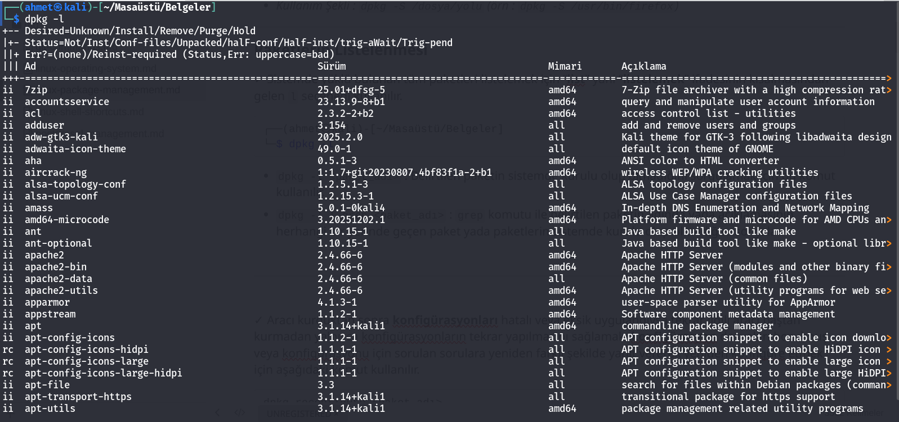
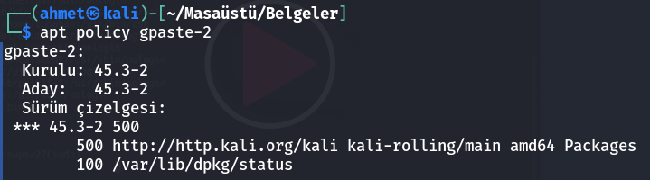
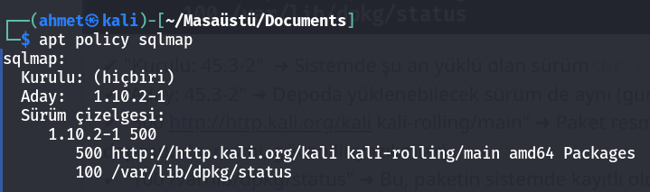
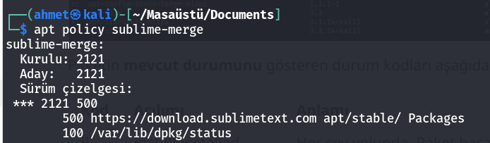

<p align="center">
  
<p/>


# Linux Paket Yönetimi

###### Son güncelleme : 02/2026

---

Paket yönetimi, sisteme yeni **yazılımların yüklenmesi** ve gerektiğinde var olanların **güncellenmesi, yeniden konfigüre edilmesi veya silinmesi** gibi işlemleri yönetir. Kullanmakta olduğumuz Linux dağıtımına bir yazılım yüklemek istediğimizde en kolay yöntem **paket yönetim aracını** kullanmaktır. Çünkü yazılımlar ilgili dağıtıma kolayca kurulup yönetilebilsin diye geliştiriciler tarafından yazılımın tüm dosyaları tek bir paket olarak bize sunuluyor. Bizler de bu paketler üzerinden ilgili yazılımları kolayca kurup yönetebiliyoruz. Dağıtımların genel olarak birbirlerinden ayrıştığı noktanın, başta **paket yönetim araçları** olmak üzere dağıtımlarda varsayılan olarak yüklü bulunan araçlardır. Debian tabanlı dağıtımlarda `apt` aracı kullanılır.
Çeşitli araçların mevcut dağıtımda sorunsuzca çalıştırılabilir güvenli paketlerini sunmak, dağıtımların en temel sorumluluklarının başında geliyor. Çünkü bizler sistemi yönetirken aslında sisteme yüklediğimiz araçları kullanıyoruz. Eğer aradığımız araçların **güncel güvenilir ve stabil sürümlerine** kolay erişemiyorsak ilgili dağıtımı kullanmak için bir sebep kalmıyor. Her bir kullanıcının bireysel olarak paket yönetimi ile boğuşması verimlilik açısından kesinlikle sürdürülebilir ve mantıklı değildir. Özellikle işletmeler güvenli ve güncel paket depolarına sahip olmayan dağıtımları kullanmayı kesinlikle istemezler. Dağıtımların en önemli sorumluluklarından biri de kullanıcılarına yazılımların tüm bağımlılıklarıyla birlikte güvenilir ve güncel paketlerin bulunduğu bir repo sunmaktır. Bu sayede bizler ekstra çaba sarf etmeden istediğimiz yazılımı mevcut sistemimize güvenli şekilde kurabiliyoruz.

---

## Debian Tabanlı Sistemlerde Paket Yönetimi

### » `dpkg`

Yalnızca indirmiş olduğumuz yani **lokal olarak** bilgisayarımızda mevcut olan “**.deb**” uzantılı paketleri kurabiliyoruz. Bu paketin, daha doğrusu kurduğumuz aracın çalışması için gereken harici paketler `dpkg` tarafından bulunup indirilmiyor. Bunu yapan `apt` aracıdır. Bizler `dpkg` aracını **lokal** paket yönetimi için kullanıyoruz. Yani bu durumda `dpkg` aracını kullanarak kurulum yapacaksak kurduğumuz paketin ihtiyaç duyduğu ek paketleri de tek tek bulup indirmemiz ve onları da `dpkg` aracını kullanarak kurmamız gerekiyor.

#### Paket Kurulumu

✓ Kurulum için `dpkg` aracının “**install**” yani “**kurma**” anlamına gelen `i` seçeneğinin ardından kurmak istediğimiz paketin ismini girmemiz gerekiyor. Paketin bulunduğu konumdan kurmak istediğimiz paketin ismini vererek aşağıdaki komutu çalıştırmalıyız.

```bash
dpkg -i <paket_adı.deb>
```

> ###### *Not : Aracın doğru şekilde çalışması için gereken ek paketler yani bağımlılıkları tek tek internetten indirip kurmamız gerekir.*
>
> ---

▪ Kurulan paketin kurulum yerlerini detaylı görüntülemek için:

```bash
dpkg -L <paket_adı>
```

---

#### Kurulu Paketin Kaldırılması

✓ Sistemimize kurmuş olduğumuz paketi silmek istersek `dpkg` aracının “**remove**” yani “**silmek - kaldırmak**” ifadesinin kısaltmasından gelen `r` seçeneği kullanılır.

```bash
dpkg -r <paket_adı>
```

> ###### *Not : Kaldırılan paket başka araç tarafından kullanılıyorsa hata alırız. Yine de diğer aracın bozulması pahasına paketi kaldırmak isiyorsanız `--force-all` yani zorlama seçeneğini kullanarak `dpkg --force-all -r <paket_adı>` komutu ile ilgili paketi kaldırmaya zorlayabilirsiniz.*
>
> ---

#### Kalıntıların Kaldırılması

✓ Aracın konfigürasyon dosyaları da dahil sistemden tamamen tüm dosyalarının kaldırılmasını istersek “**purge**” yani “**arındırmak**” anlamındaki `P` seçeneği kullanılır.

```bash
dpkg -P <paket_adı>
```

---

#### Paket Hakkında Bilgi Almak

✓ Henüz paketi kurmadan önce paketin içeriği hakkında bilgi almak istersek (boyut, versiyon, bağımlılıkları vb...) “**info**” ifadesinin kısaltmasından gelen `I` karakteri kullanır.

```bash
dpkg -I <paket_adı.deb>
```

---

▸ `dpkg -S dosya_yolu` (`--search`) komutu, bir dosyanın hangi debian paketi tarafından kurulduğunu bulmak için kullanılır.

> ###### *Kullanım Şekli : `dpkg -S /dosya/yolu` (örn : `dpkg -S /usr/bin/firefox`)*
>
> ---

#### Paketlerin Listelenmesi

✓ Sistemde yüklü bulunan tüm paketleri listelemek için “**list**” yani “**listelemek**” ifadesinin kısalmasından gelen `l` seçeneği kullanılır.

```bash
└─$ dpkg -l
```

> - `dpkg -l <paket_adı>` : Belirtilen paketin sistemde kurulu olup olmadığını sorgulamak için bu komut kullanılır.

> - `dpkg -l | grep <paket_adı>` : `grep` komutu ile belirtilen paketin adında yada açıklamasının herhangi bir yerinde geçen paket yada paketlerin sistemde kurulu olup olmadığını sorgular.



Paketin **mevcut durumunu** gösteren durum kodları aşağıdaki gibidir:

| **Kod** | **Açılımı**                   | **Anlamı**                                                   |
| ------- | ----------------------------- | ------------------------------------------------------------ |
| **ii**  | **i**nstall **i**nstalled     | Her şey yolunda. Paket başarıyla yüklendi ve sistemde kurulu. |
| **rc**  | **r**emove **c**onf_files     | Paket silinmiş (**removed**) ancak yapılandırma (**config**) dosyaları hala sistemde duruyor. |
| **un**  | **u**nknown **n**ot-installed | Paket sistem tarafından biliniyor ama hiç kurulmamış.        |
| **hi**  | **h**old **i**nstalled        | Paket kurulu ancak güncellenmemesi için "beklemeye" (hold) alınmış. |

---

#### Kurulu Paketleri Yeniden Yapılandırma

✓ Aracı kurduktan sonra **konfigürasyonları** hatalı veya eksik uygulandıysa tekrar ilgili aracı baştan kurmadan yalnızca konfigürasyonların tekrar yapılmasını sağlamak, **konfigürasyon** dosyaları bozulmuş veya konfigürasyonu için sorulan sorulara yeniden farklı şekilde yanıt vererek yeniden konfigure etmek için aşağıdaki komut kullanılır.

```bash
dpkg-reconfigure <paket_adı>
```

---

## » `apt`

Apt aracının ismi, “**a**dvanced **p**ackage **t**ool” yani “**gelişmiş paket aracı**” ifadesinin kısaltmasından geliyor. `apt` aracı repolarda paket arama ve otomatik bağımlılık çözümleme gibi özellikleri ile paket yönetimini bizler için oldukça kolay hale getiren gelişmiş paket yönetim aracıdır. Bu araç `dpkg` aracına oranla, kullanıcının işlerini daha da kolaylaştırmak üzere geliştirilmiştir. `apt` aracı paketlerin uzak sunucundan bağımlılıkları ile birlikte indirip kurulmasını sağlıyor. Ve diğer paket yönetim işlerini de bu araç üzerinden gerçekleştirebiliyoruz. `apt` aracı aslında kurulum ve kaldırma gibi paket yönetimi işleri için arka planda `dpkg` aracını kullanıyor. `apt` aracının avantajı, kurmak istediğimiz aracın paketini **repo** üzerinden otomatik bulması ve bu aracın ihtiyaç duyduğu diğer ek paketleri yani bağımlılıklarını da çözümleyip bunları da bulup kurmasıdır. Bu sayede biz bağlandığımız uzak sunucu depolarında olduğu sürece istediğimiz aracı kolayca kurabiliyoruz. Zaten repolar da bir aracın kurulması için gereken tüm bağımlılıkları içerecek şekilde düzenlendiği için `apt` aracı bütüncül olarak bizlere oldukça kolay bir paket yönetim imkanı sunuyor.

➜ `apt` yönetimi için birden fazla yardımcı araç bulunuyor, örneğin bu araçlardan başlıcaları; `apt-get` `apt-cache` ve `apt-file` araçlarıdır. Kısaca açıklamamız gerekirse;

› `apt-get`: aracını, paketleri indirmek, kurmak, güncellemek ve silmek için kullanıyoruz.

› `apt-cache`: aracını, repolarda paket araştırması yapmak için kullanıyoruz.

› `apt-file`: aracını ise paketlerin içindeki dosyaları aramak için kullanıyoruz.

> ###### Ayrıca sık kullanılan `apt-get` ve `apt-cache` araçlarını tek bir araçta birleştiren `apt` adlı bir yardımcı araç da bulunuyor. Yani `apt-get` ve `apt-cache` komutları ile uzun uzadıya komut girmek yerine yalnızca `apt` komutu ile aynı işlevleri de yerine getirebiliyoruz.
>
> ---

#### Paket Listesinin Güncellenmesi

▸ `apt-get update` | `apt update` : Repolardaki paketler kurulmadan evvel en güncel index bilgisini almak için kullanılır. Yani paket listesinin en güncel halini alıyoruz.

▸ `apt-get upgrade` | `apt upgrade` : Yazılım paketlerini en güncel sürümlerine yükseltmek için kullanılır. Yani paketleri güncellemek için kullanıyoruz.

> ###### *Eğer amacınız tüm paketleri değil de spesifik olarak bazı paketleri güncellemek ise, güncellemek istediğiniz paketi tekrar kurmak üzere `apt install <paket_adı>` şeklinde komutunuzu girebilirsiniz. Bu sayede ilgili aracın en son sürümüne güncelleme yapılacaktır. Zaten `apt` aracı sistemde aynı isimli paket olduğunu fark edeceği için yalnızca ilgili paketi üst sürüme yükseltmeyi teklif ediyor. `apt --only-upgrade install <paket_adı>` komutu ile de tek bir paket güncelleyebilirsiniz.*
>
> ---

#### Paketlerin Araştırılması

▸ `apt-cache search <paket_adı>` | `apt search <paket_adı>` : Depoda paket arama, yani bir paketi kurmadan önce ilgili paketin repoda hangi isimde tutulduğunu öğrenmek için kullanılır.

#### Paket Hakkında Ayrıntılı Bilgi

▸ `apt-cache show <paket_adı>` | `apt show <paket_adı>` : Paket hakkında ayrıntılı bilgi almamızı sağlar.

#### Paketlerin Kurulumu

▸ `apt-get install <paket_adı>` | `apt install <paket_adı>` : Depo üzerinden paketin bağımlılıkları ile beraber online kurulum yapmak için kullanılır.

#### Paketlerin Kaldırılması

▸ `apt-get remove <paket_adı>` | `apt remove <paket_adı>` : Sistemimize kurmuş olduğumuz paketi kaldırmak için kullanılır.

> ###### *Not : Sistemdeki tüm paketleri tarar ve başka bir araç tarafından kullanılmayan, artık gerek duyulmayan bağımlılıklarının da kaldırılması için `apt autoremove` komutu kullanılır. Eğer bu komutun sonuna `-y` argümanını eklersem bana sorulmadan ilgili işlem gerçekleşmiş olacaktı.*
>
> ---

▸ `apt-get remove --purge <paket_adı>` | `apt purge <paket_adı>` : Paketi ve konfigürasyon dosyalarını sistemden tamamen kaldırmak için.

🧨 `apt remove` sadece paketin kendisini kaldırır, ayar dosyalarını bırakır.

```bash
sudo apt remove <paket_adı>
```

> → Paket silinir<br />→ `/etc/paket_adı/` gibi ayar dosyaları kalır

---

🧹 `apt remove --purge` komutu, paketi ve tüm ayar/config dosyalarını beraber siler.

```bash
sudo apt remove --purge <paket_adı>
```

> ✔ Paket kaldırılır<br />✔ /etc/, /var/ altındaki konfigürasyonlar temizlenir<br />✔ Kullanıcı ayar dosyalarının çoğu silinir<br />✔ Sistem, o paket yüklenmemiş haline döner

---


🔥 `purge` Bazı bozuk paketlerde veya çakışmalarda “purge” kullanılır.

> - Bozuk GNOME eklentileri
> - Yanlış tema paketleri
> - Config bozan programlar
> - Kalan ayarlar nedeniyle tekrar kurulamayan paketler

```bash
sudo apt purge <paket_adı>
```

> → tüm sorunları sıfırlar.

---


🛑 Dikkat etmen gereken tek şey `purge` evdeki dosyaları silmez, sadece programın **sistem ayarlarını** siler.

Güvenlidir ama şu paketleri `purge` etme:

> ❌ systemd<br />❌ kali-desktop-\*<br />❌ linux-image-\* (kernel)<br />❌ apt veya dpkg<br />❌ python3 (sistem bileşeni)

---


🧹 Kullanılmayan bağımlılıkları silmek için:

```bash
sudo apt autoremove
```

> - Artık hiçbir paket tarafından kullanılmayan bağımlılıkları temizler
> - Gereksiz kütüphaneleri siler
> - Sistemi hafifletir

---


🎯 Genelde önerilen sıralama:

```bash
sudo apt remove --purge <paket_adı>
sudo apt autoremove
```

---

⚡ `autopurge` kullanmak çoğu durumda güvenlidir ve `autoremove` + `purge` ile aynı işi tek adımda yapar.

```bash
sudo apt remove --purge <paket_adı>
```

> ✔ Paketin kendisini + paketin kendi config dosyalarını siler.  Ancak bağımlılıkları silmez.

```bash
sudo apt autoremove
```

> ✔ Artık kullanılmayan bağımlılık paketlerini siler fakat bu bağımlılıkların ayar dosyaları kalır (yani sadece `remove` yapar, `purge` değil).

› Bu yüzden sistemde zamanla “**config dosyaları**” birikebilir.

```bash
sudo apt autopurge
```

> ✔ Bu komut, `autoremove + purge` birleşimidir.

Yani:

> ✓ Artık kullanılmayan bağımlılıkları kaldırır

> ✓ Onların config dosyalarını da siler

> ✓ `autopurge` yalnızca otomatik kurulan (“auto-installed”) ve şuan kullanılmayan paketlere işlem yapar. Bu yüzden yanlış paketi silmez, tıpkı `autoremove` gibi güvenlidir.

🌿 Güvenli tercih

```bash
sudo apt remove --purge <paket_adı>
sudo apt autoremove
```

🌿 Temiz sistem

```bash
sudo apt remove --purge <paket_adı>
sudo apt autopurge
```

---

### Bozuk paketleri tespit etmek, düzeltmek ve temizlemek için kullanılan komutlar.

#### 🔍 1. Bozuk Paket Var mı Kontrol Et.
>
> ```bash
> sudo apt --fix-broken install
> ```
>
>**➡ Bozuk veya yarım kalmış paket varsa gösterir ve düzeltir.**
>
> ------

#### 🔎 2. Kırık Bağımlılıkları Kontrol Et
>
> ```bash
> sudo dpkg --configure -a
> ```
> **➡ Yarım kalan kurulumları tamamlar.**
>
> ------

#### 📦 3. Eksik veya Kırık Dosyaları Tespit Et (detaylı)
>
> ```bash
> sudo apt install -f
> ```
>
> **➡ Eksik bağımlılık varsa otomatik kurar.**
>
> ------

#### 🗂 4. Depoda “tutulmuş” yani kilitli paket var mı?
>
> ```bash
> apt-mark showhold
> ```
>
> **➡ Burada bir şey çıkıyorsa, paket güncellenemiyordur.**
>
> ------

#### 🧹 5. Bozuk / Artık Kullanılmayan Paketleri Listele
>
> ```bash
> sudo apt autoremove --purge
> ```
>
> **➡ Bu kaldırma işlemi yapar ama listelemeden kaldırmaz, önce liste görmek istersen:**
>
> ```bash
> sudo apt autoremove --dry-run
> ```
>
> ------

#### 🛑 6. Depolardaki tutarsızlık hatalarını kontrol et
>
> ```bash
> sudo apt update --fix-missing
> ```
>
> ------

#### 🧰 7. APT’nin Cache’inde bozuk `.deb` dosyası var mı?
>
> ```bash
> sudo apt clean
> sudo apt update
> ```
>
> ------

🛡 **Bi paketi yüklemeden önce güvenli olup olmadığı, hangi repoda bulunduğu gibi bilgiler şu komutla kontrol edilir.**

```bash
apt policy <paket_adı>
```



> ✔ "Kurulu: 45.3-2"  ➜ Sistemde şu an yüklü olan sürüm<br />✔ "Aday: 45.3-2" ➜ Depoda yüklenebilecek sürüm de aynı (güncel versiyon)<br />✔ "500 http://http.kali.org/kali kali-rolling/main" ➜ Paket resmi kali deposundan geliyor (main deposunda, resmi, güvenilir yazılımlar)<br />✔ "100 /var/lib/dpkg/status" ➜ Bu, paketin sistemde kayıtlı olduğunu gösteriyor<br />✔ Sonuç olarak `gpaste-2` ➜ Paketinin kaynağı ve sürümü tamamen temiz.

------




> ✔ "Kurulu: (hiçbiri)"  ➜ Sistemde şu an yüklü değil<br />✔ "Aday: 1.10.2-1" ➜ Depoda yüklenebilir olan güncel sürüm<br />✔ "http://http.kali.org/kali kali-rolling/main" ➜ Paket resmi kali deposundan geliyor (main deposunda, resmi, güvenilir yazılımlar)<br />✔ Sonuç olarak `sqlmap` ➜ Paketinin kaynağı ve sürümü tamamen temiz.

---



> ✔ "Kurulu: (hiçbiri)"  ➜ Sistemde şu an yüklü değil<br />✔ "Aday: 1.10.2-1" ➜ Depoda yüklenebilir olan güncel sürüm<br />✔ "https://download.sublimetext.com apt/stable" ➜ Paket sublimetext.com deposundan geliyor (stabil güvenilir yazılımlar)<br />✔ Sonuç olarak `sublime-merge` ➜ Paketinin kaynağı ve sürümü tamamen temiz.

---

### Bozuk Bağımlılıkların Düzeltilmesi

⬧ `apt --fix-broken install` | `apt-get install -f` : APT'yi mevcut kırık paketleri düzeltmeye ve farkında olmadan bozduğumuz ya da sildiğimiz paketleri gerekirse eksik bağımlılıkları yüklemeye yönlendirir, bağımlılıkları çözülmemiş veya eksik olan paketleri belirleyip tekrar yükler.

⬧ `apt-get dist-upgrade` : Komutu ile sistemde yüklü bulunan bir paketin **bağımlılıkları arttıysa veya azaldıysa** güncelleme yapılırken aynı zamanda varsa yeni paketlerin kurulması ve ayrıca artık gerekli olmayan paketlerin de kaldırılması mümkün oluyor.
>###### *Not : `apt full-upgrade` komutu sayesindede güncelleme esnasında bağımlılık sorunlarının ilgili paket için otomatik olarak çözülmesi sağlanır.*
>
> ---

### 🧹 Gereksiz Paketlerin Silinmesi

▪ İndirilen paketler daha sonra tekrar kullanılma ihtimaline karşı diskte tutuluyorlar. Yani biz bir aracı kurmak için komut girdiğimizde o aracın paketi tekrar kullanılmak üzere diskte tutuluyor. Bu paketler `/var/cache/apt/archives/` dizini altında tutuluyor. Bunları silmek için de `apt` aracını kullanabiliriz. Eğer `apt-get clean` ya da `apt clean` komutlarını kullanırsak bu paketlerin hepsi silinmiş olacak.

---

▪ Eğer indirmiş olduğumuz `.deb` uzantılı paketi `apt` aracı ile kurarsak, internet bağlantımız da olduğu için `apt` aracı bu paketin bağımlılıklarını da otomatik çözümleyip kuracak. Yani lokal olarak bulunan paketleri dahi `apt` aracı ile kurabiliyoruz.

```bash
apt install ~/Downloads/<paket_adı.deb>
```

---

▪ `apt-cache depends <paket_adı>` : Paketin çalışması için gerekli olan bağımlılıkları listeler.

---

▪ `.deb` dosyasını kurmadan bağımlılıkların sistemde eksik olup olmadığını kontrol etmek için:

```bash
sudo apt-get install -f ./<paket_adı.deb> --dry-run
```

> - `--dry-run` : Kurulum yapmaz, sadece simülasyon yapar.
> - Eksik bağımlılıkları listeler.

---

▪ Bağımlılık ağacını detaylı görüntülemek için aşağıdaki komut kullanılır.

```bash
debtree ./<paket_adı.deb>
```

▪ `apt list` | `apt-cache pkgnames` : Depodaki mevcut tüm paketleri listeler.

▪ `apt list --upgradable` : Sistemdeki güncellenebilir paketleri listeler.

▪ `apt download <paket_adı>` | `apt install <paket_adı> -d` : İsmi verilen paketi repodan, bulunduğun konuma **kurmadan sadece indirme** işlemi yapar.

> - **Paketi ve tüm bağımlılıklarını sadece indirir**
> - `.deb` dosyalarını `/var/cache/apt/archives/` klasörüne koyar
> - Fakat **kurulum yapmaz**
> - Sistemde hiçbir dosya değişmez

Yani **offline kurulum** için paketleri önceden indirme komutudur.
>
>- İnternet yokken apt, “**önceden indirilmiş**” diyerek yeniden indirmez.

> ------

### Kaynak Listesi

APT aracının doğru paketleri bulabilmesi için, APT aracının ilgili repo adreslerini biliyor olması gerekir. İşte bu repo adresleri sistem üzerindeki “**sources.list**” yani “**kaynak listesi**” dosyasında belirtiliyor. APT aracı bu kaynak listesine bakıp sorgulama yapacağı repo adreslerini öğreniyor.

Debian tabanlı dağıtımlarda kaynak listesi `/etc/apt` dizini altındaki `sources.list` isimli dosyadır. Bu dosyada apt aracının paketleri edinmek için hangi adreslere bakması gerektiğini belirten bağlantılar vardır. Yani repoların adresi bu `sources.list` dosyası içinde tanımlanmıştır.

### Debian/Kali/Ubuntu için “LOCAL REPO (yerel depo)” oluşturma adımları

#### ✅ LOCAL REPO (dpkg-scanpackages)

Bu yöntem APT’nin anlayacağı basit bir depo oluşturur. `.deb` dosyalarını bir klasöre koyarsın → APT bunu depo gibi görür.

------

#### ➤ 1. Klasör oluştur

```bash
mkdir -p ~/localrepo
```

------

#### ➤ **2. Eklemek istediğin .deb dosyalarını bu klasöre koy**

Örnek:

```bash
cp paket1.deb paket2.deb ~/localrepo/
```

------

#### ➤ **3. Depoyu oluşturmak için gerekli araçları yükle**

```bash
sudo apt install dpkg-dev
```

------

#### ➤ **4. Packages dosyasını oluştur (APT’nin okuduğu index)**

```bash
cd ~/localrepo
dpkg-scanpackages . /dev/null | gzip -9c > Packages.gz
```

Sonuç:
 › `~/localrepo/` içinde **Packages.gz** oluşur → APT’nin görmek istediği şey.

------

#### ➤ **5. Bu repo’yu APT kaynaklarına ekle**

Bir repo kaynağı dosyası oluştur:

```bash
sudo nano /etc/apt/sources.list.d/localrepo.list
```

İçine şunu yaz:

```bash
deb [trusted=yes] file:///home/ahmet/localrepo ./
```

> `[trusted=yes]` → GPG imzası gerekmesin diye.

Kaydet.

------

#### ➤ **6. APT’yi güncelle**

```bash
sudo apt update
```

› Ve artık sistem senin klasörü **depo gibi** görüyor.

------

#### ➤ **7. Paketi normal apt komutu ile kur**

Örneğin:

```bash
sudo apt install paket1
```

APT artık `.deb` dosyasını **internet yerine yerel repo’dan** alır.

------

#### ⛳ NOT

Her yeni `.deb` eklediğinde tekrar şu komutu çalıştırırsın:

```bash
cd ~/localrepo
dpkg-scanpackages . /dev/null | gzip -9c > Packages.gz
```

› APT listeyi günceller ve yeni paketler görünür.

---

## Red Hat Tabanlı Dağıtımlarda Paket Yönetimi

> **Debian tabanlı dağıtımlarda kullandığımız** `dpkg` **ve** `apt` **araçlarının Red Hat tabanlı dağıtımlardaki karşılığı sırasıyla** `rpm` **ve** `yum` **araçlarıdır. Debian tabanlı dağıtımlar için hazırlanmış olan paketler** `.deb` **uzantılı iken, Red Hat tabanlı dağıtımlar için hazırlanmış olan paketler** `.rpm` **.** `.rpm` **uzantılı paketleri yönetmek için de** `rpm` **aracını kullanıyoruz.** `rpm` **aracı tıpkı** `dpkg` **aracı gibi paketlerin lokal olarak yönetilebilmesini sağlıyor.** `yum` **aracı ise tıpkı** `apt` **aracı gibi repolar üzerinden paketlerin ve bağımlılıkların kolayca yönetilebilmesini sağlıyor.** `yum` **aracı da aslında arkaplanda** `rpm` **aracını kullanarak repolardan paketlerin bulunması bağımlılıkların otomatik olarak çözümlenmesi gibi pek çok faydalı işlevi sunan üst seviyeli bir paket yönetim aracıdır.**

> **Kurulu tüm paketleri görmek için:**

```bash
rpm -qa | less
```

> `rpm -i <paket_adı.rpm>` **: Lokalde var olan `rpm` uzantılı bir paketi kurmak için kullanılır.**

> **Sistemde kurulu olan bir paketi kaldırmak için** `rpm` **komutunun** `-e` **seçeneğinden sonra ilgili paketin ismini girmemiz yeterli. Buradaki** `e` **seçeneği “erase” yani “silmek” ifadesinin kısaltmasıdır.**

> **Eğer işlemler hakkında detaylıca çıktı almak istersek “verbose” ifadesinin kısaltması olan** `v` **seçeneğini kullanabiliriz. Eğer bu seçeneği eklemezseniz araç silinir ancak herhangi bir çıktı almazsınız.**

---

### YUM ve DNF

> `yum` **aracı tıpkı** `apt` **aracı gibi paketlerin bulunması, kurulması, bağımlılıklarının otomatik olarak çözümlenmesi, güncellenmesi, kaldırılması gibi paket yönetimi işlerini bizler için kolay hale getiren Red Hat tabanlı dağıtımlarda kullanılan kararlı yapıdaki paket yönetim aracıdır. Fakat bu aracın daha gelişmiş versiyonu olan** `dnf` **aracını öğrenmek daha makul bir yaklaşım olacaktır.**

> **Repolardaki paketlerde araştırma yapmak için** `dnf search <paket-adı>` **komutu kullanılır.**

> **Depodan paket kurmak için** `dnf install <paket-adı>` **şeklinde komut girebiliyoruz.**

> `dnf check-update` **: Sistemde kurulu paketlerin güncellemelerini kontrol etmek için kullanılır. Tüm paketleri kontrol etmek yerine dilersek** `check-update` **komutundan sonra paket ismi girip spesifik paket güncellemesini de kontrol edebiliriz.**

> **Eğer yalnızca kontrol etmek yerine güncellemelerin yüklenmesini de istiyorsak** `dnf update` **komutunu kullanabiliyoruz.**
>
> **Spesifik olarak tek bir paketi güncellemek istersek** `sudo dnf install <paket-adı>` **komutu ile varsa ilgili aracın güncelleştirilmesini sağlayabiliriz.**

> `dnf remove <paket-adı>` **: Paket kaldırmak için bu komut kullanılır.**

> **Gereksiz paketler kurulmak üzere indirilen ve artık ihtiyaç duyulamayan paketlerin silinmesi için** `sudo dnf clean all` **komutunu kullanabiliyoruz.**

---

> **Alien komutu ile deb/rpm paket dönüşümü yapılabilmektedir.**
> **Bir yazılımın** `rpm` **paketi var fakat** `deb` **formatında paketi yoksa** `alien` **komutu sayesinde** `rpm` **paketinden** `deb` **paketine dönüşüm yapılabilir. Tam tersi olarak** `deb` **paketinden de** `rpm` **paketi yapılabilmektedir.**

| İşlem                      | Komut                                                        | Açıklama                               |
| -------------------------- | ------------------------------------------------------------ | -------------------------------------- |
| `.deb` → `.rpm` dönüştürme | `sudo alien -r paket.deb` veya `sudo alien -cr paket.deb` | `-r` rpm üretir, `-c` scriptleri korur |
| `.rpm` → `.deb` dönüştürme | `sudo alien -d paket.rpm` veya `sudo alien -cd paket.rpm` | `-d` deb üretir, `-c` scriptleri korur |

---

### Kaynak Koddan Derleyerek Kurulum

> **Kuracak olduğumuz yazılımın** `.tar.gz` **uzantılı arşiv dosyasını temin etdikten sonra dosyayı klasöre çıkarıyoruz. Burada “README” ve “INSTALL” gibi isimlerde metin dosyaları bulunuyor. İstisnalar hariç neredeyse tüm araçların kaynak kodlarında, aracın kurulumu ve konfigürasyonları ile ilgili bilgi sunan bu tür dosyalar zaten geliyor. Genel olarak kurulumu ele alıyorum ancak daha önce de söylediğim şekilde en doğru bilgiyi geliştiricinin sunduğu** `install` **veya** `readme` **gibi dosyalardan öğrenebilirsiniz. Burada listelenen dosyalar elbette ilgili yazılıma göre değişiklik gösterir. Ancak genel olarak bilgi içeren metin dosyalarının yanında kurulum için ön ayarlamaları yapan** `configure` **dosyası ve kurulum işlemini kolaylaştıran genellikle** `install.sh` **isminde kurulum betiği ile karşılaşırsınız. Konfigürasyonlar için** `configure` **dosyasını çalıştırıyoruz. Ayrıca buradaki** `makefile` **dosyaları da gerekli konfigürasyon ayarlamaları yapıldıktan sonra ilgili aracın derlenip kurulması için kullanılıyor.**

> - **İlk olarak sıkıştırılmış dosyayı açıyoruz. Açılan klasörün içine girip, orada ilk olarak** `./configure` **komutu ile "configure" dosyasını çalıştırıyoruz.**
>   - **İlk olarak konfigürasyon dosyasını çalıştırdığımız için mevcut sistemin derleme işlemine uygun olup olmadığı kontrol ediliyor. Dolayısıyla uyumlu değilse hata çıktısında belirtilen uyarıları araştırıp çözdükten sonra derleme adımlarına devam etmelisiniz.**
>   - **Bu işlem sonucunda bulunulan dizinde inşa işleminin nasıl yürüyeceğini tarif eden `Makefile` adlı bir dosya oluşur.**
> - `make` **komutu ile derleme işlemini gerçekleştiyoruz.**
>   - **Burada aslında** `./configure` **komutu ile oluşan** `Makefile` **adlı dosyayı** `make` **adlı bir program aracılığıyla çalıştırmış oluyoruz.** `make` **bir sistem komutudur. Bu komutu yukarıdaki gibi parametresiz olarak çalıştırdığımızda** `make` **komutu, o anda içinde bulunduğumuz dizinde bir** `Makefile` **dosyası arar ve eğer böyle bir dosya varsa onu çalıştırır. Eğer bir önceki adımda çalıştırdığımız** `./configure` **komutu başarısız olduysa, dizinde bir** `Makefile` **dosyası oluşmayacağı için yukarıdaki** `make` **komutu da çalışmayacaktır. O yüzden derleme işlemi sırasında verdiğimiz komutların çıktılarını takip edip, bir sonraki aşamaya geçmeden önce komutun düzgün sonlanıp sonlanmadığından emin olmamız gerekiyor.**
>   - `make` **komutunun yaptığı iş, programın sisteminize kurulması esnasında sistemin çeşitli yerlerine kopyalanacak olan dosyaları inşa edip oluşturmaktır.**
> - **Şimdi derlenmiş olanları kurmak için** `sudo make install` **komutunu girmeliyiz.**
>   - **Kuracak olduğumuz programın eski sürümü de sistemde kalsın istiyorsak** `make install` **yerine** `make altinstall` **komutu kullanılır.** `make altinstall` **komutu, program kurulurken klasör ve dosyalara sürüm numarasının da eklenmesini sağlar. Böylece yeni kurduğunuz program, sistemdeki eski sürümü silip üzerine yazmamış olur ve iki farklı sürüm yan yana varolabilir. Eğer** `make altinstall` **yerine** `make install` **komutunu verirseniz sisteminizde zaten varolan eski bir sürüme ait dosya ve dizinlerin üzerine yazıp silerek o sürümü kullanılamaz hale getirebilirsiniz.**
> - **Kurulum için derlenmiş ama artık ihtiyaç duymadığımız dosyaları** `make clean` **komutu ile temizleyebiliriz.**

---

> **Kaynak koddan kurulum yaparken** `--prefix` **parametresiyle programı istediğin yere kurabilirsiniz:**

```bash
./configure --prefix=$HOME/
make
sudo make install
```

---

### Linux’ta programın sisteme nasıl kurulduğuna göre dosyalar farklı dizinlere gider.


#### 🧩 1.Depodan (APT, DNF vs.) Kurulan Programlar:

```bash
sudo apt install <paket_adı>
```

🔹 **Bu programlar paket yöneticisi tarafından sistem standart dizinlerine kurulur:**

| Tür                       | Dizin                    | Açıklama                                             |
| ------------------------- | ------------------------ | ---------------------------------------------------- |
| Çalıştırılabilir dosyalar | `/usr/bin/` veya `/bin/` | Terminalden `program-adı` yazınca çalışan dosya burada olur |
| Kütüphaneler              | `/usr/lib/` veya `/lib/` | Paylaşılan `.so` dosyaları                           |
| Yapılandırma dosyaları    | `/etc/`                  | Sistem genel ayar dosyaları                          |
| Veri / kaynak dosyaları   | `/usr/share/`            | İkonlar, temalar, yardım dosyaları                   |
| Man sayfaları             | `/usr/share/man/`        | `man program-adı` komutu için içerikler                     |

> 💡 **Paket yöneticisi (ör. `apt`, `dnf`) tüm dosyaları bilir, bu yüzden kaldırmak için:**

```bash
sudo apt remove <paket_adı>
```

------

#### 📦 2.`.deb` Dosyasından Kurulan Programlar:

```bash
sudo dpkg -i <paket_adı.deb>
```

🔹 `.deb` **paketleri de aynı dizin yapısını kullanır, çünkü** `dpkg` **sistemin kendi paket yöneticisidir. Yani genelde yine şu klasörler kullanılır:**

- `/usr/bin/` → çalıştırılabilir dosyalar
- `/usr/share/` → ikonlar, dil dosyaları
- `/usr/lib/` → kütüphaneler
- `/etc/` → ayarlar


> 💡 `.deb` **dosyası sistemde hangi dosyaları nereye koyduğunu görmek için:**
>
> ```bash
> dpkg -c <paket_adı.deb>
> ```
>
> veya kurulduktan sonra:
>
> ```bash
> dpkg -L <paket_adı>
> ```

------

#### ⚙️ 3.Kaynak koddan (örneğin `./configure && make && make install` adımlarıyla) derleyip kurduğun programlar:

```bash
./configure
make
sudo make install
```

🔹 **Bu yöntem sistem paket yöneticisini bypass eder (haber vermez), bu yüzden nereye kurulduğunu manuel takip etmek gerekir. Varsayılan dizinler genelde:**

| Tür                       | Dizin               | Açıklama                                          |
| ------------------------- | ------------------- | ------------------------------------------------- |
| Çalıştırılabilir dosyalar | `/usr/local/bin/`   | Sistemdeki kullanıcı yazılımları için ayrılmıştır |
| Kütüphaneler              | `/usr/local/lib/`   |                                                   |
| Ayarlar                   | `/usr/local/etc/`   |                                                   |
| Veri / kaynak dosyaları   | `/usr/local/share/` |                                                   |

🔹 **Kurulum dizininde** `uninstall` **varsa yani** `Makefile` **içinde bir** `uninstall` **hedefi varsa kurulan dosyaları aşağıdaki komut sistemden kaldırır.**

```bash
sudo make uninstall
```

------

> 📁 **Genellikle kaynak koddan derlenen programlar** `/usr/local/` **altına kurulur. Kurarken hangi dosyalar nereye gittiğini görmek için:**

```bash
sudo make install > install.log
```

------

🧠 **Eğer program** `sudo make install` **komutu yerine** `sudo checkinstall` **komutu ile kurulduysa (yani** `.deb` **paketi oluşturup yükler dolayısıyla yazılım paket yöneticisine kayıt olur, aşağıdaki komutla kaldırabilirsiniz):**

```shell
sudo apt remove <paket_adı>
```

> 🔹 **Bu yöntem Debian/Pardus/Ubuntu tabanlı sistemlerde çok daha kontrollüdür, çünkü sistem paket yöneticisine kaydedilir.**

------

#### Linux’ta kurulu bir programın hangi paket ile kurulduğunu öğrenmek için:

**Programın Yolunu Bulma**

```bash
which program_adı
```

**veya**

```bash
whereis program_adı
```

**Örnek:**

```bash
which nginx
# /usr/sbin/nginx
```

Bu yol, paketi bulmak için ana girdidir.

------

#### Debian / Ubuntu / Kali (apt / dpkg)

**Dosya Hangi Pakete Ait?***

```bash
dpkg -S /usr/sbin/nginx
```

**Çıktı:**

```bash
nginx-core: /usr/sbin/nginx
```

**Paket Kurulu mu?**

```bash
dpkg -l | grep nginx
```

**Paket Bilgisi**

```bash
apt show nginx
```

------

#### Red Hat / CentOS / Fedora (dnf / rpm)

```bash
rpm -qf /usr/sbin/nginx
```

**Paket detayları:**

```bash
rpm -qi nginx 
```

---


###### Referans ve Katkılar: Bu belgedeki belirli bilgiler [Linux Dersleri](https://www.linuxdersleri.net/) üzerinden referans alınarak derlenmiştir.	
