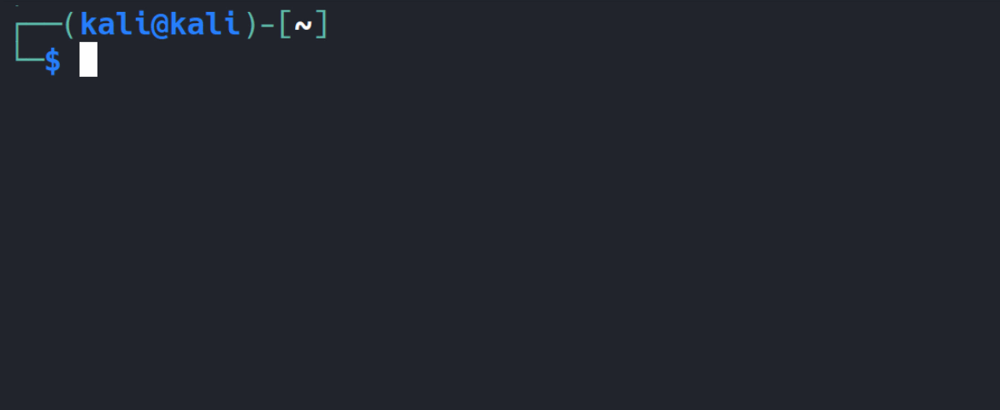
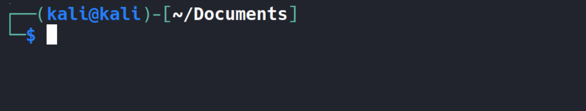
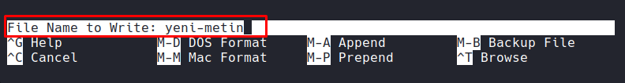

# ⚙️ Bash Terminal Kısayolları

## İmleç Kısayolları

| Kısayol  | Açıklama                                         |
| -------- | ------------------------------------------------ |
| `Ctrl + A` | İmleci satırın en başına götürür                 |
| `Ctrl + E` | İmleci satırın en sonuna götürür                 |
| `Ctrl + B` | Bir karakter sola yani geri (backward) gider |
| `Ctrl + F` | Bir karakter sağa yani ileri (forward) gider    |
| `Alt + B`  | Bir kelime sola yani geri (backward) gider  |
| `Alt + F`  | Bir kelime sağa yani ileri (forward) gider      |
| `Ctrl + P` | Önceki komutu gösterir (history up) yani ⬆ (yukarı ok) |
| `Ctrl + N` | Sonraki komutu gösterir (history down) yani ⬇ (aşağı ok) |
| `Ctrl + U` | İmleçten satır başına kadar kesme işlemi yapar   |
| `Ctrl + K` | İmleçten satır sonuna kadar kesme işlemi yapar   |
| `Ctrl + W` | İmleçden önceki kelimeyi keser     |
| `Ctrl + Y` | Son kesilen metni yapıştırır                     |
| `Ctrl + L` | Terminal ekranını temizler                       |

## Düzenleme Kısayolları

| Kısayol           | Açıklama                                         |
| ----------------- | ------------------------------------------------------------ |
| `Alt + Backspace` | İmleçten önceki kelimeleri silmek için kullanılır            |
| `Alt + D`         | İmleçten sonraki kelimeleri silmek için kullanılır           |
| `Ctrl + _`        | Silinen karakter veya kelime öbeklerini geri getirmek için kullanılır |
| `Alt + T`         | Kelimelerin yerini değiştirmek için kullanılır               |

## Otomatik Tamamlama

Bash kabuğunda etkileşimli kabuk kullanımını kolaylaştırmak için “**otomatik tamamlama**” özelliği bulunuyor. Bu özellik sayesinde komutların ve dosya klasör isimlerinin **tab** tuşuna basıldığında otomatik olarak kabuk tarafından tamamlanması mümkün oluyor.
Örneğin, `pwd` komutunu yazarken yalnızca "pw" yazıp **iki kez tab** tuşuna basarsak “pw” ile başlayan kullanılabilir komutların bir listesini alırız.



Otomatik tamlama sadece **komutlar** için değil **dosya** veya **dizinler** içinde geçerlidir. Dosyayı okumak için `cat` komutunu kullandığımda dosyanın adını hatırlamıyorsam, mevcut konumda kullanabileceğim dosyası listelemek için **iki kez tab** tuşuna basmam yeterli. Ayrıca dosya isminin birazını girip tekrar tab tuşuna bastığımda dosya ismi de otomatik olarak tamamlanacaktır.



## Geçmiş Kısayolları

| Kısayol     | Açıklama                                          |
| ----------- | ------------------------------------------------- |
| `history`   | Geçmişde girilen bütün komutların listesini verir |
| `history 5` | Geçmi   şde girilen son beş komutun listesini verir  |
| `!!`        | En son girilen komutu çağırır                     |
| `!SIRA-NO`  | Sıra numarası verilen komutu geçmişten çağırır    |
| `Ctrl + R`  | Geçmiş listesinde arama yapar                     |
| `Ctrl + G`  | Geçmiş listesi aramasını sonlandırır              |

> Geçmiş listesi her bir kullanıcının kendi ev dizininde `.bash_history` isimli dosyada tutuluyor.  Boşluk bırakılarak girilen komutlar bu listeye dahil edilmez.
>
> ---

## Alias (Takma İsim)

Uzun ve sık kullanılan komutları tek bir kısa takma isimle tanımlayıp, bu takma isim üzerinden o komuta kolayca ulaşabiliyoruz.

```bash
alias bas="echo 'bunu epey uzun bir komut olarak varsayın'"
```

Konsola `bas` yazdığımda buradaki `echo` komutu çalışıp konsola çıktıyı bastıracak. Tanımlamış olduğumuz takma isim sadece geçerli konsol içindir. Sistemi yeniden başlattığımızdada bu takma isim geçersizdir. Örneğin kendi kullanıcı hesabımdaki tüm etkileşimli kabuklarda bu takma isim geçerli olsun istersem, kendi ev dizinimdeki `.bashrc` dosyasına bu takma ismi eklemem gerekiyor. Benzer şekilde tüm kullanıcılarda geçerli olması için de `/etc/bash.bashrc` ya da `/etc/bashrc` dosyalarından hangisi mevcutsa ona ekleyip, tanımladığım takma isimin tüm kullanıcılar tarafından ortak şekilde kullanılabilmesini sağlayabiliriz.

> Mevcut kabuk üzerinde tanımlı olan takma isimleri görmek istersek `alias` komutunu kullanmamız yeterli.

> Mevcut kabuktan bir takma isimi kaldırmak isterseniz `unalias` komutunun ardından kaldırmak istediğiniz takma isimi girmeniz yeterli.

---

# 🧩 Nano Kısayolları

| Kısayol                 | Açıklama                     |
| ----------------------- | ---------------------------- |
| `Ctrl + O`              | Dosyayı kaydet (write out)   |
| `Ctrl + X`              | Çıkış (exit)                 |
| `Ctrl + G`              | Yardım menüsünü aç           |
| `Ctrl + K`              | Satırı kes                   |
| `Ctrl + U`              | Kesilen satırı yapıştır      |
| `Ctrl + W` veya `Ctrl + F` | Metin üzerinde arama yapar |
| `Ctrl + R` | Mevcut dosyaya başka bir dosyanın içeriğini ekleme |
| `Ctrl + \`              | Metin değiştirme (replace)   |
| `Alt + U` | Yaptığımız değişiklikleri geri almak için |
| `Alt + E` | Geri aldığımız bir değişikliği tekrar ileri almak için |
| `Alt + N` | Satırları numaralandırır |
| `Ctrl + C`              | İmleç konumunu göster        |
| `Ctrl + J`              | Paragrafı hizala (justify)   |
| `Ctrl + T`              | Komut çalıştırmak için |
| `Alt + A` | Panodan yapıştırır |
| `Ctrl + _`              | Belirli bir satıra git       |

###### Not : Nano aracından çıkmadan dosyayı kaydedeceğimiz dizini belirlemek için dosya sistemi hiyerarşisinde `Ctrl + T` tuşuna basıp gezinebiliriz. Bunun için öncelikle dosyayı kaydetmek istediğimizi `Ctrl + O` tuşu ile belirtmemiz gerekir.



###### Bize dosyayı hangi isimde kaydetmek istediğimiz sorulurken, `Ctrl + T` tuşu ile dosya sistemi üzerinde gezinebiliriz.

###### Sayfada hızlı gezinti yapmak için `Ctrl` tuşuna basıp yön tuşlarını kullanablirsiniz.

---

# 🧠 Vim / Vi Kısayolları

> **Vim’de iki temel mod vardır:**
>
> - **Normal mod:** Komutlar için
> - **Insert mod:** Yazı yazmak için (`i` ile girilir, `Esc` ile çıkılır)

İmlecimizin bulunduğu satırdan itibaren ekranımıza sığacak kadarlık dosya içeriğinin devamına atlamak için yani bir sayfa ileri atlamak için “**f**orward” yani “ileri” ifadesinin kısaltmasından gelen `Ctrl + f` kısayolunu kullanabiliyoruz. Benzer şekilde birer sayfa geri atlamak için de “**b**ackward” yani “geri” ifadesinin kısaltmasından gelen `Ctrl + b` kısayolunu kullanabiliyoruz.

###### Komut modundayken dosya içeriğine yeni veri girişi yapamıyoruz. Metin içerisine yeni veri eklemek için “insert” yani “ekleme moduna” geçiş yapmalıyız. Bu moda geçiş yapmak için de `i` tuşuna basmamız yeterli.

| Kısayol           | Açıklama                                                     |
| ----------------- | ------------------------------------------------------------ |
| `i`               | Insert moduna geç                                            |
| `Esc`             | Normal moda dön                                              |
| `:w`              | Dosyayı kaydet                                               |
| `:q`              | Çıkış                                                        |
| `:wq`             | Kaydet ve çık                                                |
| `:q!`             | Kaydetmeden çık                                              |
| `x`               | İmlecin üzerinde bulunduğu tek bir karakteri silmek için     |
| `dw`              | İmlecin sağında kalan kelimeyi veya kelime parçası silmek için |
| `dd`              | İmlecin üzerinde durduğu satırın tamamını silmek için        |
| `yy`              | Satırı kopyala (yank)                                        |
| `p`               | Yapıştır                                                     |
| `/kelime`         | Metin içinde ara                                             |
| `n` / `shift + N` | Bulunan eşleşmelerde ileri geri geçiş yapmak için            |
| `u`               | Geri al (undo)                                               |
| `Ctrl + r`        | Yeniden yap (redo)                                           |
| `:set number`     | Satır numaralarını göster                                    |
| `:set nonumber`   | Satır numaralarını gizle                                     |
| `gg`              | Dosyanın başına git                                          |
| `G`               | Dosyanın sonuna git                                          |

###### Not : Seçtiğin kısmı kesmek, kopyalamak ve yapıştırmak için `v` tuşuna basıp görsel (visual) moda geçiş yapıp kesme (`d`), kopyalama (`y`), yapıştırma (`p`) işlemlerini gerçekleştirebiliyoruz.

---

###### Referans ve Katkılar: Bu belgedeki belirli bilgiler [Linux Dersleri](https://www.linuxdersleri.net/) üzerinden referans alınarak derlenmiştir.