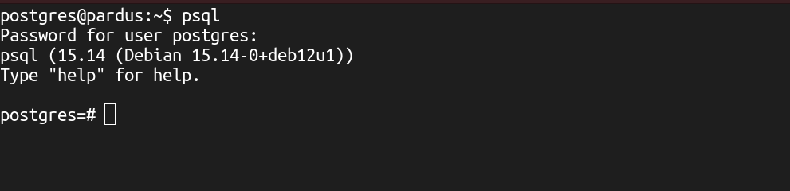

<p align="center">
    
<p/>
# Linux Sistemlerde PostgreSQL Yönetimi


###### Son güncelleme : 04/2026

---

<a id="basa-don"><a/>

**İçindekiler**

▸ [**Veritabanı İstemcisi / psql**](#psql)<br />▸ [**Sorgu Tipleri (DDL, DML, DQL, TCL)**](#sorgu-tipleri)<br />▸ [**Temel Veritabanı İşlemleri**](#temel-veritabani)<br />▸ [**Veri Türleri**](#veri-turleri)<br />▸ [**Tablo İşlemleri**](#tablo)<br />▸ [**Veri İşlemleri**](#veri-islemleri)<br />▸ [**Where Kullanımı**](#where)<br />▸ [**Order By Kullanımı**](#order-by)<br />▸ [**Aggregate Fonksiyonları**](#aggregate)<br />▸ [**İndex İşlemleri**](#index)<br />▸ [**Referans İşlemleri**](#referans)<br />▸ [**Tarih ve Zaman Fonksiyonları**](#zaman)<br />▸ [**Metin (String) Fonksiyonları**](#metin)<br />▸ [**Transaction İşlemleri**](#transaction)<br />▸ [**Kullanıcı Yönetimi**](#kullanici)

---

## PostgreSQL

PostgreSQL, tüm dünyada popüler olan açık kaynak kodlu, platform bağımsız gelişmiş bir nesne ilişkisel (ORDBMS) veritabanı yönetim sistemidir.

Yüksek performanslı, kararlı ve güvenilirdir. Modern kurumsal veritabanı kabiliyet ve özelliklerine sahiptir.

PostgreSQL’in, 1977 yılında başlayan 20 yılı akademik, son 20 yılı endüstride geçen 40 yıllık bir geçmişi olan en eski açık kaynak kodlu yazılımlardan biridir.

PostgreSQL, tüm dünyada kamuda önemli devlet hizmetleri sunan uygulama sistemlerinde (CERN, NASA, Fransa, İngiltere, G.Kore, vb.) finans ve Telekom sektörlerinde iş kritik uygulamalarda, dünyada önde gelen üreticilerin ürünlerinde (Apple, Microsoft, IBM,Amazon, vb.), araştırma merkezleri ve üniversitelerde, küçük ölçekli projelerden çok büyük ölçekli kurumsal altyapılarda güvenilerek kullanılmaktadır.

PostgreSQL, önde gelen ticari veritabanı ürünleri ile rekabet edecek kurumsal veritabanı özelliklerinin yanı sıra günümüz dijital dönüşüm projeleri ve teknolojileri ile uyumlu birçok yeni ve yenilikçi özelliğe sahip-tir (Örneğin; dizi şeklindeki veri tipleri, paralel sorgular, JSON veri tipini desteklemesi ve üzerinde sorgu çalıştırabilmesi).

PostgreSQL, veritabanı ve sistem yöneticileri, yazılım mimarları ve geliştiricileri için çekici gelen yenilikçi birçok özellik sunar.

PostgreSQL’in öğrenmesi, kurulumu, konfigürasyonu, yönetimi, izlemesi ve bakımı kolaydır. Post-greSQL ekosisteminde yönetim ve izleme için açık kaynaklı ve ticari birçok araç vardır.

### PostgreSQL’in Özellikleri ve Kabiliyetleri

- Açık kaynak ve ücretsizdir.

- ACID uyumlu, yüksek güvenilirliğe sahip bir RDBMS’tir.

- MVCC (Multi-Version Concurrency Control) mimarisi kullanır.

- Gelişmiş SQL standardı desteği sunar.

- Güçlü transaction ve rollback mekanizmasına sahiptir.

- Foreign key, check, unique, exclude gibi gelişmiş constraint’leri destekler.

- JSON / JSONB ile yarı-yapısal veri desteği sağlar.

- Gelişmiş indeks türleri (B-Tree, Hash, GIN, GiST, BRIN) sunar.

- Stored procedure ve function desteği vardır (PL/pgSQL, Python, Perl vb.).

- Trigger ve rule sistemi ile olay tabanlı işlem yapabilir.

- View ve materialized view desteği bulunur.

- Parallel query ve query planner optimizasyonları içerir.

- Replikasyon (streaming, logical) ve yüksek erişilebilirlik desteği sağlar.

- Role-based güvenlik ve detaylı yetkilendirme sunar.

- Kimlik doğrulama, yetkilendirme, denetim, veri güvenliği, veri şifreleme, satır (row) seviyesinde güvenlik gibi birçok güvenlik yapısı vardır.

- Trust, Password, LDAP, GSSAPI, SSPI, Kerberos, kimlik tabanlı (ident-based), RADIUS, sertifika, PAM, SCRAM (versiyon 11’le birlikte) kimlik doğrulaması gibi çeşitli kimlik doğrulama yöntemlerini destekler.

- Full-text search (tam metin arama) yeteneği vardır.

- Extension mimarisi ile genişletilebilir (PostGIS vb.).

- Platform bağımsızdır (Linux, Windows, macOS).

- Büyük veri ve yüksek eşzamanlı kullanıcı yükünü destekler.

- DDL komutları transaction desteklidir.

- Uzun vadeli veri tutarlılığı ve veri bütünlüğü sağlar.

---

### Debian tabanlı sistemler için repositoryden PostgreSQL kurulumu:

> **Paket indexlerini güncelle.**

```bash
sudo apt update && sudo apt upgrade -y
```

> **PsgreSQL kurulumu için Debian/Ubuntu resmi depolarında PostgreSQL paketi hazır olarak geliyor, aşağıdaki komut ile sisteme PostgreSQL sunucusu kurulabilinir :**

```bash
sudo apt install postgresql -y
```

> **PostgreSQL servisini kontrol etmek için terminale:**

```bash
sudo systemctl status postgresql
```

> **Eğer çalışmıyorsa başlatmak için:**

```bash
sudo systemctl start postgresql
```

> **Sistem açılışında otomatik olarak başlaması için:**

```bash
sudo systemctl enable postgresql
```

---

### Initialize (initdb)

- PostgreSQL **data directory** (veri kümesi) oluşturur
- `postgres`, `template0`, `template1` gibi **sistem veritabanlarını** oluşturur
- Sistem kataloglarını ve varsayılan ayarları hazırlar

➡️ PostgreSQL, `initdb` yapılmadan **çalışabilir hale gelmez.**

------

### Depodan (apt/yum/pacman) Kurulumda

- `postgresql` paketi kurulduğunda
- **initdb otomatik yapılır**
- Data dizini hazır gelir

```bash
/var/lib/postgresql/<sürüm>/main
```

------

### Kaynaktan (source) Kurulumda

```bash
./configure
make
sudo make install
```

Bu adımlar:

- **sadece binary’leri kurar**
- data directory **oluşturmaz**

Bu yüzden **manuel initdb yapmak gerekir**

```bash
initdb -D /usr/local/pgsql/data
```

veya

```bash
/usr/local/pgsql/bin/initdb -D /usr/local/pgsql/data
```

------

**Bir sistemde init edilmiş mi kontrol için:**

```bash
ls /var/lib/postgresql
```

**veya**

```bash
psql -l
```

**Çalışıyorsa → initdb yapılmıştır.**

------

### PostgreSQL Veri Kümesi

**PostgreSQL’in veritabanı kümesi (database cluster), PostgreSQL’in tüm verilerini, ayarlarını ve iç yapısını tuttuğu bir dizindir.**

#### Ana klasörler

>  - `base/` **→ Tüm veritabanlarının tabloları burada durur.**
>     **Her veritabanı için bir alt klasör vardır. Her tablo, index, sequence dosya olarak saklanır.**
>  - `global/` **→ Tüm cluster’a ait global veriler (ör. kullanıcılar, roller, transaction ID’ler).**
>  - `pg_wal/`(eski adı `pg_xlog`) **→ Write Ahead Log dosyaları; veri bütünlüğünü sağlamak için yapılan değişikliklerin günlükleri.**
>  - `pg_multixact/` **→ Çoklu transaction bilgileri.**
>  - `pg_tblspc/` **→ Tablespace’lere (farklı disklere/veri yollarına ayrılan alanlar) sembolik linkler.**
>  - `pg_stat/` **→ İstatistik bilgileri.**
>  - `pg_logical/` **→ Mantıksal replikasyon için kullanılan bilgiler.**
>  - `pg_commit_ts/` **→ Commit timestamp verileri.**
>  - `pg_subtrans/` **→ Transaction alt-id bilgileri.**

#### Önemli dosyalar

> - `PG_VERSION` **→ Bu kümenin hangi PostgreSQL sürümüne ait olduğunu gösterir (ör. `15`).**
> - `postgresql.conf` **→ Sunucunun ana yapılandırma dosyası. (Port, shared_buffers, logging vs. ayarlar).**
> - `pg_hba.conf` **→ Kimlik doğrulama kuralları (hangi IP’den kim, hangi yöntemle bağlanabilir).**
> - `pg_ident.conf` **→ Sistem kullanıcıları ile PostgreSQL kullanıcılarını eşleştirme.**
> - `postmaster.pid` **→ Sunucu çalışırken PID (process ID) bilgisini tutar.**

---

PostgreSQL veritabanı kümesi (database cluster) sorgulama:

```bas
┌──(ahmet㉿kali)-[~/Masaüstü/Belgeler]
└─$ pg_lsclusters
Ver Cluster Port Status Owner     Data directory              Log file
18  main    5432 online <unknown> /var/lib/postgresql/18/main /var/log/postgresql/postgresql-18-main.log
```

Status ➜ down ise clusteri aktif etmek için aşağıdaki komut kullanılır.

```bash
sudo pg_ctlcluster 18 main start
```

---

**PostgreSQL varsayılan veritabanı kümesinin (data cluster)  konumu işletim sistemine ve kurulum yöntemine göre değişir.**

> - **Debian / Ubuntu / Pardus  dağıtımlarında (apt ile kurulum):**

```bash
/var/lib/postgresql/<version>/main
```

> - **RedHat / CentOS / Fedora dağıtımlarında (yum/dnf ile kurulum):**

```bash
/var/lib/pgsql/<version>/data
```


> - **Kaynaktan derlediysen (**`make install`**) kurulum sırasında** `initdb` **çalıştırırken verdiğin** `-D` **parametresine göre belirlenir.**

```bash
initdb -D /usr/local/pgsql/data
```

###### Not : Kesin konumu öğrenmek için `postgres` kullanıcısındayken terminale `psql -U postgres -c "SHOW data_directory;"` komutu girilir, yada postgresql oturumunda aşağıdaki sorgu çalıştırılır:

```postgresql
postgres=# show data_directory;
       data_directory        
-----------------------------
 /var/lib/postgresql/18/main
(1 satır)
```

---

**PostgreSQL’de veritabanı (DB) ve tablo (nesne) kimliklerini (OID) öğrenmek için:**

```postgresql
postgres=# SELECT datname, oid FROM pg_database;
  datname  | oid 
-----------+-----
 postgres  |   5
 template1 |   1
 template0 |   4
(3 satır)

-- PostgreSQL’in sistem kataloğu olan pg_database tablosundan bilgi çeker. pg_database tüm veritabanlarının kayıtlarını tutar.
-- /var/lib/postgresql/<version>/main/base/ konumunda ilgili veritabanın oid numarası ile ilgili klasörde veritabanı bilgileri bulunur.

postgres=# SELECT relname, oid FROM pg_class WHERE relname = 'tablo1';
  relname  |  oid  
-----------+-------
 tablo1    | 16449
(1 satır)

-- pg_class adlı sistem kataloğunda sorgulama yapar. pg_class tabloların, görünümlerin, dizinlerin vs. meta verilerini tutar.
```

------

**PostgreSQL hangi IP’den dinlediğini aşağıdaki komut ile sorgulunabilir!**

```bash
sudo ss -ltnp | grep 5432
```

###### Not : Bu çıktı LISTEN eden adresleri gösterir. Örneğin: `127.0.0.1:5432` gibi olmalı. Eğer hiç çıkmıyorsa PostgreSQL çalışmıyor demektir.

---

##  PostgreSQL Sunucu Ayarları

### `postgresql.conf` dosyası 

Dosya genelde `/etc/postgresql/<version>/main/postgresql.conf` yada `/var/lib/pgsql/<version>/data/postgresql.conf` konumunda bulunur:

Ayarların çoğu **reload** ile aktifleşir, **restart** gerektirenler dosyada belirtilmiştir. PostgreSQL *reload* edildiğinde servis kesintisi yapılmadan ayar dosyasındaki değişiklikler tekrar okunur. Mevcut bağlantıların düşmesine neden olmayacağı için *restart* gerektiren özel parametrelerin değişimi hariç tüm durumlarda *reload* tercih edilmelidir.

```bash
sudo systemctl reload postgresql
```

Ayar dosyalarında “#” ile başlayan yorum satırları her bir parametrenin öntanımlı değerlerini gösterir:

```
#port = 5432                                            # (change requires restart)
#superuser_reserved_connections = 3                     # (change requires restart)
#unix_socket_directories = '/var/run/postgresql, /tmp'  # (comma-separated list of directories)
```

#### PostgreSQL Ayarları: Dosya Yerleri

PostgreSQL veri dizini ile yetkilendirme ayar dosyalarının yerleri özel olarak belirtilebilir. Özel olarak belirlenmezse varsayılan olarak PostgreSQL sürecini başlatırken verilen `-D` parametresinden veya **PGDATA** çevresel değişkeninden alınır. Değiştirmek istenirse:

```
data_directory = '/srv/postgresql'
hba_file = '/srv/postgresql/pg_hba.conf'
ident_file = '/srv/postgresql/pg_ident.conf'
```

PostgreSQL sunucu varsayılan olarak loopback (127.0.0.1) IP’sinden servis verir. Dışarıdan erişilebilmesi için:

```
listen_addresses = '*'
```

Hiç TCP/IP hizmeti vermemesi için:

```
listen_addresses = ''
```

PostgreSQL sunucunun aynı anda kaç bağlantı isteği kabul edeceği:

```
max_connections = 100
```

Bu değer bir süre izlenip, sunucu kaynaklarına göre düzenlenmelidir!

#### PostgreSQL Ayarları: Zaman

PostgreSQL’in sistemin zaman bilgilerini kullanması için `--with-system-tzdata` parametresiyle derlenmiş olması gerekir (rpm kurulumunda bu şekildedir). Veritabanının kullandığı zaman ve yerellik bilgileri ilklendirme sırasında sunucudan alınır.

```postgresql
postgres=# show timezone;
    TimeZone
   ----------
 Europe/Istanbul

postgres=# select current_time;
    current_time
--------------------
 14:25:00.358229+03
```

PostgreSQL’in sistem zamanından farklı bir zaman kullanması istenirse ayarlardan değiştirilebilir.

```postgresql
datestyle = 'iso, mdy'
timezone = 'Turkey'
lc_messages = 'en_US.UTF-8'
lc_monetary = 'en_US.UTF-8'
lc_numeric = 'en_US.UTF-8'
lc_time = 'en_US.UTF-8'
```

---

### `pg_hba.conf` dosyası

**Parola Şifreleme**: Veritabanı kullanıcı parolaları hash’lenerek saklanır. Böylece yönetici, kullanıcı parolalarını göremez. `SCRAM` ve `MD5` şifreleme kullanımında, şifrelenmemiş parola sunucuda geçici olarak bile tutulmaz. Bir İnternet standardı olan SCRAM, PostgreSQL’e özgü MD5 kimlik doğrulama protokolünden daha güvenlidir.

**Ağ Üzerindeki Verileri Şifreleme**: SSL, ağ üzerinden gönderilen verileri şifreler: parola, sorgu ve döndürülen veriler. Hangi host’un şifrelenmemiş bağlantıları kullanacağı, hangisinin SSL şifreli bağlantılar gerektirdiği `pg_hba.conf` dosyasında belirtilir.

PostgreSQL'de şifreleme yöntemini sorgulamak için iki farklı yaklaşım vardır: **Sunucunun şu anki ayarını** görmek veya **kullanıcıların mevcut şifrelerinin** hangi formatta saklandığını kontrol etmek.

#### 1. Sunucunun Varsayılan Ayarını Sorgulama

Yeni oluşturulacak kullanıcıların şifrelerinin hangi yöntemle (SCRAM veya MD5) şifreleneceğini görmek için aşağıdaki SQL komutunu kullanabilirsiniz:

```postgresql
postgres=# SHOW password_encryption;
 password_encryption 
---------------------
 scram-sha-256
(1 satır)
```

- **Çıktı `scram-sha-256` ise:** Yeni şifreler güvenli SCRAM yöntemiyle kaydedilecektir.
- **Çıktı `md5` ise:** Yeni şifreler eski MD5 yöntemiyle kaydedilecektir.

------

#### 2. Kullanıcıların Mevcut Şifre Formatlarını Sorgulama

Sunucu ayarı SCRAM olsa bile, bazı eski kullanıcıların şifreleri hala MD5 formatında kalmış olabilir. Hangi kullanıcının hangi yöntemi kullandığını görmek için `pg_authid` sistem tablosuna bakabilirsiniz:

```postgresql
SELECT rolname, 
       CASE 
         WHEN rolpassword LIKE 'SCRAM-SHA-256$%' THEN 'SCRAM-SHA-256'
         WHEN rolpassword LIKE 'md5%' THEN 'MD5'
         ELSE 'Şifre Belirlenmemiş veya Diğer'
       END AS sifreleme_yontemi
FROM pg_authid;
```

------

#### 💡 Önemli İpuçları

- **Ayarı Değiştirme:** Eğer yöntemi SCRAM'e çekmek isterseniz `SET password_encryption = 'scram-sha-256';` komutunu kullanabilirsiniz. Ancak bu ayar sadece **yeni** belirlenen şifreleri etkiler.

- **Şifreleri Güncelleme:** Bir kullanıcının şifreleme yöntemini MD5'ten SCRAM'e yükseltmek için, ayarı değiştirdikten sonra o kullanıcının şifresini yeniden tanımlamanız gerekir:

  ```postgresql
  ALTER ROLE kullanıcı_adı WITH PASSWORD 'yeni_sifre';
  ```

- **pg_hba.conf:** Sadece veritabanı içinde şifreleme yöntemini değiştirmek yetmez; istemcilerin bağlanabilmesi için `pg_hba.conf` dosyasındaki `method` kısmının da (örneğin `md5` yerine `scram-sha-256`) bu ayarla uyumlu olması gerekir.

### PostgreSQL kullanıcı parolaları

Modern PostgreSQL sürümlerinde (v13 ve sonrası) `scram-sha-256` artık varsayılan ve önerilen yöntemdir. Özellikle ağ üzerinden (farklı bir PC'den) bağlantı yaparken `md5` yerine `scram-sha-256` kullanmak güvenlik açısından büyük bir fark yaratır.

#### Neden SCRAM Kullanmalısınız?

1. **MD5 Artık Güvenli Değil:** MD5 algoritması artık "kırılmış" kabul ediliyor. Çakışma saldırılarına karşı zayıf ve güçlü donanımlarla (GPU'lar gibi) hızlıca çözülebiliyor.
2. **Parola Sızmasına Karşı Koruma:** `md5` yönteminde, bir saldırgan veritabanı sunucusundan hashlenmiş parolaları çalarsa, bu hashleri kırmak görece kolaydır. SCRAM-SHA-256 ise hem istemciyi hem sunucuyu doğrular ve hash çalınsa bile kırılması çok daha zordur.
3. **Ağ Dinlemesi (Sniffing):** SCRAM, parolayı ağ üzerinden gönderirken her seferinde farklı bir "challenge" (meydan okuma) kullanarak gönderir. Bu, ağ trafiğini dinleyen birinin parolanızı ele geçirmesini veya bağlantıyı taklit etmesini (replay attack) engeller.

------

##### Geçiş Yaparken İzlemeniz Gereken Adımlar

Sadece `pg_hba.conf` dosyasında `md5`'i `scram-sha-256` yapmak yetmez; çünkü mevcut parolalarınız veritabanında hala MD5 formatında saklanıyor olabilir. Şu adımları izlemelisiniz:

##### 1. `postgresql.conf` Dosyasını Güncelleyin

Önce sunucunun yeni parolaları SCRAM formatında kaydetmesini sağlamalısınız:

```
password_encryption = 'scram-sha-256'
```

*Bu değişikliği yaptıktan sonra PostgreSQL servisini yeniden başlatın veya yapılandırmayı reload edin.*

##### 2. Mevcut Kullanıcıların Parolalarını Yenileyin

Mevcut kullanıcıların parolaları hala eski formatta olduğu için SCRAM ile bağlanamazlar. Her kullanıcı için parolayı tekrar tanımlamanız gerekir:

```postgresql
ALTER USER kullanici_adi WITH PASSWORD 'yeni_parola';
```

*(Bu işlem, parolanın `pg_authid` tablosuna SCRAM formatında kaydedilmesini sağlar.)*

##### 3. `pg_hba.conf` Dosyasını Düzenleyin

Artık ağdaki diğer PC'ler için erişim yöntemini değiştirebilirsiniz:

```
# TYPE  DATABASE        USER            ADDRESS                 METHOD
host    all             all             192.168.1.0/24          scram-sha-256
```

------

##### Dikkat Etmeniz Gereken Tek Şey: İstemci Desteği

Bağlantı kuracak olan diğer bilgisayardaki yazılımların (örneğin eski bir Java uygulaması, çok eski bir pgAdmin versiyonu veya çok eski bir kütüphane) SCRAM desteği olmalıdır.

- **PostgreSQL 10+** kütüphaneleri SCRAM'ı destekler.
- Eğer bağlanan uygulama çok eskiyse bağlantı hatası alabilirsiniz.

**Özetle:** Ağdaki bir sunucuya bağlanırken `scram-sha-256` kullanmak, veritabanı güvenliğinizi bir üst seviyeye taşıyan en doğru karardır.

---

### Terminalden PostgreSQL sunucusuna bağlanmak için:

> - `ahmet@pardus:~$ sudo su`  **Komutu ile root kullanıcısına geçilir.**
> -  `root@pardus:~# su - postgres`  **Komutu ile postgres kullanıcısına geçilir.**
> - `postgres@pardus:~$ psql`  **Komutu ile PosgreSQL sunucusuna bağlanılır.**



> **Yada PostgreSQL oturumuna kendi kullanıcı hesabınızdan bağlanmak için:**
>
> ```bash
> ahmet@pardus:~$ sudo -u postgres psql
> ```
>
> *Not : PostgreSQL kurulunca varsayılan olarak "postgres" adında bir kullanıcı ve bu kullanıcıya ait "postgres" adında yeni bir veritabanı otomatik olarak gelir.*

---

<a id="psql"><a/>

## Veritabanı İstemcisi / psql

🔼 [**Başa Dön**](#basa-don)

PostgreSQL sunucu interaktif terminal istemcisidir. PostgreSQL sunucuda sorgu çalıştırma, sorgu sonuçlarını görüntüleme, kabuk parametreleri ile dosya veya komut gönderme, betik içerisinde kullanarak otomatik işlemler yaptırabilir.

#### Genel Kullanımı

```bash
psql [seçenekler...] [veritabanı[kullanıcı]]
```

#### `psql` komutu için kullanılan parametreler:

| Parametre | Açıklama | Örnek Kullanım |
|----------|----------|----------------|
| `-h` | Bağlanılacak sunucunun hostname/IP adresi | `psql -h 192.168.1.10` |
| `-p` | PostgreSQL port numarası (varsayılan: 5432) | `psql -p 5432` |
| `-U` | Bağlanılacak kullanıcı adı | `psql -U postgres` |
| `-d` | Bağlanılacak veritabanı adı | `psql -d testdb` |
| `-W` | Parolayı girmeye zorlar | `psql -U user -W` |
| `-f` | Bir SQL dosyasını çalıştırır | `psql -d db -f script.sql` |
| `-c` | Tek bir SQL komutu çalıştırır | `psql -d db -c "SELECT * FROM users;"` |
| `-v` | Değişken tanımlama | `psql -v var=123 -f script.sql` |
| `-X` | psql başlangıç dosyası (.psqlrc) yüklenmesin | `psql -X` |
| `-A` | Hizalamayı kapatır (alignment off) | `psql -A -c "SELECT * FROM t"` |
| `-t` | Sadece satırları gösterir, başlık/format yok | `psql -t -c "SELECT now()"` |
| `-o` | Komut çıktısını dosyaya yazdırır | `psql -U postgres -d postgres -o sonuc.txt -c "SELECT * FROM ogrenciler;"` |
| `--help` veya `-?` | Yardım ekranı | `psql --help` veya `psql -?` |
| `--version` veya `-V` | Sürüm bilgisini gösterir | `psql --version` veya `psql -V` |

**Kullanıcı/parola ile TCP üzerinden veritabanına bağlanma:**

```sql
$ psql -h 127.0.0.1 -U user_name -W -d db_name
Password for user user:
psql (11.5)
Type "help" for help.

db_name=>
```
> **Etkileşimli (interaktif) kabuk kullanma:**
>
> ```sql
> psql (11.5)
> Type "help" for help.
> 
> postgres=# \c db_name
> You are now connected to database "db_name" as user "postgres".
> db_name=# SELECT * FROM table_name;
> ```

---

> **Etkileşimsiz kabuk kullanma (dışardan komut yollama):**
>
> ```bash
> $ psql -U user_name -c 'SELECT * FROM table_name;' db_name
> ```
>
> **Çıktıyı dosyaya kaydetme:**
>
> ```bash
> $ psql -U user_name -c 'SELECT * FROM table_name;' db_name > sonuc
> ```
>

---

> **Komut çıktısını kullanma (pipe):**
>
> ```bash
> $ echo '\c db_name \\ SELECT * FROM table_name;' | psql
> ```

---

> **Dosyayı girdi olarak kullanma:**
>
> ```bash
> $ psql -U user_name db_name < sorgu.sql
> ```

---

> **Öntanımlı olarak sql sorgularının çıktıları sql biçeminde gelir psql üzerinden csv biçiminde çıktı almak için:**
>
> ```bash
> $ psql -U user_name -d db_name -A -F"," -c "select * from table_name;" > dosya.csv
> ```

---

#### `psql` istemci temel komutları:

| Komut         | Açıklama                           | Komut          | Açıklama                        |
| ------------- | ---------------------------------- | -------------- | ------------------------------- |
| `\l`          | Veritabananlarını listeleme        | `\q`           | Çıkış                           |
| `\c`          | Belirtilen veritabanına geçme      | `\help` (`\?`) | Yardım                          |
| `\dt`         | Tabloları listeleme                | `\copyright` | Lisans bilgileri                |
| `\dT`     | Veri tiplerini listeleme           | `\conninfo` | Sunucu bağlantı bilgileri       |
| `\du` (`\dg`) | Veritabanı rol/kullanıcı listeleme | `\password` | Rol parolası belirleme          |
| `\dx`         | Yüklü olan eklentileri listeleme   | `\encoding` | Tanımlı olan karakter kodlaması |
| `\dn`         | Mevcut şemaları listeleme          | `\s`           | Geçmiş komutları listeleme      |

---

<a id="sorgu-tipleri"><a/>

## Sorgu Tipleri

🔼 [**Başa Dön**](#basa-don)

PostgreSQL’de sorgu tiplerini dört grupta incelemek mümkündür:

1. **DDL (Data Definition Language)** veri tanımlama görevlerini yerine getiri
2. **DML (Data Manipulation Language)** veriyi oluşturma, değiştirme ve silme görevlerini yerine getirir
3. **DQL (Data Query Language)** aranan veriyi sorgulama ve sunma görevlerini yerine getirir.
4. **TCL (Transaction Control Language)** transaction kontrolü sağlar.

---

### DDL — Data Definition Language (Veri Tanımlama Dili)

PostgreSQL’de **DDL (Data Definition Language)** komutları, veritabanı **nesnelerinin yapısını tanımlamak ve değiştirmek** için kullanılan SQL komutlarıdır. Veri üzerinde değil, **şema (schema)** üzerinde çalışır.

#### PostgreSQL’de Temel DDL Komutları

#### 1.1 CREATE

Yeni nesne oluşturur.

```postgresql
CREATE TABLE kullanicilar (
    id SERIAL PRIMARY KEY,
    ad VARCHAR(50),
    email VARCHAR(100)
);
```

Oluşturulabilinen nesneler:

- TABLE
- DATABASE
- SCHEMA
- INDEX
- VIEW
- SEQUENCE
- FUNCTION
- TYPE

------

#### 1.2 ALTER

Mevcut nesnenin yapısını değiştirir.

```postgresql
-- kullanıcılar tablosuna yas adında kolon ekler.
ALTER TABLE kullanicilar
ADD COLUMN yas INT;
-- kullanıcılar tablosundaki ad kolonunu boş (null) değer kabul etmez hale getirir
ALTER TABLE kullanicilar
ALTER COLUMN ad SET NOT NULL;
```

------

#### 1.3 DROP

Nesneyi tamamen siler.

```postgresql
DROP TABLE kullanicilar;

DROP TABLE kullanicilar CASCADE;
```

------

#### 1.4 TRUNCATE

Tablodaki **tüm veriyi** hızlıca boşaltır (yapı kalır).

```postgresql
TRUNCATE TABLE kullanicilar;
```

------

#### 2. Constraint (Kısıt)

Constraint’ler, tabloya girilen verinin **doğruluğunu ve tutarlılığını** garanti altına alan kurallardır. PostgreSQL’de constraint’ler **DDL ile tanımlanır**.

#### 3. PostgreSQL Constraint Türleri

##### 3.1 PRIMARY KEY

- Tekil (unique) ve **NULL olamaz**
- Bu kısıt, bir veya daha fazla kolonun bir tablodaki satırlar için `UNIQUE` ve `NOT NULL` kısıtlarına aynı anda uyacağını garanti eder.
- Tablo başına **bir tane** olur

```postgresql
id SERIAL PRIMARY KEY
```

veya

```postgresql
CONSTRAINT pk_kullanici PRIMARY KEY (id)
```

------

##### 3.2 UNIQUE

- Tekil değer zorunluluğu
- Bu kısıt, tanımlandığı kolonun tüm satırlarındaki verilerin birbirinden farklı olmasını gerektirir.
- NULL kabul eder (PostgreSQL’de birden fazla NULL olabilir)

```postgresql
CREATE TABLE example (
    a integer,
    b integer,
    c integer,
    email VARCHAR(100) UNIQUE
);
```

Bu kısıt, herhangi bir kolon tanımında yazılabileceği gibi tablo tanımlaması içinde parantez içinde kısıtın kontrol edeceği kolonları listeleyerek de yazılabilir.

```postgresql
CREATE TABLE example (
    a integer,
    b integer,
    c integer,
    UNIQUE (a, c)
);
```

------

##### 3.3 NOT NULL

- Boş değer girilmesini engeller. Bu kısıt, bir kolona kesinlikle veri girilme zorunluluğunu ifade eder ve herhangi bir veri girişinde ya da güncellenmesinde üzerinde `NOT NULL` kısıtı olan kolonun boş bırakılmasının önüne geçer.

```postgresql
ad VARCHAR(50) NOT NULL
```

------

##### 3.4 FOREIGN KEY

- Tablolar arası ilişki kurar
- Referans bütünlüğünü sağlar

```postgresql
CREATE TABLE siparisler (
    id SERIAL PRIMARY KEY,
    kullanici_id INT REFERENCES kullanicilar(id)
);
```

Detaylı hali:

```postgresql
CONSTRAINT fk_kullanici
FOREIGN KEY (kullanici_id)
REFERENCES kullanicilar(id)
ON DELETE CASCADE
ON UPDATE CASCADE
```

------

##### 3.5 CHECK

- Değer kontrolü yapar, girilen her değer `CHECK` kuralıyla test edilir ve `TRUE` dönen değerlerin tabloya yazılmasına izin verir.

```postgresql
yas INT CHECK (yas >= 18)
```

------

##### 3.6 DEFAULT

- Varsayılan değer atar (kullanıcı o kolon için bir değer girmese dahi otomatik olarak istenilen değerin girilmesi sağlanabilir)

```postgresql
CREATE TABLE products (
    product_no integer,
    name text,
    price numeric DEFAULT 9.99
);
```

------

##### 3.7 EXCLUDE (PostgreSQL’e özgü)

- Gelişmiş benzersizlik kısıtı
- Özellikle zaman aralığı çakışmalarında kullanılır

```postgresql
EXCLUDE USING gist (
    oda_id WITH =,
    tarih WITH &&
);
```

------

#### 4. Constraint Sonradan Eklemek

```postgresql
ALTER TABLE kullanicilar
ADD CONSTRAINT uq_email UNIQUE (email);
```

------

#### 5. Constraint Silmek

```postgresql
ALTER TABLE kullanicilar
DROP CONSTRAINT uq_email;
```

------

#### 6. DDL ve Constraint İlişkisi

| DDL Komutu | Constraint ile İlişkisi        |
| ---------- | ------------------------------ |
| CREATE     | Constraint tanımlar            |
| ALTER      | Constraint ekler/siler         |
| DROP       | Constraint’leri de siler       |
| TRUNCATE   | Constraint’leri **tetiklemez** |

------

#### 7. Teknik Notlar

- Constraint’ler **index** oluşturabilir (PRIMARY KEY, UNIQUE).
- CHECK constraint’leri trigger’a göre daha hızlıdır.
- FOREIGN KEY performansı için **index önerilir**.
- DDL komutları PostgreSQL’de **transaction içindedir**.

------

#### 8. Kısa Özet

- **DDL**: Yapıyı tanımlar
- **Constraint**: Kuralları uygular
- Veri güvenliği ve bütünlüğü constraint’lerle sağlanır

---

### DML — Data Manipülasyon Language (Veri İşleme Dili)

PostgreSQL’de **DML (Data Manipulation Language)** komutları, tablodaki **veriyi eklemek, güncellemek, silmek ve okumak** için kullanılır. Yani yapıyı değil (DDL), **verinin kendisini yönetir**.

#### PostgreSQL’de Temel DML Komutları

| Komut    | Açıklama        |
| -------- | --------------- |
| `SELECT` | veri çekme      |
| `INSERT` | veri ekleme     |
| `UPDATE` | veri güncelleme |
| `DELETE` | veri silme      |

------

#### 1️⃣ SELECT (veri çekme)

```postgresql
SELECT * FROM kullanicilar;
```

Belirli kolon:

```postgresql
SELECT ad, soyad FROM kullanicilar;
```

Koşullu:

```postgresql
SELECT * FROM kullanicilar
WHERE id = 1;
```

------

#### 2️⃣ INSERT (veri ekleme)

```postgresql
INSERT INTO kullanicilar (ad, soyad)
VALUES ('Ahmet', 'Yılmaz');
```

Birden fazla:

```postgresql
INSERT INTO kullanicilar (ad, soyad)
VALUES 
('Ali', 'Kaya'),
('Veli', 'Demir');
```

------

#### 3️⃣ UPDATE (veri güncelleme)

```postgresql
UPDATE kullanicilar
SET ad = 'Mehmet'
WHERE id = 1;
```

⚠️ WHERE olmazsa:

```postgresql
UPDATE kullanicilar SET ad = 'X';
```

👉 tüm tablo değişir

------

#### 4️⃣ DELETE (veri silme)

```postgresql
DELETE FROM kullanicilar
WHERE id = 1;
```

⚠️ WHERE olmazsa:

```postgresql
DELETE FROM kullanicilar;
```

👉 tüm veri silinir (tablo durur)

------

#### 🔁 RETURNING

PostgreSQL’e özel güçlü özellik:

```postgresql
INSERT INTO kullanicilar (ad)
VALUES ('Ahmet')
RETURNING *;
```

Eklenen veriyi geri döner.

------

#### 🔁 UPSERT (INSERT + UPDATE)

```postgresql
INSERT INTO kullanicilar (id, ad)
VALUES (1, 'Ahmet')
ON CONFLICT (id)
DO UPDATE SET ad = EXCLUDED.ad;
```

------

#### 📊 DML vs DDL farkı

| Tür  | Amaç           |
| ---- | -------------- |
| DML  | veri ile oynar |
| DDL  | tablo yapısı   |

------

#### 🧠 Özet

DML = veriyi yönetir

- SELECT → oku
- INSERT → ekle
- UPDATE → değiştir
- DELETE → sil

---

### DQL — Data Query Language (Veri Sorgulama Dili)

PostgreSQL’de **DQL (Data Query Language)** dediğimiz şey temelde **veri okuma / sorgulama** işlemleridir. Ana komut:

```postgresql
SELECT
```

Ama bunun etrafında kullanılan birçok alt yapı var. Hepsini sistematik şekilde veriyorum.

------

#### 1️⃣ Temel DQL komutu

```postgresql
SELECT * FROM tablo_adi;
```

Örnek:

```postgresql
SELECT * FROM students;
```

------

#### 2️⃣ Belirli kolonları çekme

```postgresql
SELECT name, surname FROM students;
```

------

#### 3️⃣ WHERE (filtreleme)

```postgresql
SELECT * FROM students WHERE id = 1;

SELECT * FROM students WHERE age > 18;
```

------

#### Operatörler

```postgresql
=   eşit
!=  eşit değil
>   büyük
<   küçük
>=  büyük eşit
<=  küçük eşit
```

------

#### 4️⃣ AND / OR

```postgresql
SELECT * FROM students
WHERE age > 18 AND gender = 'E';

SELECT * FROM students
WHERE age < 18 OR age > 25;
```

------

#### 5️⃣ LIKE (arama)

```postgresql
SELECT * FROM students WHERE name LIKE 'A%';
```

| Pattern | Anlam             |
| ------- | ----------------- |
| A%      | A ile başlayan    |
| %a      | a ile biten       |
| %ah%    | içinde "ah" geçen |

------

#### 6️⃣ ORDER BY (sıralama)

```postgresql
SELECT * FROM students ORDER BY age;

SELECT * FROM students ORDER BY age DESC;
```

------

#### 7️⃣ LIMIT / OFFSET

```postgresql
SELECT * FROM students LIMIT 5;

SELECT * FROM students LIMIT 5 OFFSET 5;
```

------

#### 8️⃣ COUNT / AVG / SUM (aggregate)

```postgresql
SELECT COUNT(*) FROM students;

SELECT AVG(age) FROM students;

SELECT SUM(score) FROM students;
```

------

#### 9️⃣ GROUP BY

```postgresql
SELECT gender, COUNT(*)
FROM students
GROUP BY gender;
```

------

#### 🔟 HAVING

```postgresql
SELECT gender, COUNT(*)
FROM students
GROUP BY gender
HAVING COUNT(*) > 5;
```

------

#### 1️⃣1️⃣ DISTINCT

```postgresql
SELECT DISTINCT gender FROM students;
```

------

#### 1️⃣2️⃣ JOIN

##### INNER JOIN

```postgresql
SELECT s.name, c.course_name
FROM students s
JOIN courses c ON s.course_id = c.id;
```

------

##### LEFT JOIN

```postgresql
SELECT s.name, c.course_name
FROM students s
LEFT JOIN courses c ON s.course_id = c.id;
```

------

#### 1️⃣3️⃣ IN / BETWEEN

```postgresql
SELECT * FROM students WHERE id IN (1,2,3);

SELECT * FROM students WHERE age BETWEEN 18 AND 25;
```

------

#### 1️⃣4️⃣ Alias (takma ad)

```postgresql
SELECT name AS isim FROM students;
```

------

#### 1️⃣5️⃣ Subquery

```postgresql
SELECT * FROM students
WHERE id IN (SELECT student_id FROM exams);
```

------

#### 🔥 Özet (DQL ne içerir)

- SELECT
- WHERE
- JOIN
- GROUP BY
- ORDER BY
- LIMIT
- Aggregate fonksiyonlar

------

#### ⚠️ Not

DQL sadece veri okur:

| Dil  | Açıklama               |
| ---- | ---------------------- |
| DQL  | SELECT                 |
| DML  | INSERT, UPDATE, DELETE |
| DDL  | CREATE, DROP           |
| DCL  | GRANT                  |

------

### TCL — Transaction Control Language (İşlem Kontrol Dili)

**TCL (Transaction Control Language)**, veritabanında yapılan işlemleri (transaction) **onaylama, geri alma ve yönetme** için kullanılır. Özellikle PostgreSQL gibi ACID uyumlu sistemlerde kritik öneme sahiptir.

------

#### 🔹 TCL Komutları

Temel komutlar:

```postgresql
COMMIT
ROLLBACK
SAVEPOINT
```

------

#### 1️⃣ COMMIT (kalıcı yap)

Yapılan işlemleri **veritabanına kesin olarak kaydeder**.

```postgresql
BEGIN;

INSERT INTO students (name) VALUES ('Ahmet');

COMMIT;
```

✔ COMMIT sonrası:

- Veri kalıcıdır
- Geri alınamaz

------

#### 2️⃣ ROLLBACK (geri al)

Transaction içindeki işlemleri **iptal eder**.

```postgresql
BEGIN;

INSERT INTO students (name) VALUES ('Mehmet');

ROLLBACK;
```

✔ Sonuç:

- Veri eklenmez
- Her şey eski haline döner

------

#### 3️⃣ SAVEPOINT (ara nokta)

Transaction içinde **geri dönülebilir checkpoint** oluşturur.

```postgresql
BEGIN;

INSERT INTO students (name) VALUES ('Ali');

SAVEPOINT nokta1;

INSERT INTO students (name) VALUES ('Veli');

ROLLBACK TO nokta1;

COMMIT;
```

✔ Sonuç:

- Ali kalır
- Veli silinir

------

#### 4️⃣ RELEASE SAVEPOINT

Savepoint’i kaldırır:

```postgresql
RELEASE SAVEPOINT nokta1;
```

------

#### 🔹 Transaction başlatma

PostgreSQL’de:

```postgresql
BEGIN;
```

veya

```postgresql
START TRANSACTION;
```

------

#### 🔹 Otomatik vs Manuel Transaction

| Tür         | Açıklama                  |
| ----------- | ------------------------- |
| Auto-commit | Her sorgu otomatik commit |
| Manual      | BEGIN ile başlatılır      |

------

#### 🔹 ACID Mantığı

TCL’nin amacı:

| Özellik     | Açıklama                     |
| ----------- | ---------------------------- |
| Atomicity   | ya hep ya hiç                |
| Consistency | veri tutarlı                 |
| Isolation   | işlemler birbirini etkilemez |
| Durability  | veri kalıcı                  |

------

#### 🔹 Gerçek Senaryo

Para transferi:

```postgresql
BEGIN;

UPDATE hesap SET bakiye = bakiye - 100 WHERE id = 1;

UPDATE hesap SET bakiye = bakiye + 100 WHERE id = 2;

COMMIT;
```

❌ hata olursa:

```postgresql
ROLLBACK;
```

------

#### 🔹 Python (psycopg2) ile TCL

```postgresql
conn.autocommit = False

cur.execute("INSERT INTO students (name) VALUES ('Ahmet')")

conn.commit()   # COMMIT
# conn.rollback()  # ROLLBACK
```

------

#### 🔥 Özet

| Komut     | İşlev              |
| --------- | ------------------ |
| COMMIT    | kalıcı yap         |
| ROLLBACK  | geri al            |
| SAVEPOINT | ara kayıt          |
| BEGIN     | transaction başlat |

---

<a id="temel-veritabani"><a/>

## Temel Veritabanı İşlemleri

🔼 [**Başa Dön**](#basa-don)

**Mevcut veritabanlarını listeleme:**

```postgresql
postgres=# \l
                                  List of databases
   Name    |  Owner   | Enc. |   Collate   |    Ctype    |   Access
                                                            privileges
-----------+----------+------+-------------+-------------+--------------+
 postgres  | postgres | UTF8 | en_US.UTF-8 | en_US.UTF-8 |
 template0 | postgres | UTF8 | en_US.UTF-8 | en_US.UTF-8 | =c/postgres +
                                                     postgres=CTc/postgres
 template1 | postgres | UTF8 | en_US.UTF-8 | en_US.UTF-8 | =c/postgres +
                                                     postgres=CTc/postgres
(3 rows)
```

**Yeni bir veritabanı oluşturma:**

```postgresql
postgres=# CREATE DATABASE db_name;
CREATE DATABASE
```

> - `\c db_name`  **:  Diğer veritabana geçiş için kullanılır.**
> - `\c db_name user_name`  **:  Diğer veritabana kullanıcısı ile geçiş yapar.**
> - `\l+`  **:  Mevcut veritabanlarının size, tablespace ve description alanlarınıda listeler.**
> - `\i dosya`  **:  PostgreSQL sunucusuna bağlandığın konumda bulunan script dosyasını çalıştırır.**

**Sahip belirterek veritabanı oluşturma:**

```postgresql
postgres=# CREATE DATABASE db_name OWNER user_name;
CREATE DATABASE
```

```postgresql
postgres=# CREATE DATABASE db_name
    WITH
    OWNER = postgres
    TEMPLATE = template0
    ENCODING = 'UTF8'
    LC_COLLATE = 'C'
    LC_CTYPE = 'C'
    CONNECTION LIMIT = 20;
```

**Veritabanı sahipliğini değiştirmek için:**

```postgresql
postgres=# ALTER DATABASE db_name OWNER TO user_name;
ALTER DATABASE
```

**Veritabanının ismini değiştirmek için:**

```postgresql
postgres=# ALTER DATABASE db_name RENAME TO new_db_name;
ALTER DATABASE
```

**Veritabanını silmek için:**

```postgresql
postgres=# DROP DATABASE db_name;
DROP DATABASE
```

> `SELECT datname FROM pg_database;`  **:  Sistemdeki mevcut veritabanlarını listeleme sorgusu.**
>
> `SELECT usename, usesysid FROM pg_user;`  **:  Sistemdeki kullanıcıadı ve id bilgileri listelenir.**
>
> `SELECT * FROM pg_stat_activity WHERE datname='postgres';`  **:  Adı verilen veritabanına bağlı connectionları listeler.**

---

<a id="veri-turleri"><a/>

## PostgreSQL’de Veri Türleri (Data Types)

🔼 [**Başa Dön**](#basa-don)

#### 📌 1) SAYISAL (NUMERIC) TİPLER

| Veri Türü                                  | Kapladığı Boyut                   | Min / Max Değeri                  | Örnek Kullanım            |
| ------------------------------------------ | --------------------------------- | --------------------------------- | ------------------------- |
| **smallint**                               | 2 byte                            | –32768 → 32767                    | `age smallint`            |
| **integer (int)**                          | 4 byte                            | –2,147,483,648 → 2,147,483,647    | `id int`                  |
| **bigint**                                 | 8 byte                            | –9,22e18 → 9,22e18                | `population bigint`       |
| **decimal / numeric(p,s)**                 | Değişken (yakl. 2 byte / 4 digit) | Hassasiyet sınırsız               | `price numeric(12,2)`     |
| **real (kayan noktalı) sayı**              | 4 byte                            | ~6 hane hassasiyet                | `temperature real`        |
| **double precision  (kayan noktalı) sayı** | 8 byte                            | ~15 hane hassasiyet               | `rating double precision` |
| **serial**                                 | 4 byte (int)                      | Otomatik artan tamsayı            | `id serial`               |
| **bigserial**                              | 8 byte                            | Daha büyük otomatik artan tamsayı | `id bigserial`            |

------

#### 📌 2) METİN (TEXT) TİPLERİ

| Veri Türü              | Boyut             | Max Uzunluk        | Örnek                                   |
| ---------------------- | ----------------- | ------------------ | --------------------------------------- |
| **text**               | Değişken (1B–1GB) | 1 GB (yaklaşık)    | `description text`                      |
| **varchar(n)**         | Değişken          | n karakter         | `name varchar(255)`                     |
| **char(n)**            | n byte            | n karakter (sabit) | `code char(10)`                         |
| **varchar** (sınırsız) | Değişken          | 1 GB               | `name varchar`                          |
| **citext**             | Değişken          | 1 GB               | `email citext` *(büyük/küçük duyarsız)* |

------

#### 📌 3) BOOLEAN

| Tür         | Boyut  | Açıklama     |
| ----------- | ------ | ------------ |
| **boolean** | 1 byte | true / false |

Örnek:

```postgresql
is_active boolean	
```

------

#### 📌 4) TARİH & SAAT TİPLERİ

| Veri Türü               | Boyut   | Aralık               | Örnek                    |
| ----------------------- | ------- | -------------------- | ------------------------ |
| **date**                | 4 byte  | MÖ 4713 – MS 5874897 | `birthdate date`         |
| **time**                | 8 byte  | 00:00 → 24:00        | `start_at time`          |
| **time with time zone** | 12 byte |                      | `start_at timetz`        |
| **timestamp**           | 8 byte  | MÖ 4713 – MS 294276  | `created_at timestamp`   |
| **timestamptz**         | 8 byte  |                      | `created_at timestamptz` |
| **interval**            | 16 byte | ±178 milyon yıl      | `duration interval`      |

------

#### 📌 5) JSON TİPLERİ

| Tür       | Boyut    | Max  | Örnek        |
| --------- | -------- | ---- | ------------ |
| **json**  | Değişken | 1 GB | `data json`  |
| **jsonb** | Değişken | 1 GB | `meta jsonb` |

------

#### 📌 6) ARRAY (DİZİ) TİPLERİ

| Tür                            | Boyut    | Limit               | Örnek         |
| ------------------------------ | -------- | ------------------- | ------------- |
| **int[] , text[] , varchar[]** | Değişken | Her eleman max 1 GB | `tags text[]` |

**Dizi elemanları kendi veri türünün boyutuna bağlıdır.**

------

#### 📌 7) UUID

| Tür      | Boyut   | Açıklama                | Örnek                               |
| -------- | ------- | ----------------------- | ----------------------------------- |
| **uuid** | 16 byte | Global benzersiz kimlik | `id uuid DEFAULT gen_random_uuid()` |

------

#### 📌 8) PARA TİPİ

| Tür       | Boyut  | Örnek          |
| --------- | ------ | -------------- |
| **money** | 8 byte | `amount money` |

(Tavsiye edilen `numeric(12,2)`)

------

#### 📌 9) BINARY / BYTEA

| Tür       | Boyut    | Limit | Örnek        |
| --------- | -------- | ----- | ------------ |
| **bytea** | Değişken | 1 GB  | `file bytea` |

**Dosya, resim, video saklamak için.**

------

#### 📌 10) ÖZEL (SPECIAL) TİPLER

| Tür          | Boyut     | Açıklama         |
| ------------ | --------- | ---------------- |
| **inet**     | 7–19 byte | IP adresi        |
| **cidr**     | 7–19 byte | IP blokları      |
| **macaddr**  | 6 byte    | MAC adresi       |
| **macaddr8** | 8 byte    |                  |
| **tsvector** | Değişken  | Full-text search |
| **tsquery**  | Değişken  | Text search      |
| **point**    | 16 byte   | (x,y)            |
| **line**     | 32 byte   | Sonsuz çizgi     |
| **lseg**     | 32 byte   | Çizgi parçası    |
| **box**      | 32 byte   | Dikdörtgen       |
| **circle**   | 24 byte   | Daire            |
| **polygon**  | Değişken  | Çokgen           |
| **enum**     | 4 byte    | Sabit değerler   |

Örnek enum:

```postgresql
CREATE TYPE status AS ENUM ('active','passive');
```

------

#### 🟦 11) XML

| Tür     | Boyut    | Limit |
| ------- | -------- | ----- |
| **xml** | Değişken | 1 GB  |

------

#### 🟦 12) Object Identifier (OID) Türleri

| Tür                                | Boyut  | Açıklama            |
| ---------------------------------- | ------ | ------------------- |
| **oid**                            | 4 byte | Sistem nesne ID’si  |
| **regclass, regtype, regproc ...** | 4 byte | Sistem referansları |

---

<a id="tablo"><a/>

## Tablo İşlemleri

🔼 [**Başa Dön**](#basa-don)

**Bir veritabanı içinde yeni bir tablo oluşturma:**

```sql
postgres=# CREATE TABLE personel (
  id         int  PRIMARY KEY,
  ad         varchar(40),
  soyad      varchar(40),
  kidem      int
);
CREATE TABLE
```

**Tabloları listeleme:**

```sql
postgres=# \dt
          List of relations
 Schema |   Name   | Type  |  Owner
--------+----------+-------+----------
 public | personel | table | postgres
(1 row)
```

**Tablonun ismini değiştirmek için:**

```sql
postgres=# ALTER TABLE tablo_adı RENAME TO yeni_tablo_adı;
ALTER TABLE
```

**Tablo silme:**

```sql
postgres=# DROP TABLE tablo_adı;
DROP TABLE
```

**Tablo sahipliğini değiştirmek için:**

```sql
postgres=# CREATE USER yildirim;
CREATE ROLE
postgres=# ALTER TABLE personel OWNER TO yildirim;
ALTER TABLE
postgres=# \dt
          List of relations
 Schema |   Name   | Type  |  Owner
--------+----------+-------+-------
 public | personel | table | yildirim
```

###### Not : PostgreSQL’de bir tablo sahibini tablo oluşmadan belirlemek mümkün değildir. Tablo, onu oluşturan kullanıcıya aittir.

**Tablo yapısını gösterme:**

```sql
postgres=# \d personel
          Table "public.personel"
 Column |         Type          | Modifiers
--------+-----------------------+-----------
 id     | integer               | not null
 ad     | character varying(40) |
 soyad  | character varying(40) |
 kidem  | integer               |
Indexes:
    "personel_pkey" PRIMARY KEY, btree (uid)
```

**Tabloyu düzenleme: Yeni sütun ekleme:**

```sql
postgres=# ALTER TABLE public.personel
ADD COLUMN yas INT;
```

**Tabloyu düzenleme: Bir sütunun tipini değiştirme:**

```sql
postgres=# ALTER TABLE public.personel
ALTER COLUMN ad TYPE character varying (50);
```

**Tabloyu düzenleme: Bir sütun silme:**

```sql
postgres=# ALTER TABLE public.personel
DROP COLUMN kidem;
```

**Tabloyu düzenleme: Bir sütunun adını değiştirme:**

```sql
postgres=# ALTER TABLE tablo_adi
RENAME COLUMN eski_isim TO yeni_isim;
```

---

<a id="veri-islemleri"><a/>

## Veri İşlemleri

🔼 [**Başa Dön**](#basa-don)

**Tabloya bir satır ekleme:**

```sql
postgres=# INSERT INTO personel VALUES(01,'John','Doe',5);
INSERT 0 1

-- Sadece belirli kolonlar için ekleme yapılacak ise:
postgres=# INSERT INTO personel(ad,soyad) VALUES('John','Doe');
INSERT 0 1
```

**Tabloya birden fazla satır ekleme:**

```sql
postgres=# INSERT INTO personel VALUES
           		(02,'Jane','Doe',1),
           		(03,'Richard','Roe',3),
           		(04'Fred','Bloggs',7),
        		(05'Juan','Perez',11);
INSERT 0 4
```

**Satır sorgulama:**

```sql
postgres=# SELECT * FROM personel;
   ad    | soyad  | kidem | uid
---------+--------+-------+-----
 John    | Doe    |     5 |   1
 Jane    | Doe    |     1 |   2
 Richard | Roe    |     3 |   3
 Fred    | Bloggs |     7 |   4
 Juan    | Perez  |    11 |   5
(5 rows)

postgres=# SELECT ad,soyad FROM personel;
   ad    | soyad
---------+--------
 John    | Doe    
 Jane    | Doe    
 Richard | Roe    
 Fred    | Bloggs 
 Juan    | Perez  
(5 rows)
```

**Sütun Güncelleme:**

```sql
postgres=# UPDATE ogrenciler SET email='ersin-dari@yahoo.com' WHERE id=7;
UPDATE 1
```

> **Not : `WHERE` ile koşul belirtmezsek `ogrenciler` tablosundaki bütün `email` sütunları güncellenir.**

**Satır silme:**

```sql
postgres=# DELETE FROM ogrenciler WHERE id=7;
DELETE 1
```

> **Not : `WHERE` ile koşul belirtmezsek `ogrenciler` tablosundaki bütün kayıtlar silinir.**

---

PostgreSQL’de **TRUNCATE** komutu, bir tabloyu çok hızlı şekilde tamamen boşaltmak için kullanılır. **DELETE**’e göre performanslıdır.

**Temel Kullanım**

```postgresql
TRUNCATE TABLE tablo_adi;
```

Tablodaki tüm satırları siler, tablo yapısı korunur.

**Birden Fazla Tablo**

```postgresql
TRUNCATE TABLE tablo1, tablo2;
```

İlişkili tabloları aynı anda temizlemek için kullanışlıdır.

**FOREIGN KEY İlişkileri**
Varsayılan Davranış (RESTRICT)

Foreign key bağı varsa hata verir.

```postgresql
ERROR: cannot truncate a table referenced in a foreign key constraint
```

**CASCADE ile** bağlı tablolar da otomatik temizlenir.

```postgresql
TRUNCATE TABLE ana_tablo CASCADE;
```

**TRUNCATE vs DELETE Karşılaştırması**

| Özellik            | TRUNCATE  | DELETE |
| ------------------ | --------- | ------ |
| Hız                | Çok hızlı | Yavaş  |
| WHERE koşulu       | ❌ Yok     | ✅ Var  |
| Trigger çalışır mı | ❌ Hayır   | ✅ Evet |
| ROLLBACK           | ✅ Var     | ✅ Var  |
| Sequence sıfırlama | Opsiyonel | ❌ Yok  |

---

**Örnek Tablo Olşturma**

```postgresql
CREATE TABLE kullanicilar (
    id INTEGER GENERATED ALWAYS AS IDENTITY PRIMARY KEY,
    ad VARCHAR(50) NOT NULL,
    soyad VARCHAR(50) NOT NULL,
    kullanici_adi VARCHAR(50) UNIQUE NOT NULL,
    e_posta VARCHAR(100) UNIQUE NOT NULL,
    sifre TEXT NOT NULL,
    telefon VARCHAR(20),
    dogum_tarihi DATE,
    aktif BOOLEAN DEFAULT true,
    kayit_tarihi TIMESTAMP DEFAULT CURRENT_TIMESTAMP
);
```

**Kolonların Açıklaması**

| Kolon           | Açıklama                          |
| --------------- | --------------------------------- |
| `id`            | Birincil anahtar (otomatik artan) |
| `ad`            | Kullanıcının adı                  |
| `soyad`         | Kullanıcının soyadı               |
| `kullanici_adi` | Sistemde benzersiz kullanıcı adı  |
| `e_posta`       | E-posta adresi (benzersiz)        |
| `sifre`         | Şifre (hashlenmiş olmalı)         |
| `telefon`       | Telefon numarası                  |
| `dogum_tarihi`  | Doğum tarihi                      |
| `aktif`         | Kullanıcı aktif mi                |
| `kayit_tarihi`  | Sisteme kayıt zamanı              |

------

**💡 Tavsiye**

- Kolon adları: **Türkçe ama ASCII**
- Kolon adları: **kelime aralarına `_` alt tire (örn. `stok_miktari`)**
- Tablo adları: **küçük harf**
- Şifre: **asla düz metin saklama**
- `PRIMARY KEY + UNIQUE` mutlaka tanımla

- Küçük harf ve alt çizgi kullan (`snake_case`)
- Tablo isimleri çoğul (`customers`, `orders`)
- Sütun isimleri tekil (`first_name`, `email`)
- Anlamlı isimler ver — 6 ay sonra `oid`'nin ne olduğunu hatırlamak zor
- SQL anahtar kelimelerini isim olarak kullanma (`order`, `select`, `table` isim olarak sorunlu)
- Türkçe karakter kullanma (`müşteri_adı` yerine `musteri_adi` veya `first_name`)

------

CSV içeriğini içe aktarmak için öncelikle csv dosyasındaki kolon adları ile birebir yeni bir tablo oluşturulmalı:

```
ad, soyad, kullanici_adi, e_posta, sifre, telefon,
dogum_tarihi, aktif, kayit_tarihi
```

- `id` kolonu **bilinçli olarak yok**
  → PostgreSQL `IDENTITY / SERIAL` otomatik artan
- UNIQUE alanlar (`kullanici_adi`, `e_posta`)
- `BOOLEAN`, `DATE`, `TIMESTAMP` uyumlu

------

**PostgreSQL’e CSV Import**

##### 1. Sunucu Tarafında (COPY)

```postgresql
COPY kullanicilar (
    ad, soyad, kullanici_adi, e_posta, sifre,
    telefon, dogum_tarihi, aktif, kayit_tarihi
)
FROM '/path/kullanicilar.csv'
DELIMITER ','
CSV HEADER;
```

##### 2. Client Tarafında (psql → \copy)

```postgresql
\copy kullanicilar (
    ad, soyad, kullanici_adi, e_posta, sifre,
    telefon, dogum_tarihi, aktif, kayit_tarihi
)
FROM 'kullanicilar.csv'
CSV HEADER;
```

*Not : GUI uyumlu yazılımlarda tabloyu oluşturduktan sonra tabloya sağ tıklayıp csv dosyasını import edebilirsiniz.*

---

### `ALIAS` kullanımı

PostgreSQL’de **ALIAS** (takma ad), tablo veya kolon adlarını **geçici olarak yeniden adlandırmak** için kullanılır. Amaç sorguyu daha **okunabilir**, **kısa** ve özellikle **JOIN**’lerde daha **net** hale getirmektir.

##### 1. Kolon (Column) Alias Kullanımı

##### Temel Sözdizimi

```postgresql
SELECT kolon_adı AS alias_adı
FROM tablo_adı;
```

> `AS` **opsiyoneldir**, yazılmasa da çalışır.
>
> `alias_adı` boşluk içerecek ise **çift tırnaklar** arasına yazılmalıdır.

##### Örnekler

```postgresql
SELECT
    first_name AS ad,
    last_name  AS soyad
FROM users;

SELECT
    salary * 12 aylik_maas
FROM employees;
```

------

##### 2. Tablo (Table) Alias Kullanımı

##### Temel Sözdizimi

```postgresql
SELECT * FROM tablo_adı AS t;
```

##### Örnek

```postgresql
SELECT u.username, u.email
FROM users AS u;
```

➡️ Bundan sonra `users.username` yerine **`u.username`** kullanılır.

---

```sql
=== Syntax ===
SELECT *, distinct(tekrarsız veriler), top(istenilen sayıda kayıt), min,max,avg(ortalama),sum, count
FROM tablo_adı
WHERE (BIL - Between, In, Like)
ORDER BY (Sıralama)
JOIN (Birden fazla tabloda ortak vb yapıları listelemek)
GROUP BY (Belli kolon için gruplama yapmak içindir)
HAVING (Filtreleme) (Sum, Avg, Count, Min, Max)
```

---

<a id="where"><a/>

### `WHERE` kullanımı

🔼 [**Başa Dön**](#basa-don)

PostgreSQL’de **`WHERE`** ifadesi, sorgu sonucunu **belirli koşullara göre filtrelemek** için kullanılır.

##### Temel Kullanım

```sql
SELECT * FROM table_name
WHERE kosul;
```

**Örnek:**

```sql
SELECT * FROM users
WHERE age = 25;
```

→ Yaşı 25 olan kayıtları getirir.

------

##### Karşılaştırma Operatörleri

| Operatör       | Açıklama   |
| -------------- | ---------- |
| `=`            | Eşittir    |
| `!=` veya `<>` | Eşit değil |
| `>`            | Büyük      |
| `<`            | Küçük      |
| `>=`           | Büyük eşit |
| `<=`           | Küçük eşit |

**Örnek:**

```sql
SELECT name, salary FROM employees
WHERE salary >= 50000;
```

------

##### Mantıksal Operatörler (`AND`, `OR`, `NOT`)

```sql
SELECT * FROM orders
WHERE status = 'paid' AND total_amount > 1000;

SELECT * FROM users
WHERE city = 'Ankara' OR city = 'İstanbul';

SELECT * FROM users
WHERE NOT is_active;
```

------

##### `IN` Kullanımı

Birden fazla değeri kontrol etmek için:

```postgresql
SELECT * FROM products
WHERE category IN ('Elektronik', 'Bilgisayar', 'Telefon');
```

------

##### `BETWEEN` Kullanımı

Belirli bir aralık için:

```postgresql
SELECT * FROM orders
WHERE order_date BETWEEN '2024-01-01' AND '2024-12-31';
```

------

##### `LIKE` ve `ILIKE` (Metin Arama)

- `%` → herhangi bir karakter dizisi
- `_` → tek karakter

```postgresql
-- kullanıcı ismi `ahmet` ile başlayan kayıtlar
SELECT * FROM users
WHERE username LIKE 'ahmet%';

-- kullanıcı ismi `can` ile bitmeyen kayıtlar
SELECT * FROM users
WHERE username NOT LIKE '%can';
```

- **`ILIKE`** → büyük/küçük harf duyarsızdır

```postgresql
SELECT * FROM users
WHERE email ILIKE '%gmail.com';
```

------

##### `IS NULL` / `IS NOT NULL`

```postgresql
SELECT * FROM users
WHERE phone IS NULL;

SELECT * FROM users
WHERE phone IS NOT NULL;
```

------

##### Tarih ve Saat ile `WHERE`

```postgresql
SELECT * FROM logs
WHERE created_at >= NOW() - INTERVAL '7 days';
```

------

##### Sayısal Fonksiyonlarla Kullanım

```postgresql
-- fiyat beşyüzden küçük olan ürünler listelenir.
SELECT * FROM products
WHERE price < 500;

-- fiyat * miktar binden büyük olan ürünler listelenir.
SELECT * FROM products
WHERE price * quantity > 1000;
```

------

##### Subquery ile `WHERE`

```sql
SELECT * FROM employees
WHERE department_id IN (
    SELECT id
    FROM departments
    WHERE name = 'IT'
);
```

------

##### Performans Notu (Önemli)

- `WHERE` koşulunda kullanılan kolonlara **index** eklemek performansı ciddi artırır.

```sql
CREATE INDEX idx_users_email ON users(email);
```

------

##### Kısa Özet

- `WHERE` → filtreleme
- `AND / OR / NOT` → mantık
- `IN / BETWEEN / LIKE / IS NULL` → sık kullanılan yardımcılar
- `ILIKE` → case-insensitive arama (PostgreSQL’e özgü)

---

<a id="order-by"><a/>"

### `ORDER BY` Kullanımı

🔼 [**Başa Dön**](#basa-don)

`ORDER BY`, sorgu sonuçlarını **belirli bir kolona veya ifadeye göre sıralamak** için kullanılır.

---

##### Temel Sözdizimi

```sql
SELECT kolon1, kolon2 FROM tablo_adı
ORDER BY kolon_adı;
```

Varsayılan olarak sıralama **artan (ASC)** şeklindedir.

---

##### Artan (ASC) ve Azalan (DESC) Sıralama

```sql
-- Artan sıralama (varsayılan)
SELECT * FROM users
ORDER BY age ASC;

-- Azalan sıralama
SELECT * FROM users
ORDER BY age DESC;
```

---

##### Birden Fazla Kolona Göre Sıralama

Önce `department`, aynı department içindekileri ise `salary`'e göre sıralar:

```sql
SELECT * FROM employees
ORDER BY department ASC, salary DESC;
```

---

##### Kolon Sıra Numarası ile Sıralama

`SELECT` listesindeki kolonların **sıra numarası** kullanılabilir:

```sql
SELECT name, age, city FROM users
ORDER BY 2 DESC;  -- age kolonu
```

> ⚠️ Okunabilirlik açısından genellikle **kolon adı kullanılması önerilir**.

---

##### Metinlerde Büyük/Küçük Harfe Duyarsız Sıralama

```sql
SELECT * FROM users
ORDER BY LOWER(username);
```

---

##### NULL Değerlerin Sıralanması

PostgreSQL'de varsayılan davranış:

* `ASC` → NULL **en sonda**
* `DESC` → NULL **en başta**

##### Manuel Kontrol

```sql
-- NULL 'ları en sona alır
SELECT * FROM products
ORDER BY price ASC NULLS LAST;

-- NULL 'ları en başa alır
SELECT * FROM products
ORDER BY price DESC NULLS FIRST;
```

---

##### Hesaplanan Değer ile Sıralama

```sql
SELECT name, price, quantity, price * quantity AS total FROM orders
ORDER BY total DESC;
```

---

##### `ORDER BY` + `LIMIT`

En sık kullanılan senaryolardan biri:

```sql
-- En pahalı 5 ürün
SELECT * FROM products
ORDER BY price DESC
LIMIT 5;
```

---

##### `ORDER BY` Nerede Kullanılır?

`ORDER BY` **her zaman sorgunun en sonunda** yer alır:

```sql
SELECT ...
FROM ...
WHERE ...
GROUP BY ...
HAVING ...
ORDER BY ...
LIMIT ...;
```

---

##### Özet

* `ORDER BY` → sonuçları sıralar
* `ASC` / `DESC` → artan / azalan
* Birden fazla kolonla sıralama mümkündür
* `NULLS FIRST | LAST` ile NULL kontrol edilir
* Performans için büyük tablolarda **index** kullanımı önemlidir

---

<a id="aggregate"><a/>

### Aggregate Fonksiyonları

🔼 [**Başa Dön**](#basa-don)

| Fonksiyon | Açıklama       |
| --------- | -------------- |
| `COUNT()` | Satır sayısı   |
| `SUM()`   | Toplam         |
| `AVG()`   | Ortalama       |
| `MIN()`   | En küçük değer |
| `MAX()`   | En büyük değer |

------

#### COUNT Kullanımı

##### Tüm satırlar

```postgresql
SELECT COUNT(*) FROM users;
```

##### NULL hariç sayım

```postgresql
SELECT COUNT(*) FROM users
WHERE email IS NOT NULL;
```

##### Koşullu sayım

```postgresql
SELECT COUNT(*) FROM users
WHERE active = true;
```

------

#### SUM

```postgresql
SELECT SUM(amount) FROM orders;
```

⚠️ `NULL` değerler otomatik olarak yok sayılır.

------

#### AVG (Ortalama)

```postgresql
SELECT AVG(price) FROM products;
```

📌 Sonuç `numeric` döner.

------

#### MIN / MAX

```postgresql
SELECT MIN(created_at), MAX(created_at) FROM users; 
```

---

<a id="index"><a/>

## İndeks İşlemleri

🔼 [**Başa Dön**](#basa-don)

**PostgreSQL’de index işlemleri; sorguları hızlandırmak, tablo içindeki belirli kolonlara göre hızlı arama yapabilmek için kullanılır.**

**Index, bir tablo içinde belirli sütunlara göre arama / filtreleme / sıralama işlemlerini hızlandıran veri yapılarıdır. Bir nevi kitabın arka dizini gibi çalışır.**

------

#### 🟩 1) Index Oluşturma (CREATE INDEX)

**Temel kullanım**

```postgresql
CREATE INDEX idx_adi ON tablo_adi (kolon_adi);
```

**Örnek:**

```postgresql
CREATE INDEX idx_users_email ON users (email);
```

📌 *Bu, users tablosunda email üzerinden aramayı hızlandırır.*

------

#### 🟩 2) UNIQUE Index

**Aynı değerin iki kez girilmesini engeller.**

```postgresql
CREATE UNIQUE INDEX idx_users_tc ON users (tc_kimlik);
```

------

#### 🟩 3) Birden Fazla Kolonlu (Composite) Index

```
CREATE INDEX idx_orders_user_date ON orders (user_id, order_date);
```

📌 *Sorgu hem user_id hem de order_date içeriyorsa hızlanır.*

------

#### 🟩 4) Index Silme (DROP INDEX)

```
DROP INDEX idx_adi;
```

**Örnek:**

```
DROP INDEX idx_users_email;
```

------

#### 🟩 5) Indexleri Listeleme

**Sadece açıklayıcı yapmak istersen:**

```postgresql
\d tablo_adi
```

veya

```postgresql
SELECT * FROM pg_indexes WHERE tablename = 'users';
```

------

#### 🟩 6) Index Çalışıyor mu? — EXPLAIN ANALYZE

**Sorgu index kullanıyor mu görmek için:**

```postgresql
EXPLAIN ANALYZE SELECT * FROM users WHERE email = 'a@b.com';
```

**Çıktıda →** `Index Scan` **yazıyorsa index kullanılıyor demektir.**

------

#### 🟩 7) En Yaygın Index Türleri

| Index Türü | Açıklama                                      | Kullanım Alanı          |
| ---------- | --------------------------------------------- | ----------------------- |
| **B-Tree** | Varsayılan index                              | Eşitlik, <, >, ORDER BY |
| **Hash**   | Sadece eşitlik için                           | WHERE id = 5            |
| **GIN**    | JSONB, Array                                  | JSON içi arama          |
| **GiST**   | Geometrik, tam metin                          | Konum / yakınlık        |
| **BRIN**   | Çok büyük (milyonlarca satır), sıralı veriler | Zaman serisi            |

------

#### 🟦 8) JSONB için Index Örneği (GIN)

```postgresql
CREATE INDEX idx_products_data ON products USING GIN (data);
```

------

#### 🟩 9) Partial (Koşullu) Index

**Tablonun tamamı yerine sadece belirli bir kısmında index oluşturur.**

```postgresql
CREATE INDEX idx_active_users ON users (email)
WHERE active = true;
```

------

#### 🟦 10) Index Ne Zaman Kullanılmamalı?

- **Tablo çok küçükse (1–2 bin satır)**
- **Kolon çok fazla tekrar eden değerler içeriyorsa (ör: cinsiyet)**
- **Sürekli güncellenen kolonlar (index güncelleme maliyeti yüksek)**

---

<a id="referans"><a/>

## Referans Verme İşlemleri

🔼 [**Başa Dön**](#basa-don)

**Bir tablodan başka bir tabloya o tablonun Primary Key alanı aracılığıyla referans verilir.**

```sql
pagila=# CREATE TABLE items
(
  code int PRIMARY KEY,
  name text,
  price numeric(10,2)
);
CREATE TABLE


pagila=# CREATE TABLE orders
(
  no int PRIMARY KEY,
  date date,
  amount numeric,
  item_code int REFERENCES items (code)
);
CREATE TABLE
```

**Referans veren tablo:**

```sql
postgres=# \d orders
      Table "public.orders"
  Column   |  Type   | Modifiers
-----------+---------+-----------
 no        | integer | not null
 date      | date    |
 amount    | numeric |
 item_code | integer |
Indexes:
    "orders_pkey" PRIMARY KEY, btree (no)
Foreign-key constraints:
    "orders_item_code_fkey" FOREIGN KEY (item_code) REFERENCES items(code)
```


**PostgreSQL’de referans verme işlemi, yani FOREIGN KEY (yabancı anahtar) tanımlamak; bir tablodaki bir kolonun başka bir tablodaki PRIMARY KEY/UNIQUE bir kolona bağlı olmasını sağlar. Bu, veri bütünlüğü için çok önemlidir.**

------

#### 🟥 1) Temel FOREIGN KEY Kullanımı

**✔ İki tablo düşünelim:**

- **users** (ana tablo)
- **orders** (users tablosunu referanslayan alt tablo)

**users tablosu**

```postgresql
CREATE TABLE users (
    id SERIAL PRIMARY KEY,
    name TEXT
);
```

**orders tablosu (FOREIGN KEY ile)**

```postgresql
CREATE TABLE orders (
    id SERIAL PRIMARY KEY,
    user_id INT,
    FOREIGN KEY (user_id) REFERENCES users(id)
);
```

🔹 Burada **orders.user_id → users.id** şeklinde referans verildi.

------

#### 🟥 2) FOREIGN KEY Sonradan Ekleme

**Eğer tabloyu önceden oluşturduysan:**

```postgresql
ALTER TABLE orders
ADD CONSTRAINT fk_orders_user
FOREIGN KEY (user_id) REFERENCES users(id);
```

------

#### 🟥 3) FOREIGN KEY Silme

```postgresql
ALTER TABLE orders
DROP CONSTRAINT fk_orders_user;
```

------

#### 🟥 4) ON DELETE / ON UPDATE Kuralları

**Referans verilen veride değişiklik veya silme olunca ne yapılacağını belirler.**

**✔ ON DELETE CASCADE**

**Ana tablo silinince alt tablodaki ilgili kayıtlar da otomatik silinir.**

```postgresql
FOREIGN KEY (user_id)
REFERENCES users(id)
ON DELETE CASCADE;
```

------

**✔ ON DELETE SET NULL**

**Ana tablo silinince alt tablodaki değer NULL olur.**

```postgresql
FOREIGN KEY (user_id)
REFERENCES users(id)
ON DELETE SET NULL;
```

------

**✔ ON DELETE RESTRICT / NO ACTION**

Silme *engellenir*.

```postgresql
ON DELETE RESTRICT;
```

------

#### 🟥 5) Composite (Çoklu kolon) FOREIGN KEY

**Eğer tabloda iki kolon birlikte PRIMARY KEY ise:**

**Ana tablo**

```postgresql
CREATE TABLE cities (
    country_code TEXT,
    city_code TEXT,
    PRIMARY KEY(country_code, city_code)
);
```
**Referans veren tablo**

```postgresql
CREATE TABLE people (
    id SERIAL PRIMARY KEY,
    country_code TEXT,
    city_code TEXT,
    FOREIGN KEY (country_code, city_code)
        REFERENCES cities(country_code, city_code)
);
```

------

#### 🟥 6) FOREIGN KEY ile Index İlişkisi

**PostgreSQL, referans veren kolonlara otomatik index oluşturmaz.**

**Örnek:**

```postgresql
ALTER TABLE orders
ADD FOREIGN KEY (user_id) REFERENCES users(id);
```

📌 Bu durumda **orders.user_id** için index önerilir:

```postgresql
CREATE INDEX idx_orders_user_id ON orders(user_id);
```

------

#### 🟥 7) Tabloları Listeleme + Foreign Key’leri Görme

```postgresql
\d orders
```

veya:

```postgresql
SELECT
    tc.table_name,
    kcu.column_name,
    ccu.table_name AS foreign_table,
    ccu.column_name AS foreign_column
FROM 
    information_schema.table_constraints AS tc
JOIN information_schema.key_column_usage AS kcu
    ON tc.constraint_name = kcu.constraint_name
JOIN information_schema.constraint_column_usage AS ccu
    ON ccu.constraint_name = tc.constraint_name
WHERE constraint_type = 'FOREIGN KEY';
```

---

## Çalışma Zamanı Parametreleri

`SHOW` **ile belirli bir çalışma parametresinin bilgisi alınabilir:**

```sql
postgres=# SHOW DateStyle;
 DateStyle
_____________
 ISO, MDY
(1 row)
```

**Tüm parametrelerin listesine ve bilgisine erişmek için:**

```sql
postgres=# SHOW ALL;
            name         | setting |                description
-------------------------+---------+-------------------------------------------------
 allow_system_table_mods | off     | Allows modifications of the structure
                     of ...
    .
    .
    .
 xmloption               | content | Sets whether XML data in implicit
                     parsing ...
 zero_damaged_pages      | off     | Continues processing past damaged
                     page headers.
(290 rows)
```

`SET` **komutu ile bir parametre çalışma zamanında değiştirilebilir:**

```sql
postgres=# SET timezone='Europe/Rome';
SET
```

`SET` **komutu ile değiştirilen parametre sadece o oturumda geçerlidir, oturum kapandığında geçerliliğini kaybeder. Parametrelerin kalıcı olması için `postgresql.conf` dosyası üzerinde ayarlama yapılmalıdır.**

---

<a id="zaman"><a/>

### PostgreSQL Tarih ve Zaman Fonksiyonları

🔼 [**Başa Dön**](#basa-don)

#### 🔹Zaman Bilgisi Alma

| Fonksiyon           | Açıklama                                                | Örnek Kullanım              | Örnek Çıktı                  |
| ------------------- | ------------------------------------------------------- | --------------------------- | ---------------------------- |
| `NOW()`             | Şu anki tarih ve saati döner (timestamp with time zone) | `SELECT NOW();`             | `2025-10-20 22:41:32.123+03` |
| `CURRENT_TIMESTAMP` | `NOW()` ile aynıdır                                     | `SELECT CURRENT_TIMESTAMP;` | `2025-10-20 22:41:32.123+03` |
| `CURRENT_DATE`      | Sadece tarihi döner                                     | `SELECT CURRENT_DATE;`      | `2025-10-20`                 |
| `CURRENT_TIME`      | Sadece saati döner                                      | `SELECT CURRENT_TIME;`      | `22:41:32.123+03`            |
| `LOCALTIMESTAMP`    | Saat dilimi olmadan döner                               | `SELECT LOCALTIMESTAMP;`    | `2025-10-20 22:41:32.123`    |

---

#### 🔹Tarih Formatlama (`TO_CHAR`)

| Fonksiyon                            | Açıklama                         | Örnek Kullanım                               | Örnek Çıktı           |
| ------------------------------------ | -------------------------------- | -------------------------------------------- | --------------------- |
| `TO_CHAR(tarih, 'YYYY-MM-DD')`       | Tarihi belirtilen biçime çevirir | `SELECT TO_CHAR(NOW(), 'YYYY-MM-DD');`       | `2025-10-20`          |
| `TO_CHAR(tarih, 'DD Mon YYYY')`      | Ay adını içerir                  | `SELECT TO_CHAR(NOW(), 'DD Mon YYYY');`      | `20 Oct 2025`         |
| `TO_CHAR(tarih, 'HH24:MI:SS')`       | Saat biçimi                      | `SELECT TO_CHAR(NOW(), 'HH24:MI:SS');`       | `22:45:30`            |
| `TO_CHAR(tarih, 'Day, DD Mon YYYY')` | Gün + tarih                      | `SELECT TO_CHAR(NOW(), 'Day, DD Mon YYYY');` | `Monday, 20 Oct 2025` |

---

#### 🔹Tarih Dönüştürme

| Fonksiyon                      | Açıklama           | Örnek Kullanım                                               | Örnek Çıktı           |
| ------------------------------ | ------------------ | ------------------------------------------------------------ | --------------------- |
| `TO_DATE(string, format)`      | String → Date      | `SELECT TO_DATE('2025-01-15', 'YYYY-MM-DD');`                | `2025-01-15`          |
| `TO_TIMESTAMP(string, format)` | String → Timestamp | `SELECT TO_TIMESTAMP('2025-01-15 10:30', 'YYYY-MM-DD HH24:MI');` | `2025-01-15 10:30:00` |

------

#### 🔹Tarih Üzerinde İşlem (INTERVAL)

| İşlem         | Kullanım                                | Açıklama                  |
| ------------- | --------------------------------------- | ------------------------- |
| Gün ekleme    | `SELECT NOW() + INTERVAL '5 days';`     | 5 gün sonrasını verir     |
| Ay çıkarma    | `SELECT NOW() - INTERVAL '2 months';`   | 2 ay öncesini verir       |
| Saat ekleme   | `SELECT NOW() + INTERVAL '3 hours';`    | 3 saat ekler              |
| Dakika ekleme | `SELECT NOW() + INTERVAL '30 minutes';` | 30 dakika ekler           |
| Yıl çıkarma   | `SELECT NOW() - INTERVAL '1 year';`     | 1 yıl önceki zamanı verir |

------

#### 🔹Tarih Parçalama (`EXTRACT`, `DATE_PART`)

| Fonksiyon                   | Açıklama                | Örnek Kullanım                      | Örnek Çıktı |
| --------------------------- | ----------------------- | ----------------------------------- | ----------- |
| `EXTRACT(YEAR FROM tarih)`  | Yıl bilgisi             | `SELECT EXTRACT(YEAR FROM NOW());`  | `2025`      |
| `EXTRACT(MONTH FROM tarih)` | Ay bilgisi              | `SELECT EXTRACT(MONTH FROM NOW());` | `10`        |
| `EXTRACT(DAY FROM tarih)`   | Gün bilgisi             | `SELECT EXTRACT(DAY FROM NOW());`   | `20`        |
| `EXTRACT(DOW FROM tarih)`   | Haftanın günü (0=Pazar) | `SELECT EXTRACT(DOW FROM NOW());`   | `1`         |
| `DATE_PART('hour', tarih)`  | Saat bilgisi            | `SELECT DATE_PART('hour', NOW());`  | `22`        |

------

#### 🔹Tarih Farkı Hesaplama

| Fonksiyon                  | Açıklama                  | Örnek Kullanım                            | Örnek Çıktı              |
| -------------------------- | ------------------------- | ----------------------------------------- | ------------------------ |
| `AGE(t1, t2)`              | İki tarih arasındaki fark | `SELECT AGE('2025-10-20', '2020-10-20');` | `5 years`                |
| `AGE(NOW(), dogum_tarihi)` | Yaş hesaplama örneği      | `SELECT AGE(NOW(), '2000-06-15');`        | `25 years 4 mons 5 days` |

------

#### 🔹Epoch (Unix Timestamp)

| Fonksiyon                   | Açıklama                              | Örnek Kullanım                      | Örnek Çıktı              |
| --------------------------- | ------------------------------------- | ----------------------------------- | ------------------------ |
| `EXTRACT(EPOCH FROM NOW())` | Şu anki zamanı saniye cinsinden verir | `SELECT EXTRACT(EPOCH FROM NOW());` | `1730050000`             |
| `TO_TIMESTAMP(epoch)`       | Epoch → Timestamp                     | `SELECT TO_TIMESTAMP(1730050000);`  | `2025-10-20 22:45:00+03` |

------

#### 🔹Örnekler

```sql
-- 1. Yarının tarihi
SELECT CURRENT_DATE + INTERVAL '1 day';

-- 2. 10 gün sonra saat 12:00
SELECT CURRENT_DATE + INTERVAL '10 days' + TIME '12:00';

-- 3. Haftanın gününü öğren
SELECT TO_CHAR(NOW(), 'Day');

-- 4. Bugün Pazartesi mi?
SELECT EXTRACT(DOW FROM CURRENT_DATE) = 1;

-- 5. Ayın kaçıncı haftası
SELECT EXTRACT(WEEK FROM CURRENT_DATE);

----------------------------------------------------------------------------------
SELECT *
FROM tablo_adı
WHERE EXTRACT(YEAR FROM doğum_tarihi) = 1990;
-- Bu sorgu, doğum tarihi 1990 olan tüm kayıtları getirir.

----------------------------------------------------------------------------------
SELECT *
FROM tablo_adı
WHERE EXTRACT(YEAR FROM doğum_tarihi) IN (1985, 1990, 1995);
-- Bu sorgu, doğum tarihi 1985, 1990 veya 1995 olan tüm kayıtları getirir.

----------------------------------------------------------------------------------
SELECT *
FROM tablo_adı
WHERE doğum_tarihi BETWEEN '1980-01-01' AND '1990-12-31';
-- Bu sorgu, doğum tarihi 1980 ile 1990 yılları arasında olan tüm kayıtları getirir.
/*
AGE() Fonksiyonu: Eğer doğum tarihinden yaş hesaplamak isterseniz, AGE() fonksiyonunu kullanabilirsiniz. Bu fonksiyon, iki tarih arasındaki farkı hesaplar.
*/
```

---

<a id="metin"><a/>

### PostgreSQL Metin (String) Fonksiyonları

🔼 [**Başa Dön**](#basa-don)

#### 🔹Temel Fonksiyonlar

| Fonksiyon                                         | Açıklama                                            | Örnek                            | Çıktı         |
| ------------------------------------------------- | --------------------------------------------------- | -------------------------------- | ------------- |
| `LENGTH(text)`                                    | Metindeki karakter sayısını döner (byte sayabilir). | `SELECT LENGTH('Ahmet');`        | `5`           |
| `CHAR_LENGTH(text)` veya `CHARACTER_LENGTH(text)` | Gerçek karakter sayısını döner (UTF8 güvenli).      | `SELECT CHAR_LENGTH('Çağrı');`   | `5`           |
| `LOWER(text)`                                     | Tüm harfleri küçük yapar.                           | `SELECT LOWER('AHMET');`         | `ahmet`       |
| `UPPER(text)`                                     | Tüm harfleri büyük yapar.                           | `SELECT UPPER('ahmet');`         | `AHMET`       |
| `INITCAP(text)`                                   | Her kelimenin ilk harfini büyük yapar.              | `SELECT INITCAP('ahmet bedir');` | `Ahmet Bedir` |
| `REVERSE(text)`                                   | Metni ters çevirir.                                 | `SELECT REVERSE('Ahmet');`       | `temhA`       |

------

#### 🔹Alt String Alma

| Fonksiyon                             | Açıklama                                  | Örnek                                     | Çıktı |
| ------------------------------------- | ----------------------------------------- | ----------------------------------------- | ----- |
| `SBSTRING(text FROM start FOR count)` | Belirtilen aralıktaki karakterleri döner. | `SELECT SUBSTRING('Ahmet' FROM 2 FOR 3);` | `hme` |
| `LEFT(text, n)`                       | Soldan n karakter döner.                  | `SELECT LEFT('Ahmet', 2);`                | `Ah`  |
| `RIGHT(text, n)`                      | Sağdan n karakter döner.                  | `SELECT RIGHT('Ahmet', 2);`               | `et`  |

------

#### 🔹Metin Birleştirme

| Fonksiyon                          | Açıklama                         | Örnek                                      | Çıktı                        |
| ---------------------------------- | -------------------------------- | ------------------------------------------ | ---------------------------- |
| `CONCAT(a, b, c...)`               | Değerleri birleştirir.           | `SELECT CONCAT('Postgre', 'SQL');`         | `PostgreSQL`                 |
| `CONCAT_WS(delimiter, a, b, c...)` | Araya ayraç koyarak birleştirir. | `SELECT CONCAT_WS('-', 'Ahmet', 'Bedir');` | `Ahmet-Bedir`                |
| `a                                 |                                  | b`                                         | Metin birleştirme operatörü. |

------

#### 🔹Arama ve Karşılaştırma

| Fonksiyon / Operatör    | Açıklama                       | Örnek                              | Çıktı  |
| ----------------------- | ------------------------------ | ---------------------------------- | ------ |
| `POSITION(sub IN text)` | Alt dizinin pozisyonunu döner. | `SELECT POSITION('m' IN 'Ahmet');` | `3`    |
| `LIKE`                  | Desene göre eşleşme            | `SELECT 'Ahmet' LIKE 'Ah%';`       | `true` |
| `ILIKE`                 | Harf duyarsız eşleşme          | `SELECT 'ahmet' ILIKE 'AH%';`      | `true` |
| `~`                     | Regex (büyük/küçük duyarlı)    | `SELECT 'ahmet' ~ '^[a-z]+$';`     | `true` |
| `~*`                    | Regex (büyük/küçük duyarsız)   | `SELECT 'Ahmet' ~* 'ahmet';`       | `true` |

------

#### 🔹Metin Değiştirme ve Temizleme

| Fonksiyon                 | Açıklama                                        | Örnek                                | Çıktı   |
| ------------------------- | ----------------------------------------------- | ------------------------------------ | ------- |
| `REPLACE(text, from, to)` | Metin içindeki parçayı değiştirir.              | `SELECT REPLACE('ahmet', 'a', 'o');` | `ohmet` |
| `TRIM(text)`              | Baştaki ve sondaki boşlukları temizler.         | `SELECT TRIM('  ahmet  ');`          | `ahmet` |
| `LTRIM(text)`             | Sadece baştaki boşlukları siler.                | `SELECT LTRIM('   ahmet');`          | `ahmet` |
| `RTRIM(text)`             | Sadece sondaki boşlukları siler.                | `SELECT RTRIM('ahmet   ');`          | `ahmet` |
| `BTRIM(text, chars)`      | Belirtilen karakterleri baştan ve sondan siler. | `SELECT BTRIM('xxahmetxx', 'x');`    | `ahmet` |

------

#### 🔹Biçimlendirme ve Dönüştürme

| Fonksiyon                | Açıklama                         | Örnek                                  | Çıktı        |
| ------------------------ | -------------------------------- | -------------------------------------- | ------------ |
| `TO_CHAR(value, format)` | Tarih veya sayıyı biçimlendirir. | `SELECT TO_CHAR(NOW(), 'YYYY-MM-DD');` | `2025-10-20` |
| `CAST(value AS TEXT)`    | Veriyi metne dönüştürür.         | `SELECT CAST(123 AS TEXT);`            | `'123'`      |
| `CAST(value AS INTEGER)` | Metni sayıya dönüştürür.         | `SELECT CAST('456' AS INTEGER);`       | `456`        |

------

#### 🔹Faydalı Ek Fonksiyonlar

| Fonksiyon                            | Açıklama                                    | Örnek                                           | Çıktı    |
| ------------------------------------ | ------------------------------------------- | ----------------------------------------------- | -------- |
| `SPLIT_PART(text, delimiter, field)` | Belirtilen ayraçtan sonra n. parçayı döner. | `SELECT SPLIT_PART('ahmet@bedir.com', '@', 1);` | `ahmet`  |
| `REPEAT(text, number)`               | Metni belirtilen kadar tekrarlar.           | `SELECT REPEAT('Ha', 3);`                       | `HaHaHa` |
| `LPAD(text, length, fill)`           | Soldan belirtilen karakterle doldurur.      | `SELECT LPAD('7', 3, '0');`                     | `007`    |
| `RPAD(text, length, fill)`           | Sağdan belirtilen karakterle doldurur.      | `SELECT RPAD('7', 3, '0');`                     | `700`    |

------

#### 🔹Örnek Tablo: `ogrenciler`

```sql
CREATE TABLE ogrenciler (
    id SERIAL PRIMARY KEY,
    ad VARCHAR(50),
    soyad VARCHAR(50),
    email VARCHAR(100),
    dtarihi DATE
);

INSERT INTO ogrenciler (ad, soyad, email, dtarihi) VALUES
('Ahmet', 'Bedir', 'ahmet.bedir@example.com','1988-08-30'),
('Mehmet', 'Kaya', 'mehmet.kaya@example.com','2013-01-22'),
('Ali', 'Çelik', 'ali.celik@example.com','1979-04-30');
```

------

#### 🔹Uzunluk ve Biçim Fonksiyonları

```sql
SELECT ad, LENGTH(ad) AS karakter_sayisi, UPPER(soyad) AS buyuk_harf
FROM ogrenciler;
```

| ad     | karakter_sayisi | buyuk_harf |
| ------ | --------------- | ---------- |
| Ahmet  | 5               | BEDIR      |
| Mehmet | 6               | KAYA       |
| Ali    | 3               | ÇELIK      |

------

#### 🔹Birleştirme (Concatenation)

```sql
SELECT ad || ' ' || soyad AS tam_ad
FROM ogrenciler;
```

| tam_ad      |
| ----------- |
| Ahmet Bedir |
| Mehmet Kaya |
| Ali Çelik   |

------

#### 🔹Belirli Kısmı Alma

```sql
SELECT ad, SUBSTRING(email FROM 1 FOR 5) AS mail_parcasi
FROM ogrenciler;
```

| ad     | mail_parcasi |
| ------ | ------------ |
| Ahmet  | ahmet        |
| Mehmet | mehme        |
| Ali    | ali.c        |

------

#### 🔹Ayraçla Bölme (`SPLIT_PART`)

```sql
SELECT ad, SPLIT_PART(email, '@', 1) AS kullanici_adi
FROM ogrenciler;
```

| ad     | kullanici_adi |
| ------ | ------------- |
| Ahmet  | ahmet.bedir   |
| Mehmet | mehmet.kaya   |
| Ali    | ali.celik     |

------

#### 🔹Değiştirme (`REPLACE`)

```sql
SELECT ad, REPLACE(email, '.com', '.org') AS yeni_email
FROM ogrenciler;
```

| ad     | yeni_email              |
| ------ | ----------------------- |
| Ahmet  | ahmet.bedir@example.org |
| Mehmet | mehmet.kaya@example.org |
| Ali    | ali.celik@example.org   |

------

#### 🔹Trim ve Temizleme

```sql
SELECT TRIM('   ' || ad || '   ') AS temiz_ad
FROM ogrenciler;
```

| temiz_ad |
| -------- |
| Ahmet    |
| Mehmet   |
| Ali      |

------

#### 🔹Pad (Soldan veya Sağdan Doldurma)

```sql
SELECT ad, LPAD(id::text, 3, '0') AS kod
FROM ogrenciler;
```

| ad     | kod  |
| ------ | ---- |
| Ahmet  | 001  |
| Mehmet | 002  |
| Ali    | 003  |

------

#### 🔹Küçük / Büyük Harf Dönüştürme

```sql
SELECT INITCAP(LOWER(ad || ' ' || soyad)) AS duzgun_isim
FROM ogrenciler;
```

| duzgun_isim |
| ----------- |
| Ahmet Bedir |
| Mehmet Kaya |
| Ali Çelik   |

------

#### 🔹Regex Arama (desen kontrolü)

```sql
SELECT ad, email
FROM ogrenciler
WHERE email ~ '^[a-z]+\.';
```

| ad     | email                   |
| ------ | ----------------------- |
| Ahmet  | ahmet.bedir@example.com |
| Mehmet | mehmet.kaya@example.com |
| Ali    | ali.celik@example.com   |

------

#### 🔹Biçimlendirme (`TO_CHAR`)

```sql
SELECT ad, TO_CHAR(NOW(), 'YYYY-MM-DD HH24:MI') AS kayit_tarihi
FROM ogrenciler;
```

| ad     | kayit_tarihi     |
| ------ | ---------------- |
| Ahmet  | 2025-10-20 14:37 |
| Mehmet | 2025-10-20 14:37 |
| Ali    | 2025-10-20 14:37 |

------

#### 🔹Tarih Biçimlendirme (`TO_CHAR`)

```sql
SELECT ad, TO_CHAR(dtarihi, 'DD.MM.YYYY') AS dogum_tarihi FROM ogrenciler;
```

| ad     | dogum_tarihi |
| ------ | ------------ |
| Ahmet  | 30.08.1988   |
| Mehmet | 22.01.2013   |
| Ali    | 30.04.1979   |

---

<a id="transaction"><a/>

## 🧱 PostgreSQL’de Transaction (İşlem) Nedir?

🔼 [**Başa Dön**](#basa-don)

Transaction, bir grup SQL işleminin **tamamının başarıyla yapılması** veya **hiç yapılmaması** demektir.
 Yani **atomicity (bölünmezlik)** ilkesini sağlar.

💡 Özetle:
 **Ya hepsi olur, ya hiçbiri olmaz.**

------

#### 🔑 Temel Transaction Komutları

##### ▶️ 1. `BEGIN`

Transaction başlatır.

##### ▶️ 2. `COMMIT`

Transaction içindeki tüm işlemleri kalıcı yapar.

##### ▶️ 3. `ROLLBACK`

Transaction içindeki tüm işlemleri iptal eder.

------

#### 🎯 Basit Transaction Örneği

```
BEGIN;

UPDATE hesap SET bakiye = bakiye - 500 WHERE id = 1;
UPDATE hesap SET bakiye = bakiye + 500 WHERE id = 2;

COMMIT;
```

İki sorgudan biri başarısız olursa işlem `ROLLBACK;` ile geri alınır ve bakiyeler değişmez.

------

#### ⚠️ Hata Olunca Otomatik Rollback

PostgreSQL şunu yapar:

- Transaction içinde bir hata olursa transaction **ERROR** durumuna geçer.
- Bundan sonra COMMIT edemezsin.
- Mutlaka ROLLBACK yapman gerekir.

Örnek:

```
BEGIN;

UPDATE users SET age = 'abc';  -- hata
-- ERROR: invalid input syntax for type integer

ROLLBACK;  -- mecburi
```

------

#### 🧩 Savepoint (Ara Nokta) Kullanımı

Transaction içinde küçük geri dönüş noktaları.

✔ Savepoint Oluştur

```
BEGIN;

UPDATE table1 SET x = 1;

SAVEPOINT s1;

UPDATE table2 SET y = 'aaa';  -- hata olabilir
```

✔ Hata olursa savepointe dön

```
ROLLBACK TO s1;
```

✔ Devam edeilirsin

```
COMMIT;
```

------

#### ⚙️ Transaction Isolation Levels (İzolasyon Seviyeleri)

PostgreSQL’de 4 seviye vardır:

| Seviye               | Açıklama                                                    |
| -------------------- | ----------------------------------------------------------- |
| **READ UNCOMMITTED** | PostgreSQL desteklemez (otomatik READ COMMITTED olur)       |
| **READ COMMITTED**   | 🟢 Varsayılan. Yalnızca commit edilmiş veriyi görür.         |
| **REPEATABLE READ**  | Aynı transaction içinde tekrar sorguda aynı sonucu alırsın. |
| **SERIALIZABLE**     | En güvenli ama en yavaş. Çakışmaları engeller.              |

Seviye seçimi:

```
SET TRANSACTION ISOLATION LEVEL SERIALIZABLE;
```

------

#### 🛠 Transaction ile Fonksiyon Örneği

PL/pgSQL fonksiyonları da otomatik olarak bir transaction içinde çalışır.

```
CREATE OR REPLACE FUNCTION para_transfer(a int, b int, miktar int)
RETURNS void AS $$
BEGIN
    UPDATE hesap SET bakiye = bakiye - miktar WHERE id = a;
    UPDATE hesap SET bakiye = bakiye + miktar WHERE id = b;
END;
$$ LANGUAGE plpgsql;
```

Fonksiyon hata alırsa otomatik rollback olur.

------

#### 📌 Transaction Kullanım Senaryoları

- Banka işlemleri
- Sipariş oluşturma
- Çoklu tablo güncellemeleri
- Kritik log kayıtları
- Veri bütünlüğünün önemli olduğu her şey

---

<a id="kullanici"><a/>

## PostgreSQL Kullanıcı Yönetimi

🔼 [**Başa Dön**](#basa-don)

> ```sql
> postgres=# ALTER USER postgres PASSWORD 'parola';
> ALTER ROLE
> ```
>
> **Yukarıdaki komut ile `postgres` süper kullanıcı hesabının parolasını sıfırlamış olursun. Mevcut normal kullanıcıya parola atamak / değiştirmek için `ALTER USER user WITH PASSWORD 'new_password;` komutu kullanılır.**
>
> - `\du`  **:  Komutu ile mevcut kullanıcılar listelenir.**
>
> - **Oturum açıkken kullanıcı değiştirmek için:**
> ```sql
> postgres=# \c db_name user
> ```


> - `CREATE USER new_user;`  **:  Varsayılan olarak login yetkisi olan bir kullanıcı oluşturur.**
> 
> - `CREATE ROLE new_user;`  **:  Nologin bir kullanıcı oluşturur.**
> 
>  ```sql
>   postgres=# CREATE ROLE yildirim;
>  CREATE ROLE
>    postgres=# CREATE USER bilgem;
>  CREATE ROLE
>    postgres=# \du
>                               List of roles
>    Role name  |             Attributes              | Member of
>  -------------+-------------------------------------+-----------
>   yildirim    | Cannot login                        | {}
>   bilgem      |                                     | {}
>   postgres    | Superuser, Create role, Create DB,  | {}
>                            Replication, Bypass RLS
>  ```

>   **Kullanıcı oluşturulurken özellikde (attribute) belirlenebilinir:**
> 
>   ```sql
>   postgres=# CREATE ROLE deploy SUPERUSER LOGIN;
>   CREATE ROLE
>   ```
> 
>   **Kullanılabilecek attribute’lar:**
> 
>   ```
>   LOGIN
>    SUPERUSER
>   CREATEDB
>    CREATEROLE
>   REPLICATION LOGIN
>   PASSWORD
>   ```
> 
>  **Ya da sonradan değiştirilir:**
> 
>  ```sql
>   postgres=# ALTER ROLE deploy NOSUPERUSER CREATEDB;
>   ALTER ROLE
>  ```


> - `CREATE USER new_user WITH PASSWORD 'parola';`  **:  Yeni bir kullanıcı oluşturur ve ona şifre verir.**
>
> - `CREATE USER new_user WITH PASSWORD 'parola' CREATEDB;`  **:  Yeni kullanıcı oluşturur ve veritabanı oluşturma yetkisi de verir.**
>
> - `CREATE DATABASE db_name OWNER user;`  **:  İsmi verilen kullanıcıya veritabanı oluşturmak için kullanılır.**
>
> - `DROP USER user;`  **:  Kullanıcı silmek için kullanılır. Silinmek istenen rol kullanımda ise önce her bir veritabanında bu rolün sahiplendiği nesneler başka rollere devredilir ya da silinir, sonra kullanıcı silinir.**

---